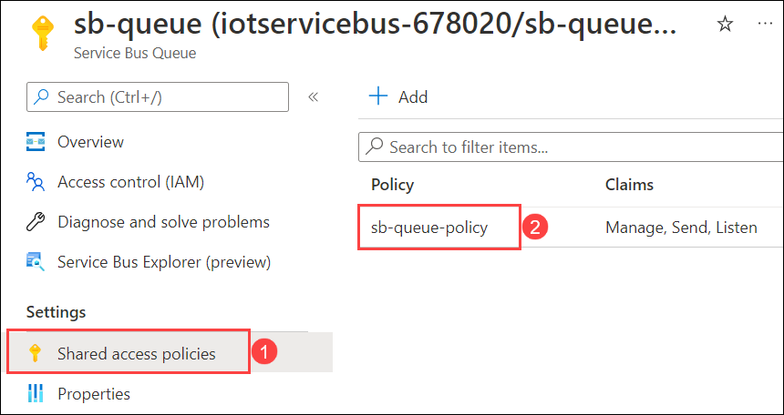
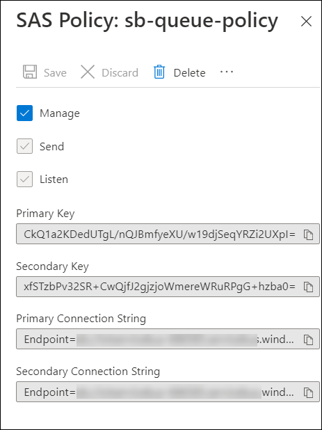
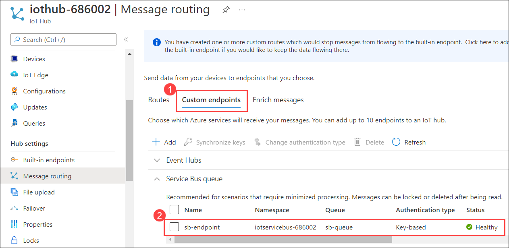
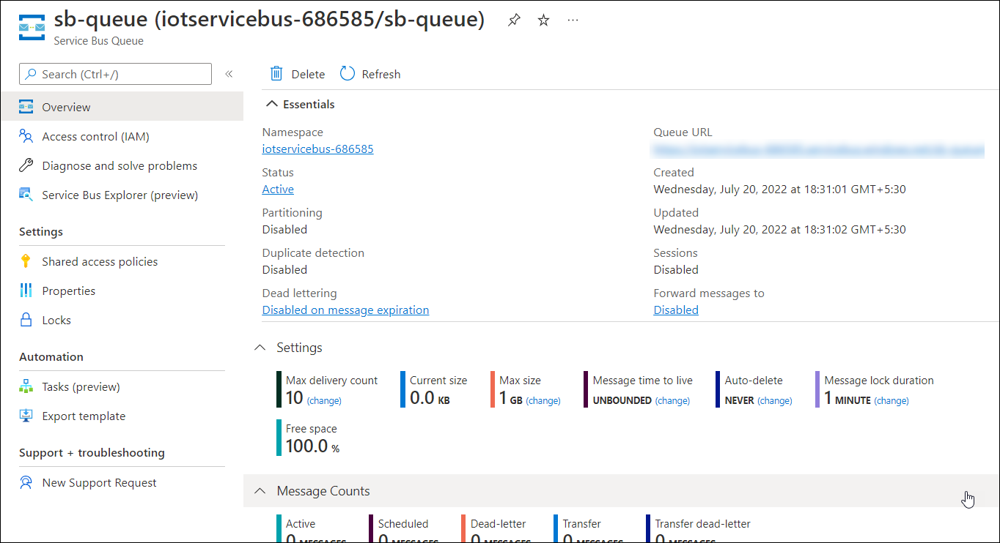
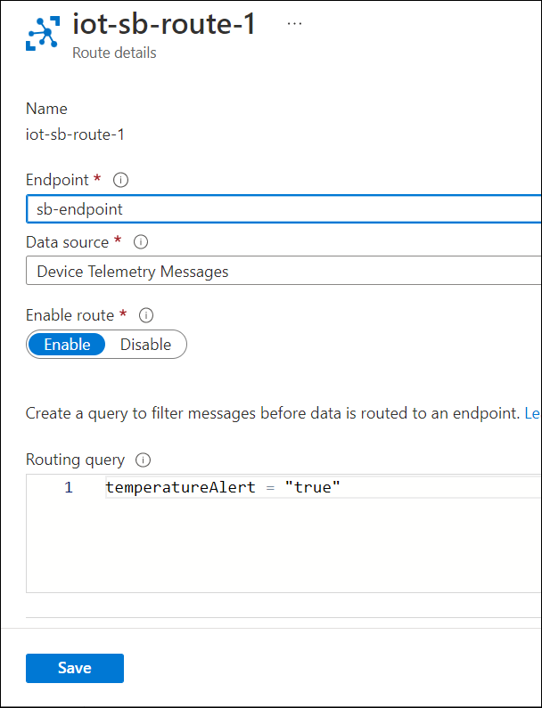
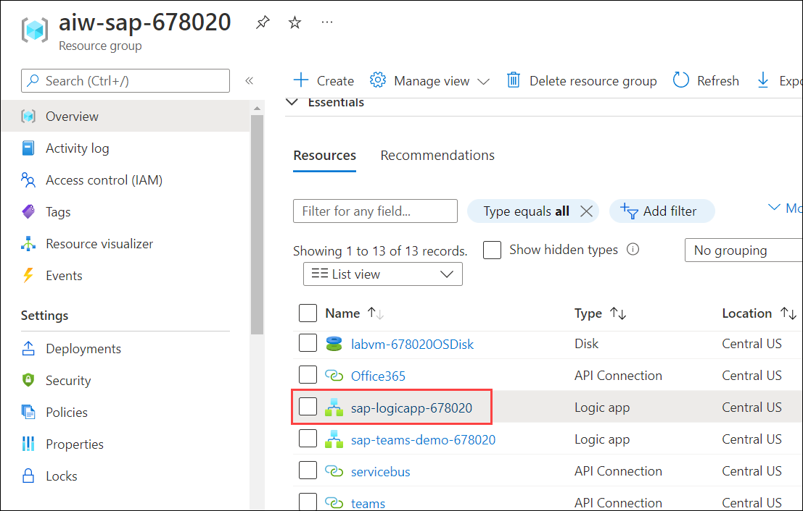
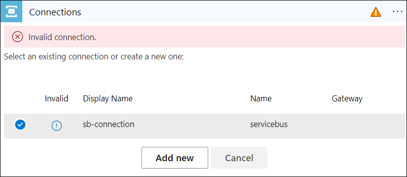
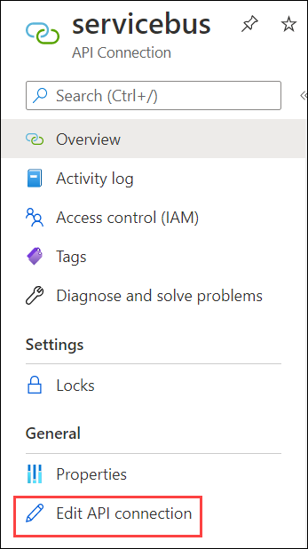

# Module 2: Data Insights

# Exercise 4:	Implement IoT remote Monitoring and Notifications 

Duration: 20 mins

## Scenario

Contoso wants to make sure that the vaccine is not exposed to unstable temperatures as that will result in irreversible damage to the vaccines. So, Contoso requires a way to monitor the temperature data generated by the built-in sensors and evaluate if the vaccine needs to be replaced in case the temperature goes above 30°. Contoso wants an order to be placed automatically to replace the damaged vaccine in case the measured temperature goes above 30°.

To achieve these requirements, you will be configuring a route in the Azure IoT Hub to direct the messages to the service bus queue as soon as the temperature reaches 30° or more. Then you will configure a Logic App to be triggered by a Service Bus queue whenever a message is added to the queue and automatically creates a sales order in the SAP system.

## Overview

In this exercise, you will review the message routing rule to direct messages that contain a temperature alert to the Service Bus queue. Then, you will use the pre-configured Logic App to monitor the Service Bus queue and place an order automatically in the SAP system to replace the damaged vaccine whenever a message is added to the queue.

This exercise includes the following tasks:

* Review the Service Bus queue and Shared access policy in the Service Bus namespace. 
* Review the custom endpoint and routing rule in the Azure IoT hub.
* Review the Pre-configured Logic App that create a SAP Sales order via Odata.
* Run the Raspberry Pi Simulator 
* Run the Logic App and review the Logic App run. 

 > `Microsoft Azure Service Bus` is a fully managed enterprise message broker with message queues and publish-subscribe topics. To use Service Bus messaging entities in Azure, a namespace with a name that is unique across Azure needs to be created.
    
 > `Service Bus Namespace` - A namespace is a container for all messaging components. Multiple queues and topics can be in a single namespace, and namespaces often serve as application containers. A namespace provides a scoping container for addressing Service Bus resources.
    
 > `Service Bus Queue` - Messages are sent to and received from queues. Queues store messages until the receiving application is available to receive and process them. Messages in queues are ordered and timestamped on arrival.

   > You can find more information about Microsoft Azure Service Bus here: `https://docs.microsoft.com/en-us/azure/service-bus-messaging/service-bus-messaging-overview`

## Task 1: Review the Service Bus queue and Shared access policy in the namespace. 

In this task, you will review the existing Service Bus namespace and Service Bus queue then review the pre-created Shared access policy in the queue which allows the queue to send and listen to the requests.

1. Navigate back to the browser tab in which Azure Portal is open and select **aiw-sap-<inject key="DeploymentID" />** resource group then service bus named **iotservicebus-<inject key="DeploymentID" />** .

   

1. Select **Queues (1)** under *Entities* from the left-hand side menu and select the **sb-queue (2)** queue from the list.

   

1. On the **sb-queue** blade, select **Shared access policies (1)** from the left-hand side menu and select the pre-deployed **SAS Policy** named **sb-queue-policy (2)**

   
   
1. On **SAS Policy: sb-queue-policy** page, review the keys and connection strings of Shared access policy.

   
   
## Task 2: Review custom endpoint and routing rule in the Azure IoT hub. 

In this task, you will review the pre-created custom endpoint for the Service Bus queue in your IoT hub and message routing rule which directs the messages containing a temperature alert to the Service Bus queue.

The routing rule uses a routing query, temperatureAlert = "true", to forward messages based on the value of the temperatureAlert application property set by the client code running on the device.

### Task 2.1: Review the custom endpoint

   > An IoT hub has a default built-in endpoint. You can review the custom endpoints to route messages to other services available in the subscription by linking them to Azure IoT Hub. IoT Hub currently supports Azure Storage containers, Event Hubs, Service Bus Queues, and Service Bus topics as custom endpoints.

1. Navigate to **aiw-sap-<inject key="DeploymentID" enableCopy="false" />** resource group and select the iothub named **iothub-<inject key="DeploymentID" enableCopy="false" />**.

1. From the left-hand side menu, select **Message routing** under **Hub settings**. 

   

1. On the Message routing pane, select the **Custom endpoints (1)** tab and select the pre-deployed endpoint named **sb-endpoint (2)**.

   

1. On **sb-queue** page, review the custom endpoint.

    

### Task 2.2: Review the routing rule

  > Routing provides a querying capability to filter the data before routing it to the Custom endpoints.

1. Back on the **Message routing** pane of IoT Hub, select the **Routes (1)** tab and select **iot-sb-route-1 (2)**.

    
   
1. On **iot-sb-route-1** page, review the Route configuration.

   


   
   
## Task 3: Review the Pre-configured Logic App that create a SAP Sales order via Odata.

Logic Apps is a cloud-based platform that helps you review and run automated workflows for integrating apps, data, services, and systems. Using this platform, you can more easily and quickly build highly scalable integration solutions for enterprise and business-to-business (B2B) scenarios. You can find more references about Logic App from here: `https://docs.microsoft.com/en-us/azure/logic-apps`

In this task, you will review the pre-deployed Logic App to be triggered by a Service Bus queue that create a SAP Sales order via OData whenever a message is added to the Service Bus queue. The data will be sent to the Service Bus queue from IoT Hub if the temperature of the devices exceeds a certain value (30°). You will renew the authorization to service bus API connection to use the pre-configured Logic App and trigger the Logic App flow.


1. Navigate back to the **aiw-sap-<inject key="DeploymentID" enableCopy="false" />** resource group and select the Logic App named **sap-logicapp-<inject key="DeploymentID" enableCopy="false" />**.

   
   
1. On the **Overview** pane toolbar, click on **Enable** to enable the Logic App and trigger it manually.

   
   
1. Select **Logic app designer** from the left-hand side menu of the Logic App.

   
  
1. Now, expand the **Servicebus** Connection and notice that it shows an invalid connection.

    This is because the session to the Servicebus connection is expired, you will have to re-establish the session to the Servicebus connection.
  
   
  
1. To establish the connection, navigate back to the **aiw-sap-<inject key="DeploymentID" enableCopy="false" />** resource group and select the API Connection named **servicebus**.

   
   
1. Select **Edit API connection** from the left-hand side menu to edit the connection.

   
   
1. On the **Connection String** blade, enter the SAS policy Connection string value of Service Bus Namespace **(1)** and click on **Save (2)**. You can find the connection string value below.

   **Connection String** : <inject key="ServiceBus" />
   
   
   

 

## Task 4: Start resending data from the Simulator 

In this task, you will run the Raspberry Pi online simulator and view the sensor data that is being sent to IoT Hub by the Azure IoT Hub device. 

1. Navigate back to the browser tab in which the Raspberry Pi online simulator was open, you can also launch it using the below URL.

   ```
   https://azure-samples.github.io/raspberry-pi-web-simulator/#GetStarted
   ```

1. Select Run or type npm start to run the application.

   

1. You should see the following output that shows the sensor data and the messages that are sent to your IoT hub.

   
   
## Task 5: Run the Logic App and review the Logic App run. 

In this task, you will run the Logic App and review the Logic App run.

1. Navigate back to the **aiw-sap-<inject key="DeploymentID" enableCopy="false" />** resource group and select the **Logic App** named sap-logicapp-<inject key="DeploymentID" enableCopy="false" />. 

1. Select **Logic app designer** under **Development Tools** from the left-hand side menu.

   
   
1. On the **Logic app designer** blade, click on **RunTrigger** and click on **Run** to run the workflow.  

   
   
1. Once you click on **Run**, the Logic App will be triggered for new data.

   > Info: Every time you trigger the Logic App, all the triggers and actions are executed, and a sales order is added to the SAP system.

1. Now, select **Overview (1)** from the left-hand side menu then scroll down and select **Run history (2)** tab.

   

1. Select the most recent run and review the Logic App run details then, minimize the Azure Portal window.

   
   
   > **Note**: If you are not able to see the Logic App run under **Run history**, click on **Refresh** on the **Overview** pane toolbar to fetch the recent results.
   
     
     
   > Since, you are done with this exercise, you will go ahead and disable the Logic App in the following steps.

1. Navigate back to the **sap-logicapp-<inject key="DeploymentID" enableCopy="false" />** and select **Overview** from the left-hand side menu.

   

1. On the **Overview** pane toolbar, click on **Disable** to disable the Logic App.

   
   
## Summary

In this exercise, you have covered the following:

* Review custom endpoint for the Service Bus queue to your IoT hub.
* Review the message routing rule to direct messages that contain a temperature alert to the Service Bus queue.
* Configured a Logic App to monitor the Service Bus queue and place a new order to replace the damaged vaccine whenever a message is added to the queue. 
* Reviewed the Logic App run.
