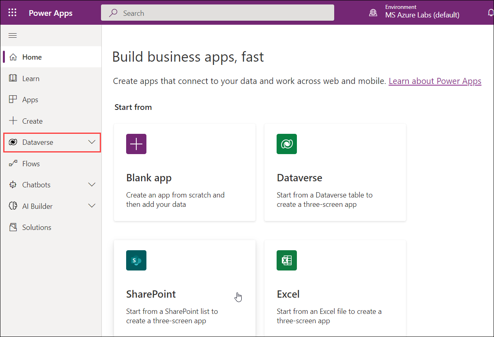
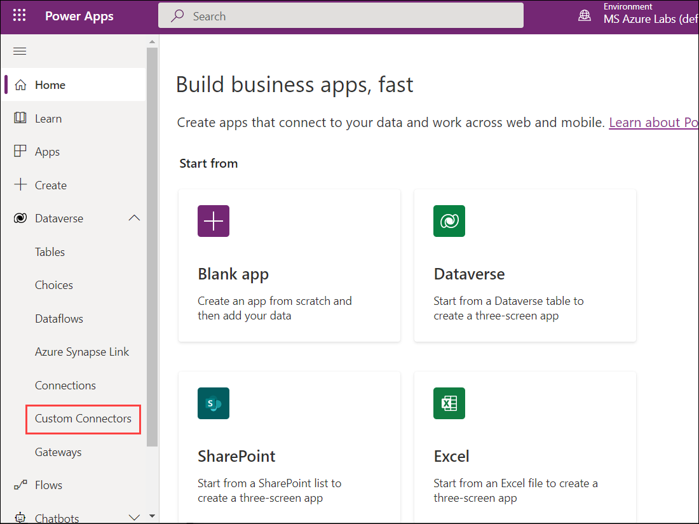
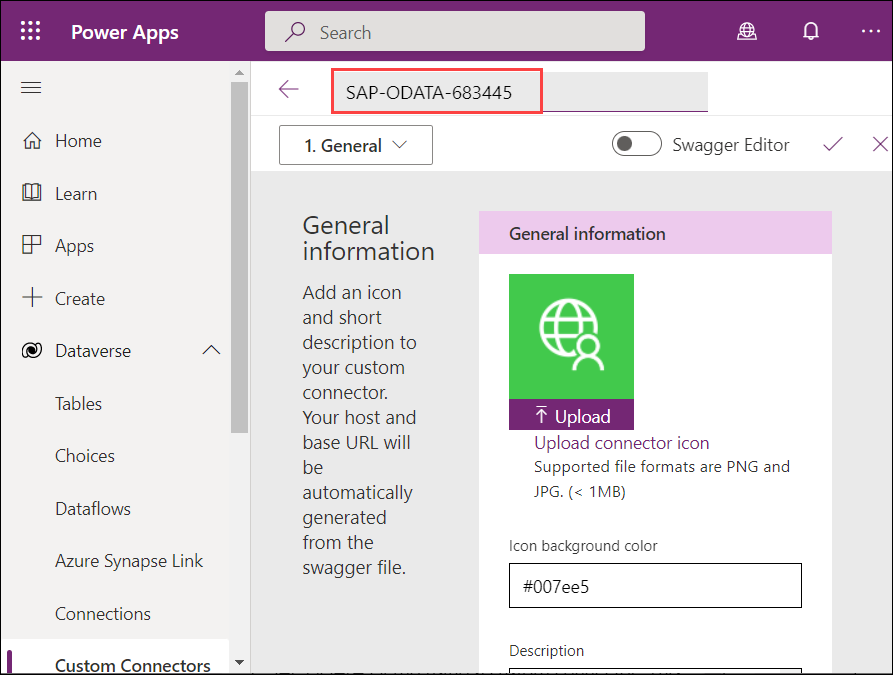
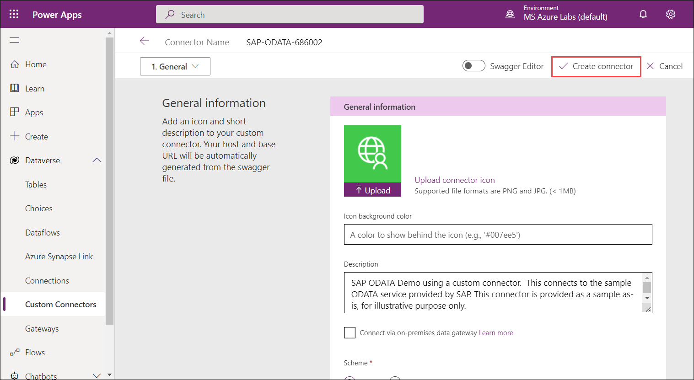
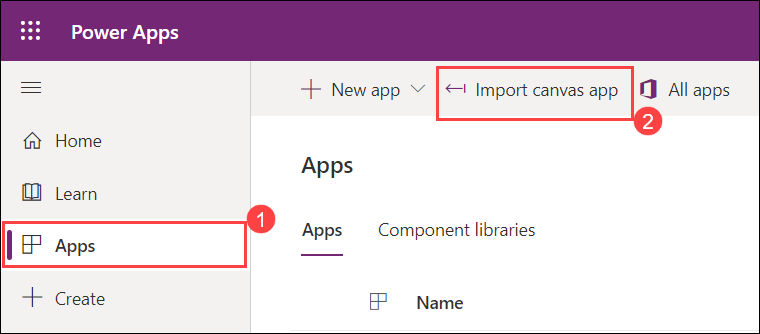
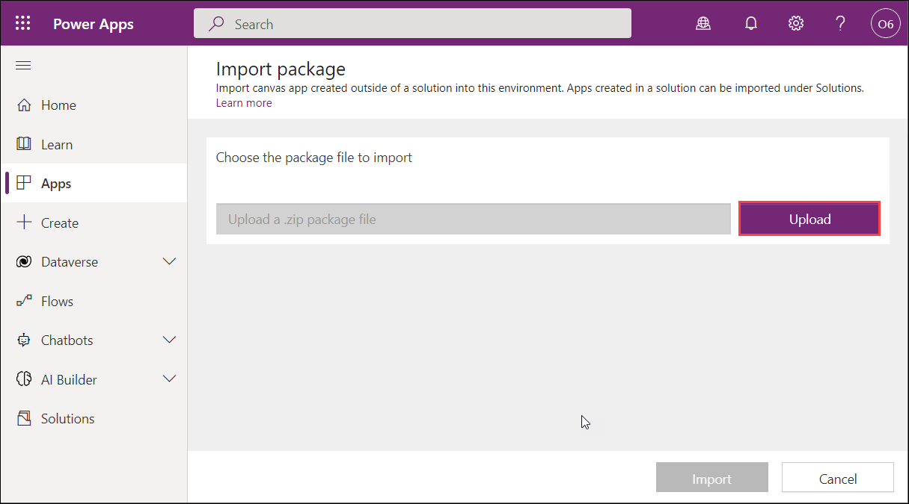
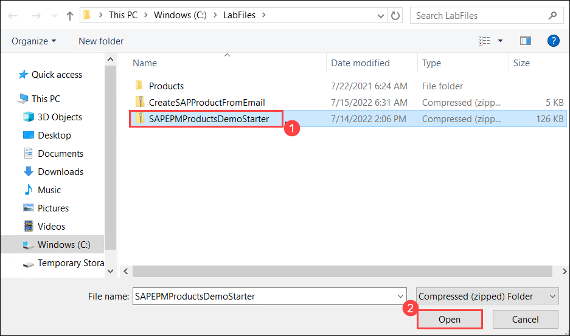
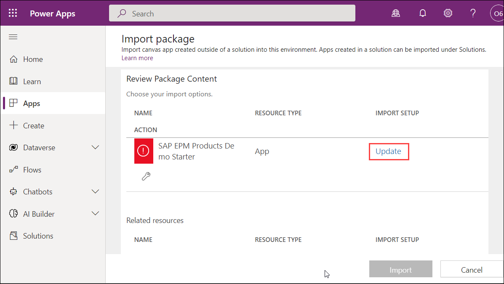
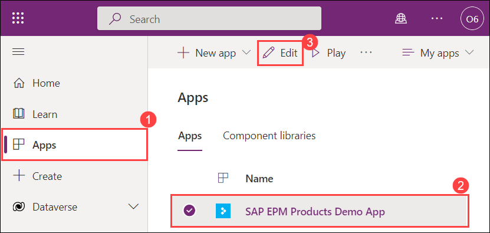
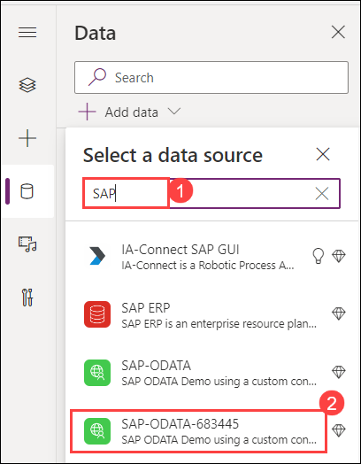

# Module 3: App Innovation

## Scenario
 
Contoso uses SAP Systems to store information related to the products they provide. Currently, the process to add a new product into the catalog is by first sending the Product Information to the Manager over email for approval. Once approved, the product details are entered manually into the catalog via SAP Fiori Web Application. Contoso now wants to get rid of this manual process and is looking for ways to do that.

Contoso has selected you to innovate and transform their manual business processes to digital, automated processes using Power Apps, Power Automate.

## Exercise 1: Create Power App and add Custom Connector to connect to SAP System

Duration: 15 minutes

## Overview

Power Apps is a suite of apps, services, connectors, and data platform that provides a rapid application development environment to build custom apps for your business needs. Using Power Apps, you can quickly build custom business apps that connect to your business data stored either in the SAP System or in the underlying data platform (Microsoft Dataverse) or various online and on-premises data sources (SharePoint, Microsoft 365, Dynamics 365, SQL Server, and so on).

> You can find complete information about PowerApps here: `https://docs.microsoft.com/en-in/powerapps/powerapps-overview`.

In this exercise, you will create a custom connector and Power App then add the custom connector to the app, which will be used to connect to your SAP System.

Here are the tasks you will be performing in this exercise:

  * Task 1: Create a custom connector
  * Task 2: Import Power App and add Custom Connector to SAP System
  
## Task 1: Create a custom connector

In this task, you will create a custom connector that will be used to connect to your SAP System.

> You will be using the SAP ODATA Sample connector to connect to an SAP ODATA service from Power Apps and Power Automate. This connector connects to the Sample ODATA service on the demo SAP Gateway from SAP. This ODATA services provide basic (CRUDQ) operations against a set of entities - Products, Partners, SalesOrders, and Contacts. This connector provides functionality to browse Products, Partners and Salesorders. 

1. Within the Virtual Machine, open a new browser tab and navigate to the below URL to open the Power Apps Portal.

   ```
   https://make.powerapps.com/
   ```
   
1. Select **Dataverse** from the left-hand side menu.

   

1. Now, to create a custom connector select **Custom Connectors** from the dropdown list.

   

1. You will be presented with the custom connectors page, click on **+New custom connector** to create a new customer.

   

1. Select **Import from Github** from the list to import the connector from **Github**.

   

1. On the **Import from Github** blade, enter the following information:

     1. Connector Type: Select **Custom (1)**
     2. Branch: Select **dev (2)** from the dropdown.
     3. Connector: Select **SAP-ODATA-Demo (3)** from the dropdown.
     4. After adding all the values, your screen will look like the below screenshot:
   
     

1. Click on **Continue** to proceed with the custom connector creation process.

1. Next, You will be presented with the below page which provides the general information about the custom connector.

   
   
1. Now, rename the connector with **SAP-ODATA-<inject key="DeploymentID" enableCopy="false" />**.

    

1. Review the available parameters on the **General information** blade and click on **Create Connector** to create the SAP custom connector.

    


## Task 2: Import a Canvas app and add Custom Connector 

In this task, you will import a Power App and add the custom connector to the app to connect to your SAP System.

1. Select **Apps** from the left-hand side menu and click on **Import canvas app** to import the app.

   

1. On **Import package** page, click on **Upload**.

   
   
1. Inside the Virtual Machine, navigate to this path **C:\LabFiles** and select **SAPEPMProductsDemoStarter (1)** zip file then click on **Open (2)** to open it.

    

1. Now, select **Update** that is next to **SAP EPM Products Demo Starter** flow under Review Package Content to import the app.

    
    
1. On the **Import setup** blade, enter the following information:

    - **Setup**: Select **Create as new (1)** from the dropdown.
    - **Resource name (2)**: Enter `SAP EPM Products Demo Starter`
    - Click on **Save (3)**

    
    
1. Navigate back to **Apps (1)**, select the newly created app **SAP EPM Products Demo App (2)** and click on **Edit (3)**

   
   
1. On **Welcome to Power Apps Studio** pop-up, click on **Skip**.

    

1. Wait until the file is loaded. Once loaded, you will be able to view the sample app in your Power Apps dashboard which allows you to connect to the SAP system.

   

   > You will not be able to see any product data on the app, since you have not connected the SAP custom connector which you created in the previous task to the app.

1. Select **Data** from the left-hand side menu to add the custom connector.

   

1. Select **+Add data** to add a custom connector.

1. Search for **SAP (1)** then select **SAP-ODATA-<inject key="DeploymentID" enableCopy="false" /> (2)** connector from the list.

   

1. You will be asked to provide your ES5 demo account credentials to connect and access the data. Use the below credentials to login into the SAP system.

     - **Username**: Enter this <inject key="SapUserID" />
     - **Password** : Enter this value <inject key="SapPassword" />

    

    > Note: If you have used a different password while creating the demo ES5 account, you can use that password. You can enter the above password if you have followed the instructions given in the lab guide.

13. After entering username and password values, click on **Connect** to connect to the SAP system.

14. Now, you will be presented with a pop-up to have a premium license on your power apps plan. Click on **Got it** to proceed with the next step.

15. Notice that all red marks are disappeared since you have connected the custom connector **SAP-ODATA-Demo** to the app.

   

16. To review the available products, press the **Alt** key and click on the **refresh** button which is at the left-side of **Products**.

   

17. Press the **Alt** key then select any product from the list and review the information about the product on the right side of the app.

   

18. After reviewing the product information, click on **X** to close the tab.

## Summary

 In this exercise, you have covered the following:
   * Created the custom connector.
   * Import the canvas app in the Power Apps portal.
   * Added the custom connector to the canvas app to connect to the SAP system.
   
