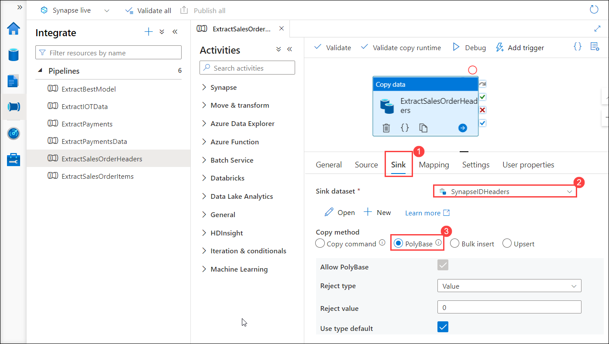
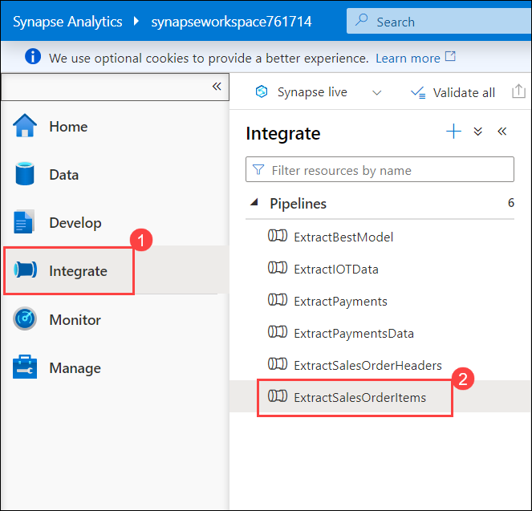
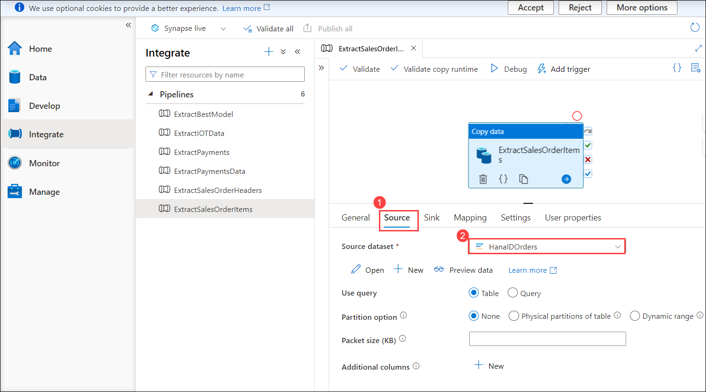
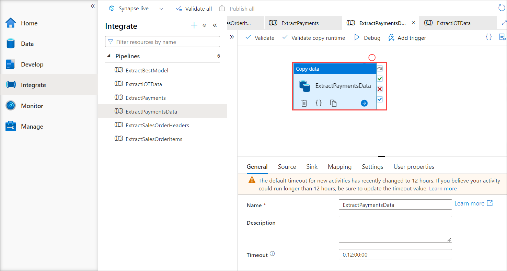
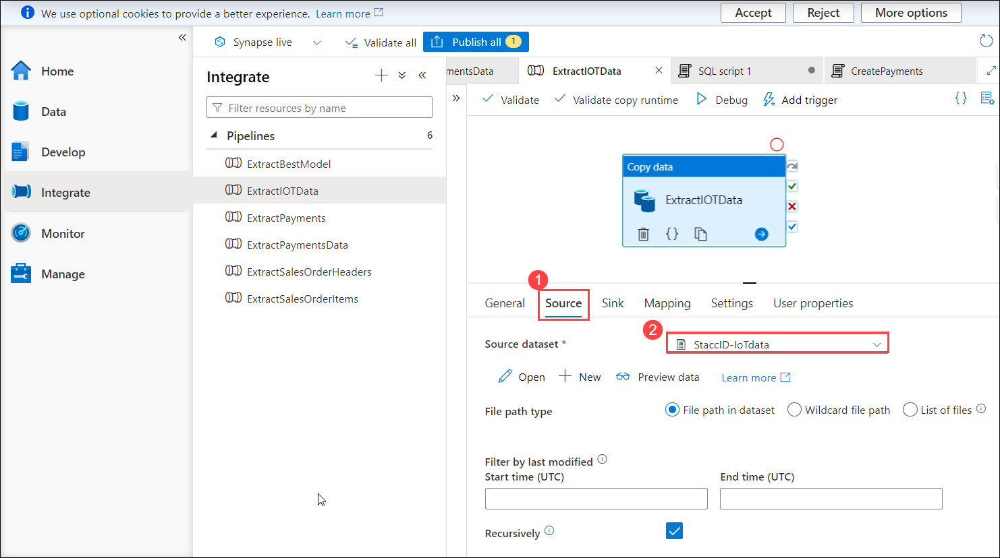
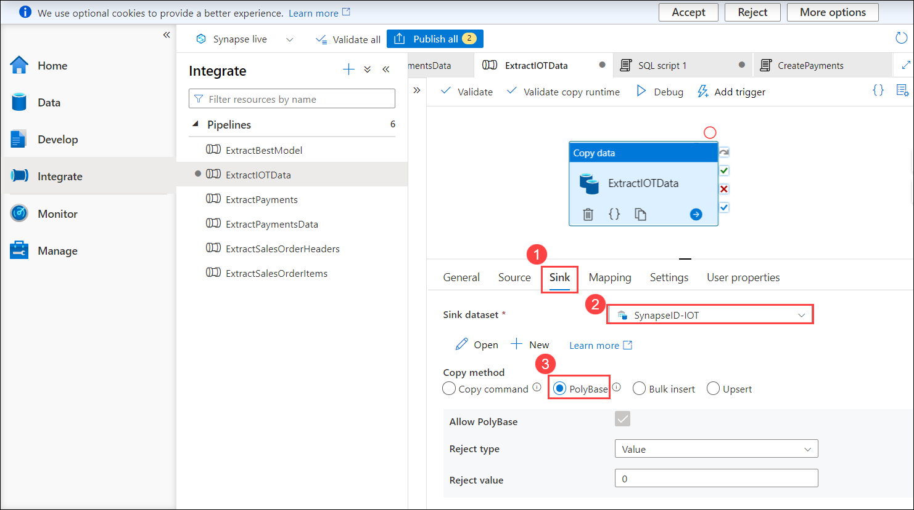

# Exercise 2: Combine and streamline SAP and non-SAP Data Flow 


## Overview

In this exercise, you will review the pre-deployed Pipelines and will run the SQL scripts to get the data for the tables SalesOrderHeaders, SalesOrderItems, PaymentsData, and IoT data.


## Task 1:  Review the pre-deployed Pipeline for SalesOrderHeaders

In this task, you will review the pipeline which is deployed to share SalesOrderHeaders data from the SAP Hana database to Synapse

1. Navigate to the **aiw-sap-<inject key="DeploymentID" enableCopy="false"/>** **(1)** resource group and open Synapse workspace with the name **synapseworkspace<inject key="DeploymentID" enableCopy="false"/>** **(2)**.

   
   
2. From the Overview **(1)** pane of Synapse workspace, scroll down and click on **Open** **(2)** under Getting started to Open Synapse Studio.

   
   
3. In Synapse Analytics Studio, from the left panel click on the expand icon.

   
   
4. Select **Integrate** hub **(1)** from left hand side menu and click on **Pipelines** **(2)**.

    

    >Info: You can observe the pre-deployed Pipelines for SalesOrderHeaders, SalesOrderItems, Payments, and IoT Data.

5. Click on **ExtractSalesOrderHeaders (1)** under Pipelines and select **ExtractSalesOrderHeaders (2)** from the canvas.

    

6. Navigate to the **Source (1)** tab and observe the Source settings of the Pipeline

    
    
    >Info: In this Pipeline **HanaIDHeaders (2)** has been selected as the Source dataset where HanaIDHeaders is an Integration dataset that stores data of sales order headers that are being fetched from the SAP Hana database.
    
7. Switch to **Sink (1)** tab and observe the Sink settings of the Pipeline.

    
   
   >Info: In this Pipeline **SynapseIDHeaders (2)** has been selected as the Sink dataset and **PolyBase (3)** as Copy Method. When the pipeline is successful, the data from HanaIDHeaders Integration dataset will be copied to the Synapse table, which is connected to the Integration dataset SynapseIDHeaders.

  
8. Navigate to **Develop (1)** hub, click on **+** **(2)** and select **SQL Script (3)** to verify the SalesOrderHeaders data.

    
   
9. In the SQL script tab, choose **sapdatasynsql** dedicated SQL pool from the drop-down next to the **Connect to** parameter in the toolbar menu.

    

10.  Enter the below SQL script into the codespace **(1)** and click on **Run** **(2)** then explore the **Results** **(3)**.

     ```bash
     select * from SalesOrderHeaders
     ```

     

## Task 2:  Review the pre-deployed Pipeline for SalesOrderItems

In this task, you will review the pipeline which is deployed to share SalesOrderItems data from the SAP Hana database to Synapse


1. Navigate back to **Integrate (1)** hub and click on **ExtractSalesOrderItems (2)** under Pipelines.

   
   
2. Click on **ExtractSalesOrderItems** from the canvas.

    
    
3. Navigate to the **Source (1)** tab and observe the Source settings of the Pipeline.

    
    
    >Info: In this Pipeline **HanaIDOrders (2)** has been selected as the Source dataset where HanaIDHeaders is an Integration dataset that stores data of sales order Items that are being fetched from the SAP Hana database.

4. Switch to **Sink (1)** tab and observe the Sink settings of the Pipeline.

    
    
     >Info: In this Pipeline **SynapseIDOrders (2)** has been selected as the Sink dataset and **PolyBase (3)** as Copy Method. When the pipeline is successful, the data from HanaIDOrders Integration dataset will be copied to the Synapse table, which is connected to the Integration dataset SynapseIDOrders.

5. Navigate to **Develop (1)** hub, click on **+** **(2)** and select **SQL Script (3)** to verify the SalesOrderHeaders data.

    
    
6. In the SQL script tab, choose **sapdatasynsql** dedicated SQL pool from the drop-down next to the **Connect to** parameter in the toolbar menu.

    
    
7.  Enter the below SQL script into the codespace **(1)** and click on **Run** **(2)** then explore the **Results** **(3)**.

     ```bash
     select * from SalesOrderHeaders
     ```

     
     
 ## Task 3:  Review the pre-deployed Pipeline for PaymentsData

In this task, you will review the pipeline which is deployed to share Payments Data from Cosmos DB to Synapse.

1. Navigate back to **Integrate (1)** hub and click on **ExtractPaymentsData (2)** under Pipelines.

   
   
2. Click on **ExtractPaymentsData** from the canvas.

    
    
3. Navigate to the **Source (1)** tab and observe the Source settings of the Pipeline.

    
    
    >Info: In this Pipeline **CosmosDbIDPayments (2)** has been selected as the Source dataset where CosmosDbIDPayments is an Integration dataset for the Cosmos database that stores data of Payments that are being fetched from the Storage account.

4. Switch to **Sink (1)** tab and observe the Sink settings of the Pipeline.

    
    
     >Info: In this Pipeline **SynapseIDPayments (2)** has been selected as the Sink dataset and **PolyBase (3)** as Copy Method. When the pipeline is successful, the data from CosmosDbIDPayments Integration dataset will be copied to the Synapse table, which is connected to the Integration dataset SynapseIDPayments.

5. Navigate to **Develop (1)** hub, click on **+** **(2)** and select **SQL Script (3)** to verify the SalesOrderHeaders data.

    
    
6. In the SQL script tab, choose **sapdatasynsql** dedicated SQL pool from the drop-down next to the **Connect to** parameter in the toolbar menu.

    
    
7.  Enter the below SQL script into the codespace **(1)** and click on **Run** **(2)** then explore the **Results** **(3)**.

     ```bash
     select * from Payments
     ```

     


 ## Task 4:  Review the pre-deployed Pipeline for PaymentsData

In this task, you will review the pipeline which is deployed to combine SAP and Non-SAP data and shares the IoT Data from the Storage account to Synapse.

1. Navigate back to **Integrate (1)** hub and click on **ExtractPaymentsData (2)** under Pipelines.

   
   
2. Click on **ExtractIOTData** from the canvas.

     

3. Navigate to the **Source (1)** tab and observe the Source settings of the Pipeline.

    
    
    >Info: In this Pipeline **StaccID-IoTdata (2)** has been selected as the Source dataset where StaccID-IoTdata is an Integration dataset that stores the telemetry data sent by the simulated IoT Hub device to Azure IoT Hub.

4. Switch to **Sink (1)** tab and observe the Sink settings of the Pipeline.

    
    
     >Info: In this Pipeline **SynapseID-IOT (2)** has been selected as the Sink dataset and **PolyBase (3)** as Copy Method. When the pipeline is successful, the data from StaccID-IoTdata Integration dataset will be copied to the Synapse table, which is connected to the Integration dataset SynapseID-IOT.

5. Navigate to **Develop (1)** hub, click on **+** **(2)** and select **SQL Script (3)** to verify the SalesOrderHeaders data.

    
    
6. In the SQL script tab, choose **sapdatasynsql** dedicated SQL pool from the drop-down next to the **Connect to** parameter in the toolbar menu.

    
    
7.  Enter the below SQL script into the codespace **(1)** and click on **Run** **(2)** then explore the **Results** **(3)**.

     ```bash
     select * from iotdatadef
     ```

     
