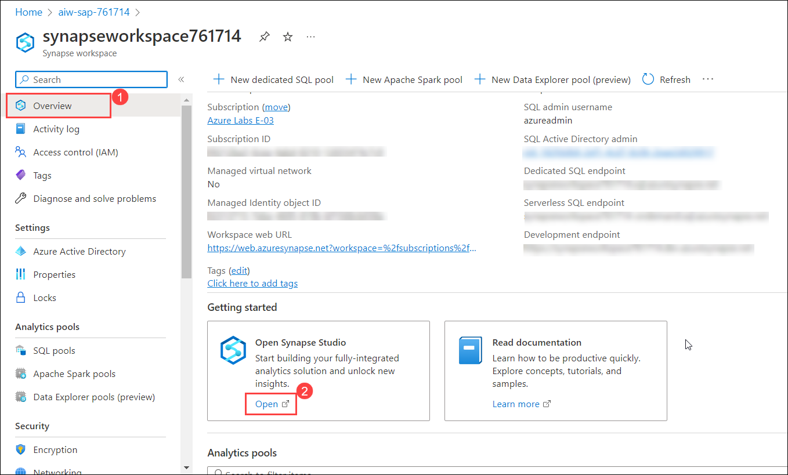
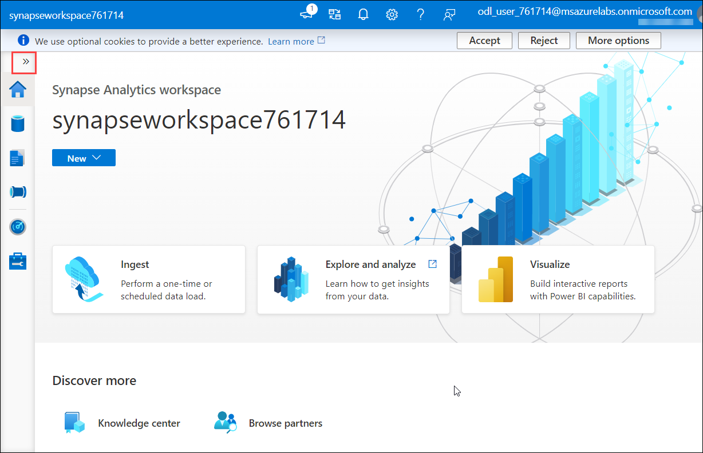
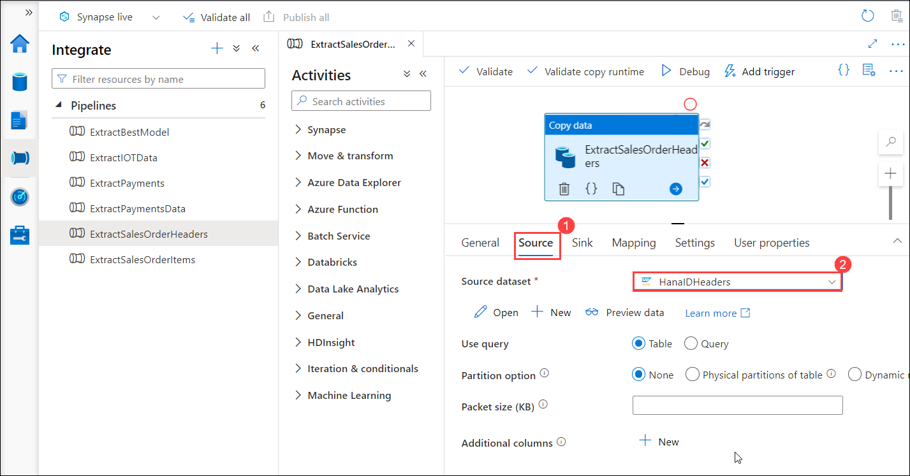

# Exercise 2: Combine and streamline SAP and non-SAP Data Flow 


## Overview

In this exercise, you will review the pre-deployed Pipelines and will run the SQL scripts to get the data for the tables SalesOrderHeaders, SalesOrderItems, Payments, IoTdata.


## Task 1 :  Review the pre-deployed Pipelines

1. Navigate to the **aiw-sap-<inject key="DeploymentID" enableCopy="false"/>** **(1)** resource group and open Synapse workspace with the name **synapseworkspace<inject key="DeploymentID" enableCopy="false"/>** **(2)**.

   
   
2. From the Overview **(1)** pane of Synapse workspace, scroll-down to Getting started and click on **Open** **(2)** to Open Synapse Studio.

   
   
3. In Synapse Analytics Studio, from the left panel click on the expand icon.

   
   
4. Now, navigate to **Integrate** hub **(1)** and click on **Pipelines** **(2)**.

    

5. You can observe the pre-deployed Pipelines for SalesOrderHeaders, SalesOrderItems, Payments and IoT Data.

6. Click on **ExtractSalesOrderHeaders (1)** under Pipelines and select **ExtractSalesOrderHeaders (2)** from the canvas.

    

7. Navigate to **Source (1)** tab and observe **HanaIDHeaders (2)** is selected as Source dataset.

    
    
    >Info : A source transformation configures the data source for the data flow. When you design data flows, your first step is always configuring a source transformation. Each source transformation is associated with exactly one dataset or linked service

8. Switch to **Sink (1)** tab and observe that **SynapseIDHeaders (2)** is selected as Sink dataset and **PolyBase (3)** as Copy Method.

    
   
   >Info : Once you finish transforming your data from Source, you will write it into a destination store by using the sink transformation. Each sink transformation is associated with exactly one dataset object or linked service. 

   >**Note :** In this Pipeline you are sharing the SalesOrderHeaders data from SAP HANA to Synapse.

9. Navigate to **Develop (1)** hub, click on **+** **(2)** and select **SQL Script (3)** to verify the SalesOrderHeaders data.

    
   
10. In the SQL script tab, choose to connect to the **sapdatasynsql** dedicated SQL pool in the toolbar menu.

    

11.  Enter the below SQL script into the codespace **(1)** and click on **Run** **(2)** then explore the **Results** **(3)**.

     ```bash
     select count(*) from SalesOrderHeaders
     select * from SalesOrderHeaders
     ```

    
