# Exercise 3: Drive Sales Insight through Power Bi Visualization

Azure Synapse Analytics and Power BI become more powerful when used together, combining to provide a unique, modern approach to data analytics. Azure Synapse enables Power BI professionals across a diverse set of use cases to deliver the scale, performance, and cost management your projects require. To learn more about Azure Firewall refer: `https://learn.microsoft.com/en-us/power-bi/connect-data/service-azure-and-power-bi`

In this exercise, you will visualize the **Sales Orders data, Payments, and IoT Hub device data** in the **PowerBI application** using the pre-built PowerBI reports. 

This exercise includes the following tasks:

   1: Data Visualization
   2: Publish the Power BI Reports
   
### Task 1: Data Visualization

1. Open the **File Explorer** **(1)** from the taskbar and navigate to `C:\PowerBI Reports` directory **(2)**. Double-click on the **SAP-IoT-Data** file to open the Power BI Report.

   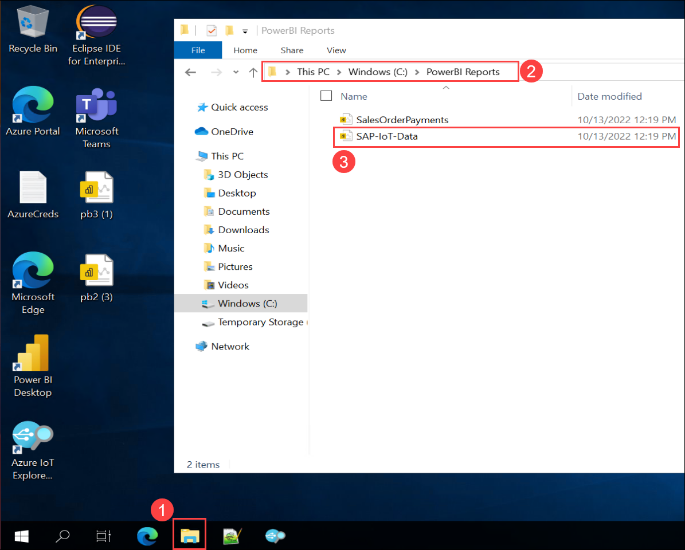
   
1. You can start reviewing the visualization from the report canvas of Power BI. Select the **Sales per Date and CustomerGroup** **(1)** tile and click on **Focus mode** **(2)**.

   
   
1. Take a look at the **SalesOrders TotalNetAmount** by **Year** for the various **CustomerGroups (Z1 and Z2)**. Select the CustomerGroup **Z1** **(1)** for the year **2020** **(2)** and review the sum of **TotalNetAmount** **(3)**.

   > **Info**: You can also review the sum of **TotalNetAmount** for various **CustomerGroups** in the different years by selecting the appropriate **CustomerGroup** and **Year**.

   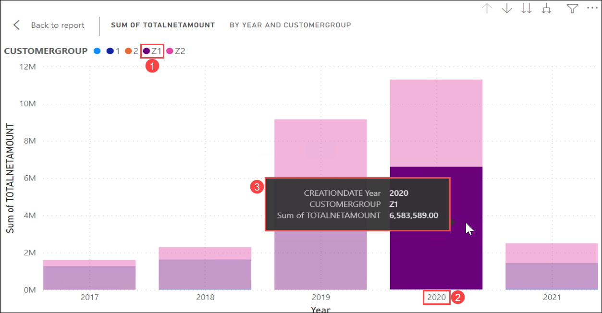

1. Once you finished reviewing the visualization, click on **Back to report** that is present at the top-left corner of the Focus mode to navigate back to the report canvas.

   > **Info**: This graph represents the relationship between CREATIONDATE and CUSTOMERGROUP of SalesOrderHeaders data.

   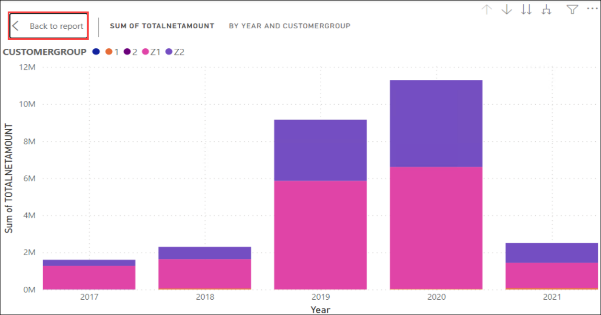
   
1. Now, select the **Sales per Region and CustomerGroup** **(1)** tile and click on **Focus mode** **(2)**.

   

1. Take a look at the **Sales per Region and CustomerGroup** by **Region** for the various **CustomerGroups (Z1 and Z2)**. Select the CustomerGroup **Z1** **(1)**, Region as **GEORGIA** **(2)** and review the sum of **TotalNetAmount** **(3)**.

   > **Info**: You can also review the sum of **TotalNetAmount** for various **CustomerGroups** in the different regions by selecting the appropriate **CustomerGroup** and **Region**.

   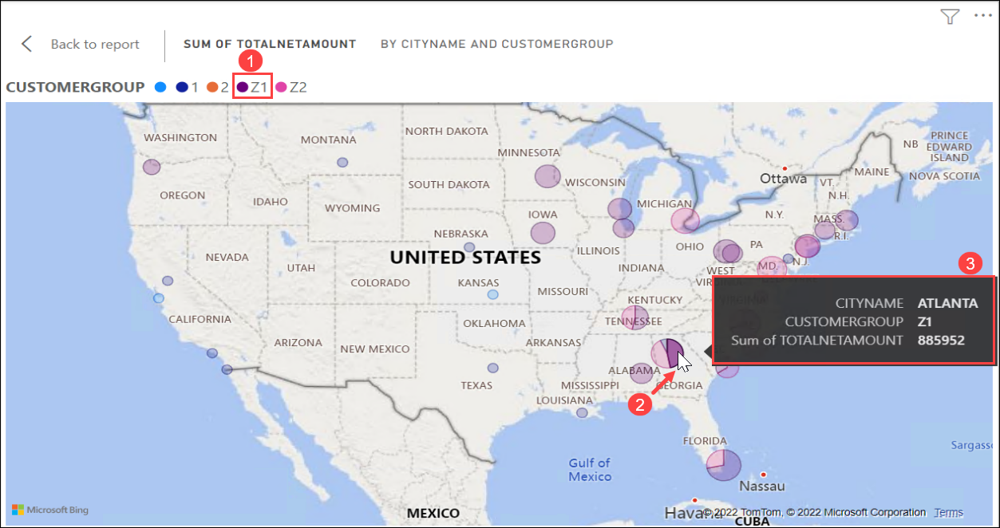

1. Once you finished reviewing the visualization, click on **Back to report** that is present at the top-left corner of the Focus mode to navigate back to the report canvas.

   > **Info**: This graph represents the relationship between CITYNAME and CUSTOMERGROUP of SalesOrderHeaders data.
   
1. Select the visualization of **Payments per Date and CustomerGroup** **(1)** and click on **Focus mode** **(2)**.

   
   
1. Take a look at the **Payments per Date and CustomerGroup** by **Year** for the various **CustomerGroups (Z1 and Z2)**. Select the CustomerGroup **Z1** **(1)** for the year **2020** **(2)** and review the sum of **PaymentValue** **(3)**.

   > **Info**: You can also review the sum of **PaymentValue** for various **CustomerGroups** in the different years by selecting the appropriate **CustomerGroup** and **Year**.

   
   
1. Once you finished reviewing the visualization, click on **Back to report** that is present at the top-left corner of the Focus mode to navigate back to the report canvas.

   > **Info**: This graph represents the relationship between PaymentDate, PaymentValue, and CUSTOMERGROUP of Payments and SalesOrderHeaders data.
   
1. Select the **Sales Per CustomerGroup and MaterialGroup** **(1)** tile and click on **Focus mode** **(2)**.

   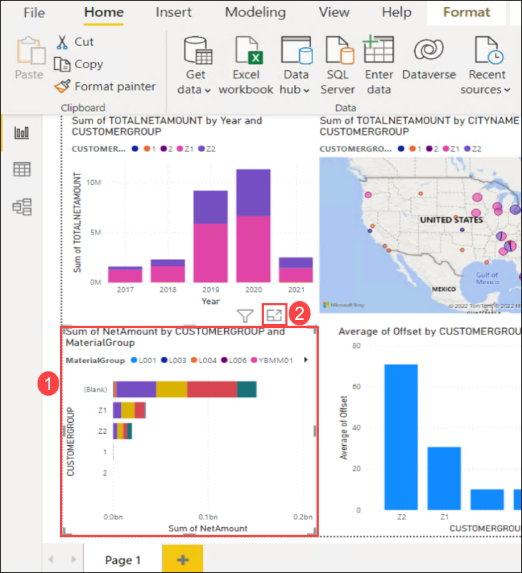

1. Take a look at the **Sales Per CustomerGroup and MaterialGroup** by **MaterialGroup** for the various **CustomerGroups (Z1 and Z2)**. Select the MaterialGroup **ZCRUISE** **(1)** for the CustomerGroup **Z1** **(2)** and review the sum of **NetAmount** **(3)**.

   > **Info**: You can also review the sum of **NetAmount** for various **CustomerGroups** with the different MaterialGroup by selecting the appropriate  **MaterialGroup** and **CustomerGroups**.

   

1. Once you finished reviewing the visualization, click on **Back to report** that is present at the top-left corner of the Focus mode to navigate back to the report canvas.

   > **Info**: This graph represents the relationship between CUSTOMERGROUP, MatieralGroup, and NetAmount of SalesOrderHeaders and SalesOrderItems data.
   
1. Select the **Average Offset Report** **(1)** tile and click on **Focus mode** **(2)**.

    

1. Take a look at the **Average Offset Report** by **Average Offset** for the various **CustomerGroups (Z1 and Z2)**. Select the CustomerGroup **Z1** **(1)** and review the Average of **Offset** **(2)**.

   > **Info**: You can also review the Average of **Offset** for various **CustomerGroups** by selecting the appropriate **CustomerGroups**.

   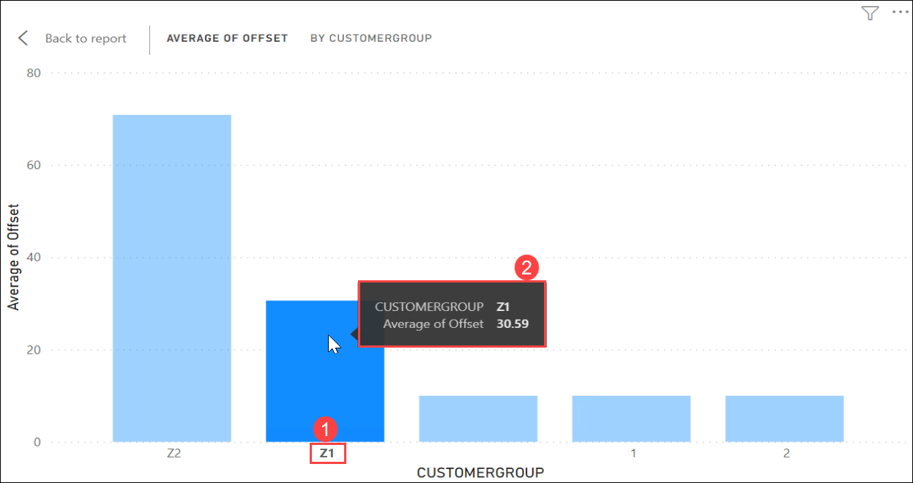

1. Once you finished reviewing the visualization, click on **Back to report** that is present at the top-left corner of the Focus mode to navigate back to the report canvas.

    > **Info**: This graph represents the relationship between CUSTOMERGROUP and the Offset of SalesOrderPayments data.
   
1. Select the **IoT Data per TemperatureAlert and CreationDate** **(1)** tile and click on **Focus mode** **(2)**.

   

1. Take a look at the **IoT Data per temperatureAlert and CreationDate** by **temperatureAlert** for the various **CreationDate** in the Year. Select the **CreationDate in the Year 2022** **(1)** and review the Count of **temperatureAlert** **(2)**.

   > **Info**: You can also review the Count of **temperatureAlert** for various **CreationDate** by selecting the appropriate **CreationDate** in the Year.

   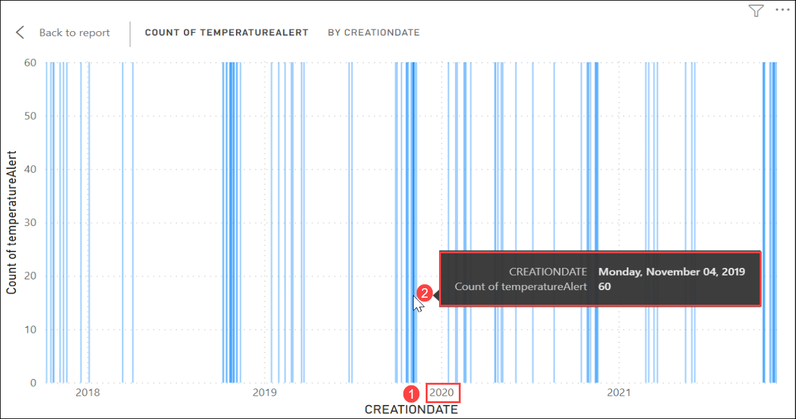

1. Once you finished reviewing the visualization, click on **Back to report** that is present at the top-left corner of the Focus mode to navigate back to the report canvas.

    > **Info**: This graph represents the relationship between temperatureAlert and CREATIONDATE of iotdatadef and SalesOrderHeaders data.

   

### Task 2: Publish the Power BI Reports

1. On the Power BI Desktop application and click on **Publish** that is present at the top right corner of the application.

   

1. Complete the Sign-in process using the below credentials.

   * Email/Username: <inject key="AzureAdUserEmail"></inject>
   * Password: <inject key="AzureAdUserPassword"></inject>   

1. On the **Publish to Power BI** blade, click on **Select**.

   

1. Wait for the Publish operation to succeed. Once succeeded, you will be presented with below blade, click on **Got it**.

   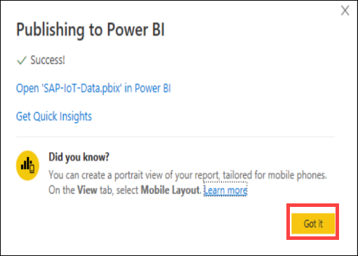
   
1. Now, navigate to the below URL to open Power BI portal.

   ```
   https://www.powerbi.com/
   ```
   
1. Complete the Sign-in process using the below credentials.

   * Email/Username: <inject key="AzureAdUserEmail"></inject>
   * Password: <inject key="AzureAdUserPassword"></inject>   

1. Select **Workspaces** from the Power BI menu and click on more button that is next to **My workspace**.

   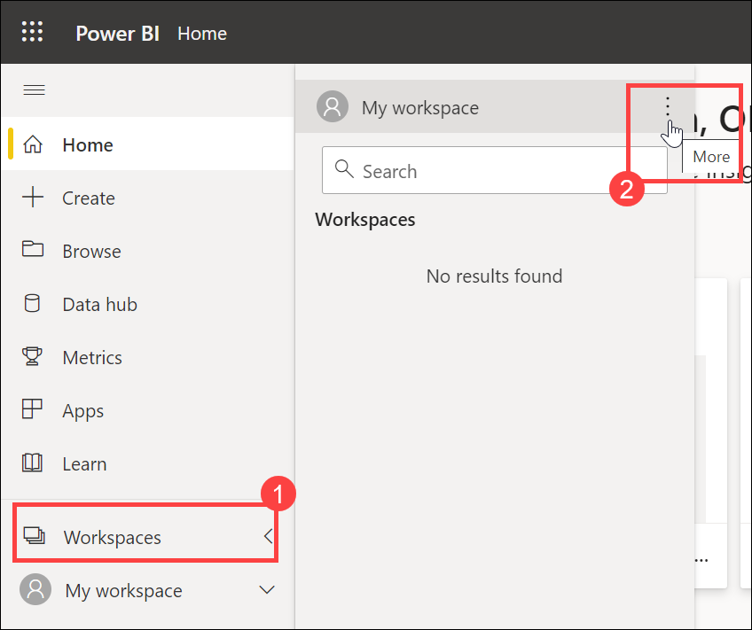
   
1. Now, click on **Edit this workspace**.

   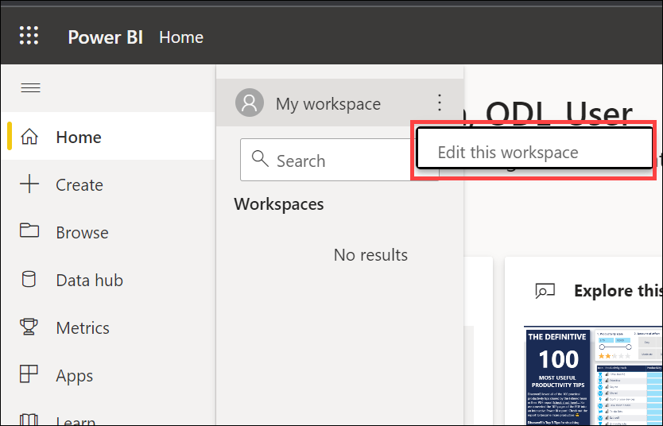

1. One the **Edit workspace** blade, select **License mode** as **Premium per capacity** and click on **Save**.

   

1. Select **My Workspace** from the left-hand menu and click on **SAP-IoT-Data** report from the workspace.

   
   
1. You can observe the published **SAP-IoT-Data** report.

   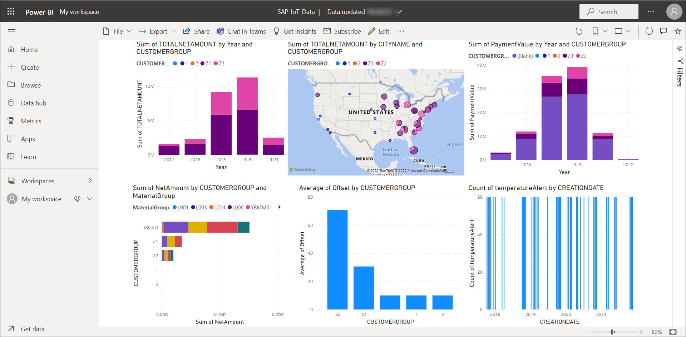
   

## Summary

In this exercise, you have visualized the pre-built the PowerBI reports in **PowerBI application** that are built against the **Sales Orders data, Payments, and IoT Hub device data**.
