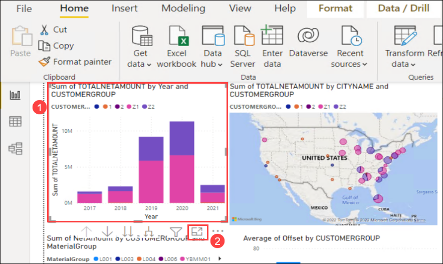
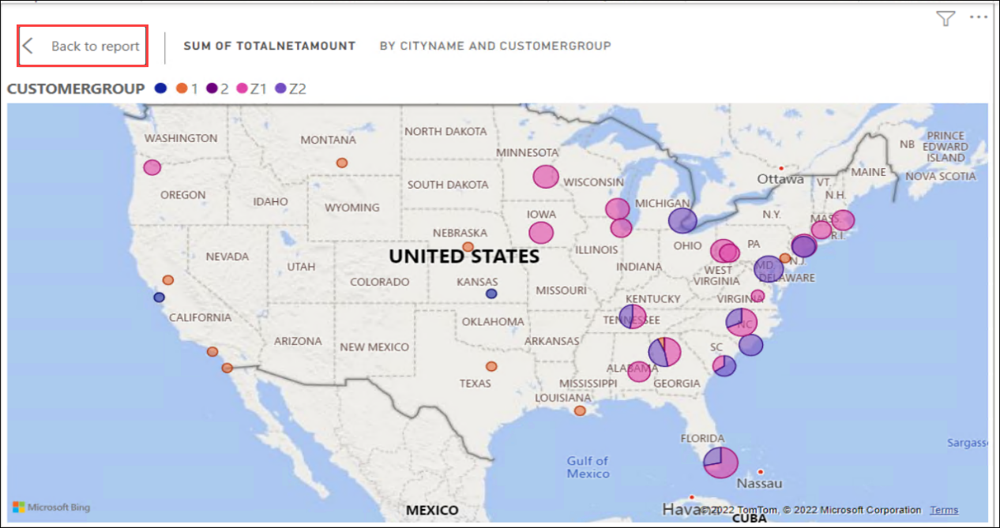
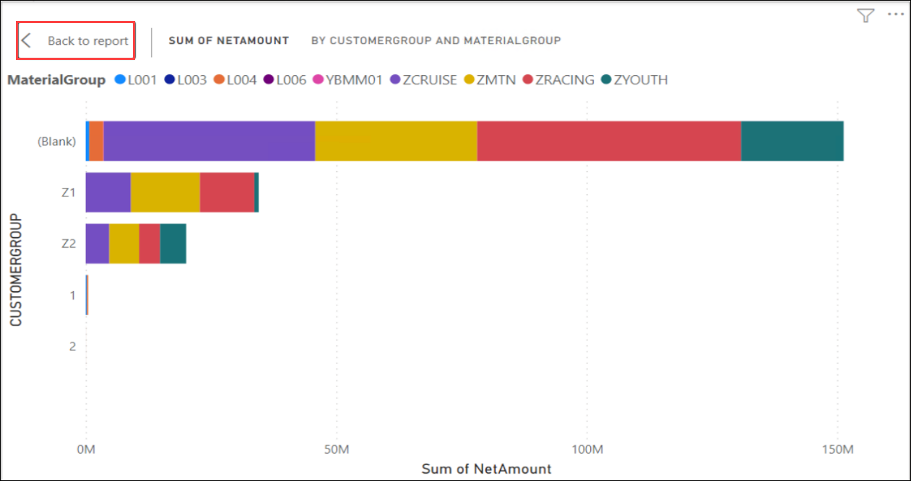
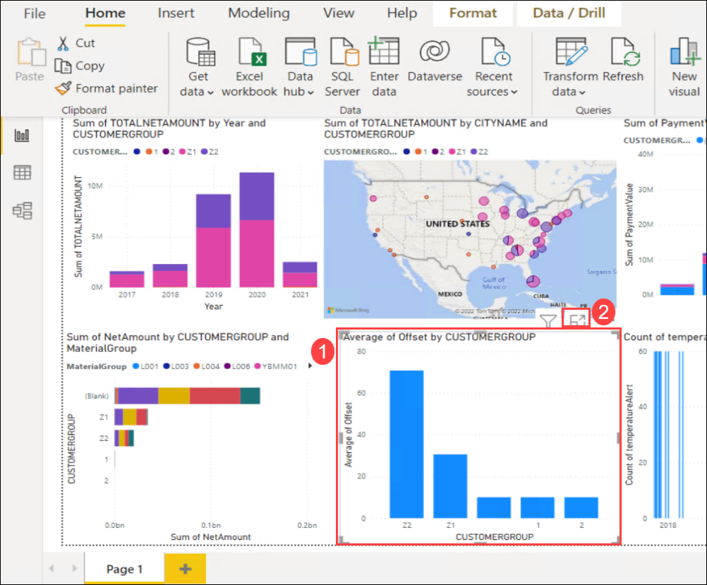
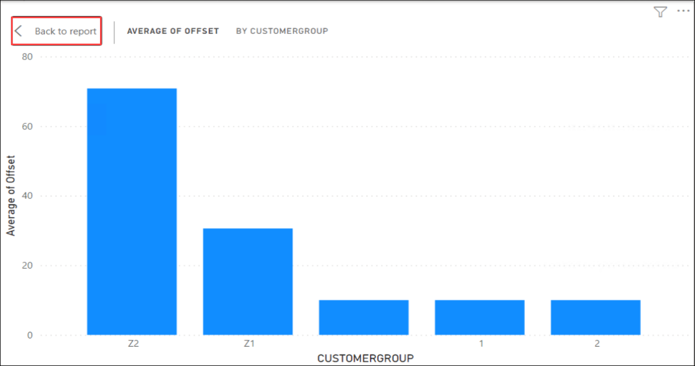

# Exercise 3: Drive Sales Insight through Power Bi Visualization

In this exercise you will be reviewing the powerBI reports for the extracted data in the last exercise. You will be using [PowerBI Desktop](https://powerbi.microsoft.com/en-us/desktop/) for this.

### Task 1: Review the Data Visualization

1. Open the **File Explorer** **(1)** from the task bar and navigate to `C:\PowerBI Reports` directory **(2)**. Double-click on **SAP-IoT-Data** file to open the Power BI Report.

   
   
2. You can start reviewing the visualization from the report canvas of Power BI. Select the visualization of **Sales per Date and CustomerGroup** **(1)** and click on **Focus mode** **(2)**.

   
   
3. Review the **Sales per Date and CustomerGroup** visualization. Once you finished reviewing the visualization, click on **Back to report** at the left-top of the Focus mode to navigate back to report canvas.

   > **Info**: This graph represents the relationship between CREATIONDATE and CUSTOMERGROUP of SalesOrderHeaders data.

   
   
4. Select the visualization of **Sales per Region and CustomerGroup** **(1)** and click on **Focus mode** **(2)**.

   
   
5. Review the **Sales per Region and CustomerGroup** visualization. Once you finished reviewing the visualization, click on **Back to report** at the left-top of the Focus mode to navigate back to report canvas.

   > **Info**: This graph represents the relationship between CITYNAME and CUSTOMERGROUP of SalesOrderHeaders data.

   
   
6. Select the visualization of **Payments per Date and CustomerGroup** **(1)** and click on **Focus mode** **(2)**.

   
   
7. Review the **Payments per Date and CustomerGroup** visualization. Once you finished reviewing the visualization, click on **Back to report** at the left-top of the Focus mode to navigate back to report canvas.

   > **Info**: This graph represents the relationship between PaymentDate, PaymentValue and CUSTOMERGROUP of Payments and SalesOrderHeaders data.

   
   
8. Select the visualization of **Sales Per CustomerGroup and MaterialGroup** **(1)** and click on **Focus mode** **(2)**.

   
   
9. Review the **Sales Per CustomerGroup and MaterialGroup** visualization. Once you finished reviewing the visualization, click on **Back to report** at the left-top of the Focus mode to navigate back to report canvas.

   > **Info**: This graph represents the relationship between CUSTOMERGROUP, MatieralGroup and NetAmount of SalesOrderHeaders and SalesOrderItems data.

   
   
10. Select the visualization of **Average Offset Report** **(1)** and click on **Focus mode** **(2)**.

    
   
11. Review the **Average Offset Report** visualization. Once you finished reviewing the visualization, click on **Back to report** at the left-top of the Focus mode to navigate back to report canvas.

    > **Info**: This graph represents the relationship between CUSTOMERGROUP and Offset of SalesOrderPayments data.

   
   
12. Select the visualization of **IoT Data** **(1)** and click on **Focus mode** **(2)**.

   
   
13. Review the **IoT Data** visualization. Once you finished reviewing the visualization, click on **Back to report** at the left-top of the Focus mode to navigate back to report canvas.

    > **Info**: This graph represents the relationship between temperatureAlert and CREATIONDATE of iotdatadef and SalesOrderHeaders data.

   
