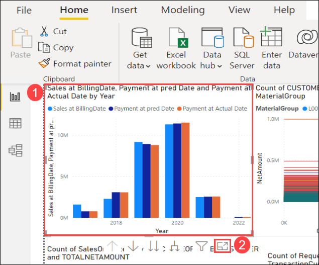

# Exercise 4: Integrate Azure Machine Learning and PowerBI

In this exercise, you will be reviewing the integrated data visualization of Azure Machine Learning Model within PowerBI.

### Task 1: Review the integrated data visualization of Azure Machine Learning Model within PowerBI

1. In the **File Explorer**, navigate to `C:\PowerBI Reports` directory **(1)**. Double-click on **SalesOrderPayments** **(2)** file to open the Power BI Report.

   
   
2. You can start reviewing the visualization from the report canvas of Power BI. Select the visualization of **Sales and Payment Forecast report** **(1)** and click on **Focus mode** **(2)**.

   
   
3. Review the **Sales and Payment Forecast report** visualization. Once you finished reviewing the visualization, click on **Back to report** at the left-top of the Focus mode to navigate back to report canvas.

   > **Info**: This graph represents the relationship of Date, Payment at Actual Date, Payment at pred Date and Sales at BillingDate of Date data.

   
   
4. Select the visualization of **Sales Per CustomerGroup, MaterialGroup and NetAmount** **(1)** and click on **Focus mode** **(2)**.

   
   
5. Review the **Sales Per CustomerGroup, MaterialGroup and NetAmount** visualization. Once you finished reviewing the visualization, click on **Back to report** at the left-top of the Focus mode to navigate back to report canvas.

   > **Info**: This graph represents the relationship of CustomerGroup, MaterialGroup and NetAmount of SalesOrderHeaders and SalesOrderItems data.

   
   
6. Select the visualization of **Payments per SalesOrder by CustomerName** **(1)** and click on **Focus mode** **(2)**.

   
   
7. Review the **Payments per SalesOrder by CustomerName** visualization. Once you finished reviewing the visualization, click on **Back to report** at the left-top of the Focus mode to navigate back to report canvas.

   > **Info**: This graph represents the relationship of SalesOrder and CustomerName of SalesOrderItems and Payments data.

      
   
8.    
   
   
   
   
