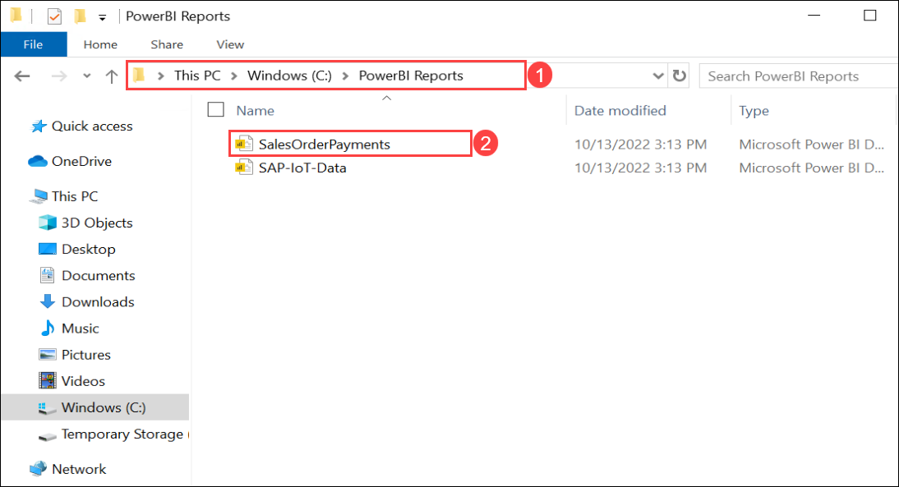
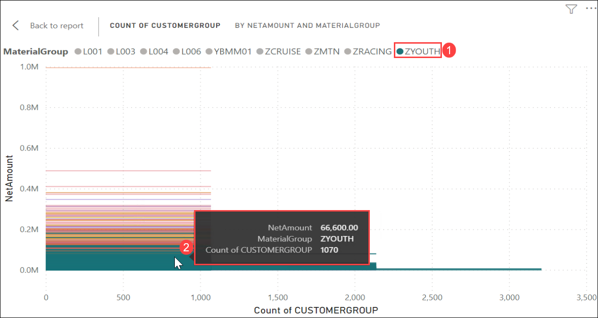
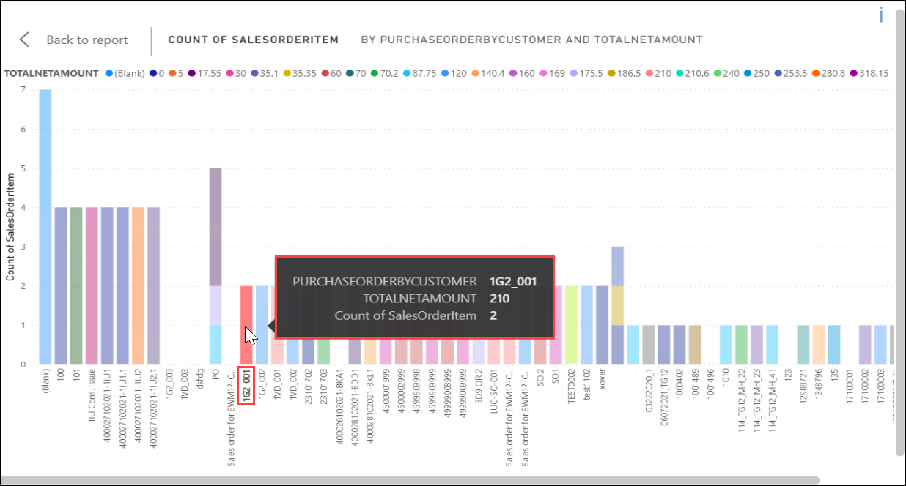

# Exercise 4: Integrate Azure Machine Learning and PowerBI

In this exercise, you will visualize the **Sales Orders Payments** data in the **PowerBI** application using the pre-built PowerBI reports.

### Task 1: Review the Tables, Sales, and Payment Forecast report

1. In the **File Explorer**, navigate to `C:\PowerBI Reports` directory **(1)**. Double-click on **SalesOrderPayments** **(2)** file to open the Power BI Report.

   
   
1. You can start reviewing the visualization from the report canvas of Power BI. Select the  **Sales and Payment Forecast report** **(1)** tile and click on **Focus mode** **(2)**.

   

1. Take a look at the **Sales and Payment Forecast report** by **Year**. Select the Year **2022** **(1)** and review the **Sales at BillingDate** **(2)** by placing the cursor over it as shown in the below image.

   > **Info**: You can also review the **Payments at Prediction Date** and **Payments at Actual Date** by placing the cursor over it for various years by selecting the appropriate **Year**.

   

1. Once you finished reviewing the visualization, click on **Back to report** that is present at the top-left corner of the Focus mode to navigate back to the report canvas.

   > **Info**: This graph represents the relationship of Date, Payment at the Actual Date, Payment at pred Date, and Sales at BillingDate of Date data.

   
   
1. Select the **Sales Per CustomerGroup, MaterialGroup and NetAmount** **(1)** tile and click on **Focus mode** **(2)**.

   

1. Take a look at the **Sales Per CustomerGroup, MaterialGroup, and NetAmount** by **Year** for the various **MaterialGroups**. Select the **ZYOUTH** **(1)** and review the **NetAmount and Count of CustomerGroup** **(2)**.

   > **Info**: You can also review the **NetAmount and Count of CustomerGroup** for various **MaterialGroups** by selecting the appropriate **MaterialGroup**.

   

1. Once you finished reviewing the visualization, click on **Back to report** that is present at the top-left corner of the Focus mode to navigate back to the report canvas.

   > **Info**: This graph represents the relationship of CustomerGroup, MaterialGroup, and NetAmount of SalesOrderHeaders and SalesOrderItems data.
   
1. Select the **Payments per SalesOrder by CustomerName** **(1)**  tile and click on **Focus mode** **(2)**.

   

1. Take a look at the **Payments per SalesOrder** by **CustomerName**  for the various Customers. Select the **CostClub** CustomerName and review the **Count of SalesOrder**.

   > **Info**: You can also review the **Count of SalesOrder** for various **Customers** by selecting the appropriate **CustomerName**.

   

1. Once you finished reviewing the visualization, click on **Back to report** that is present at the top-left corner of the Focus mode to navigate back to the report canvas.

   > **Info**: This graph represents the relationship of SalesOrder and CustomerName of SalesOrderItems and Payments data.
   
1. Select the **Sales per SalesOrderItem by PurchaseOrderbyCustomer** **(1)** tile and click on **Focus mode** **(2)**.

   

1. Take a look at the **Sales per SalesOrderItem** by **PurchaseOrderbyCustomer** for the various **Purchases**. Select the **IG2_001** **(1)** and review the **TotalNetAmount and Count of SalesOrderItem** **(2)**.

   > **Info**: You can also review the **TotalNetAmount and Count of SalesOrderItem** for various **Purchases** by selecting the appropriate
**PurchaseOrderbyCustomer**.

   

1. Once you finished reviewing the visualization, click on **Back to report** that is present at the top-left corner of the Focus mode to navigate back to the report canvas.

   > **Info**: This graph represents the relationship of SalesOrderItem, NetAmount, and PurchaseOrderbyCustomer of SalesOrderHeaders and SalesOrderItems data.
   
1. Select the **Sales per RequestedDeliveryDate by IoTData** **(1)** tile and click on **Focus mode** **(2)**.

    

1. Take a look at the **Sales per RequestedDeliveryDate** by **IoTData** for the Count of **RequestedDeliveryDate** and **TransactinCurrency**. Select the **Count of RequestedDeliveryDate** and review the **connectionAuthMethod** **(1)**.

   > **Info**: You can also review the Count of **RequestedDeliveryDate** and **TransactinCurrency** for reviewing the **connectionAuthMethod** by selecting the appropriate **connectionAuthMethod**.

   

1. Once you finished reviewing the visualization, click on **Back to report** that is present at the top-left corner of the Focus mode to navigate back to the report canvas.

    > **Info**: This graph represents the relationship of RequestedDeliveryDate and connectionAuthMethod of SalesOrderItems and IoTData data.
   
1. Select the **Sales per CITYNAME by IoTData** **(1)** tile and click on **Focus mode** **(2)**.

    

1. Take a look at the **Sales per CITYNAME** by **IoTData** for the Count of **temperatureAlert**. Select the **CITYNAME** **(1)** and review the **Count of temperatureAlert** **(2)**.

   > **Info**: You can also review the **Count of temperatureAlert** for different **CITY** by selecting the appropriate **CITYNAME**.

   

1. Once you finished reviewing the visualization, click on **Back to report** that is present at the top-left corner of the Focus mode to navigate back to the report canvas.

    > **Info**: This graph represents the relationship of CITYNAME and temperatureAlert of SalesOrderHeaders and IoTData data.

    

## Summary

In this exercise, you have visualized the pre-built the PowerBI reports in **PowerBI application** that are built against the **Sales Orders Payments** data.
