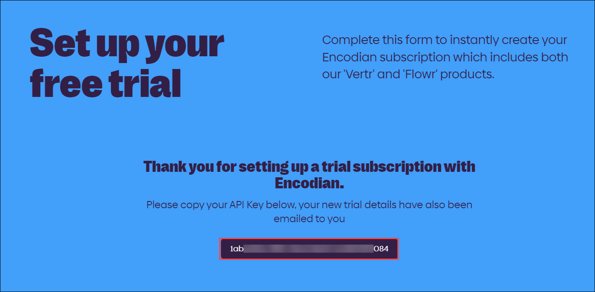
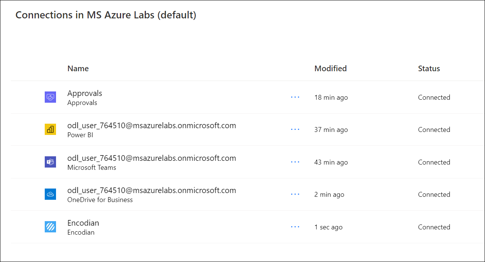
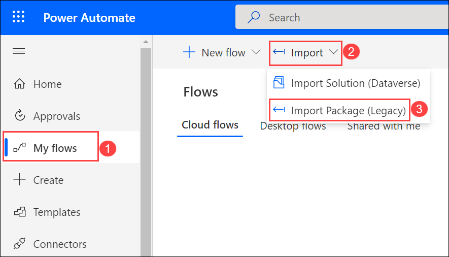
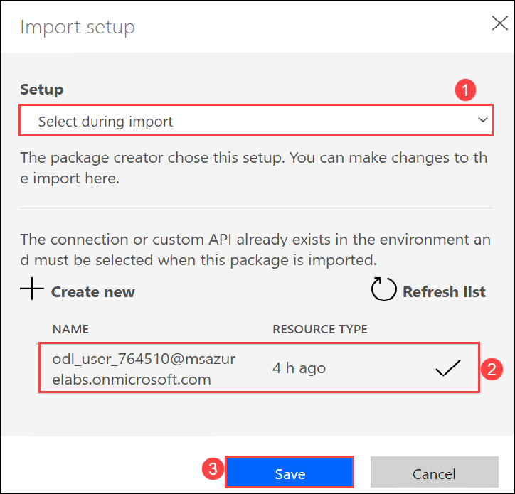
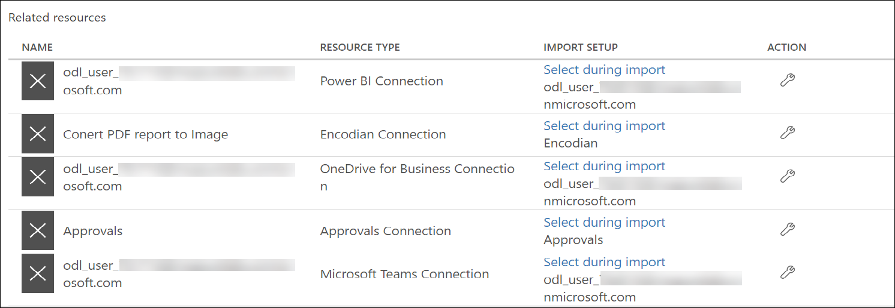
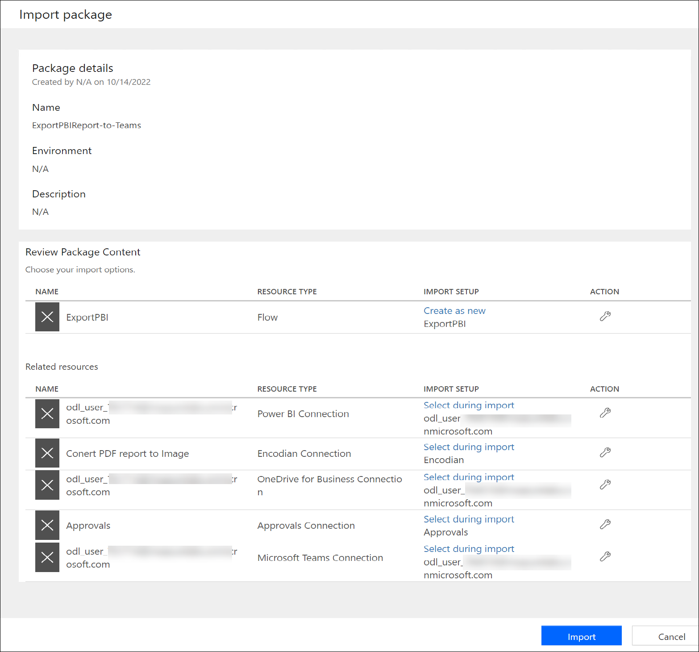

# Exercise 6: Create a workflow to export the PowerBI Sales report and Share it to Teams

## Overview

Power Automate is a tool that helps users create workflows between desired applications to synchronize files, get notifications, and collect data. This intelligent cloud-based solution uses triggers and actions to create chain reactions within a workflow so that repetitive, manual, and time-consuming tasks are accomplished without human intervention.

> You can find complete information about Power Automate here: `https://docs.microsoft.com/en-us/power-automate/`.

### Task 1: Create Connections in Power Automate

Power Automate uses connections to make it easy for you to access your data while building flows. Power Automate includes commonly used connections, including SharePoint, SQL Server, Power BI, Microsoft 365, OneDrive for Business, Approvals, Encodian, Salesforce, Excel, Teams, Dropbox, Twitter, and more.

In this task, you will create connections in Power Automate and use them in the next task while building workflow.

1. Open a new browser tab and navigate to the below URL to open the Power Automate Portal.

   ```
   https://flow.microsoft.com/en-us/
   ```
   
1. Now, select the **Sign in** option from the right-top to sign in to the Power Automate Portal.

   
   
1. On the **Welcome to Power Automate** window, choose your **Country/Region** and click on **Get Started** to agree with the terms and conditions.

   

1. Select **Data (1)** from the left-hand side menu and click on **Connections (2)** from the dropdown list.

   

1. You will be presented with the Connections page, click on **+New connection** to create a connection.

   

1. Now, type **Power BI** **(1)** in the search bar available at the top right corner and select **Power BI** **(2)**.

   

1. On the **Power BI** pop-up, click on **Create** and use the below credentials to complete the **Sign-in** process and create the connection.

      * Email/Username: <inject key="AzureAdUserEmail"></inject>
      * Password: <inject key="AzureAdUserPassword"></inject>

   

1. Repeat the steps from 5 to 7 to add **New connection** for the following:

   - One Drive for busniess
   - Approvals
   - Microsoft Teams

1. Open a new browser tab and navigate to the below URL to open Encodian.

   ```
   https://www.encodian.com/apikey
   ```
   
1. Enter your own details for the ask as shown in the below sreenshot then click on **Submit** to get an Encodian API Key.

   
   
1. Once you click on **Submit**, you can see the API Key as shown in the below screenshot. Copy the API Key and save it for creating a Encodian connection.

   
   
1. Navigate back to **Microsoft Power Automate** tab and click on **+ New connection** to create a connection.

   
   
1. Now, type **Encodian** **(1)** in the search bar available at the top right corner and select **Encodian** **(2)**.

   

1. On the **Encodian** pop-up, enter the **API Key** which you have copied in the previous steps and then click on **Create**.

   
   
1. Verify all the five connections which you have added as shown in the below screenshot.

    
   
### Task 2: Import the workflow in Power Automate

1. Select **My Flows (1)** from the left-hand side menu, click on **Import (2)** and click on **Import Package(Legacy)** **(3)**.

   
   
2. On the **Import package** blade, click on **Upload** to choose the package file to import.

   
   
3. In the Virtual Machine, navigate to this path **C:\LabFiles** **(1)** and select the **ExportPBIReport-to-Teams_20221014121145.zip** **(2)** file and click on **Open** **(3)** to select the file.

   
   
4. Once the zip file is uploaded, you will be presented with the below page that provides information about the package and its related resources.

   
   
5. Now, select **Update** that is next to **ExportPBI** flow under **Review Package Content** to import the flow.

   
   
6. On the **Import setup** blade, enter the following information.

      1. **Setup**: Select **Create as new (1)** from the dropdown.
      2. **Resource name (2)**: Enter `ExportPBI`
      3. Click on **Save (3)**

   
   
7. Then, click on **Select during import** that is next to **<inject key="AzureAdUserEmail"></inject>** under **Related resources** to select the Power BI Connection.

   
   
8. On the **Import setup** blade, select the **Select during import** **(1)** and select the **<inject key="AzureAdUserEmail"></inject>** resource **(2)** and click on **Save** **(3)**.

   
   
9. Repeat the steps from 7 to 8 for the other resources in Related resources. Once you are done with this, Related resources section should look as shown in the below screenshot.

   
   
10. After providing all the information, your screen will look like the below screenshot. Then click on **Import** to import the workflow.

    
    
11. Once the flow is imported, you will be presented with the below page. Click on **Open flow**.

       
   
       

   
   
