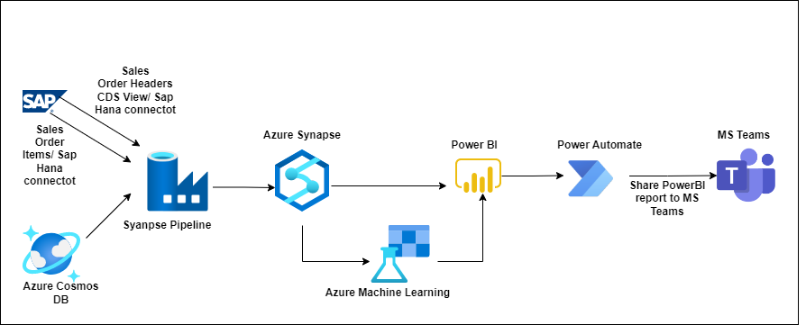

# Azure Virtual Workshop: SAP on Azure

## Overview

**Contoso Retail** processes and distributes food to supermarkets and other small-to-medium sized companies. Generous credit terms based on relationships instead of data analytics has put the company in financial difficulty. 

**Contoso** have challenges identifying customers payment behaviors and notifying customers when they are behind on invoice payments. The accounting department uses manual processes to identify delinquent accounts making the accounts receivable (AR) management time consuming. Also, lenders and have capped CFD’s line of credit and increased the interest rate until they can lower their AR balance and be able to predict near term future cash flow.

When customers buy goods, the corresponding payments are not completed immediately. Some customers will pay directly while other customers will pay at the end of their payment terms. This makes it difficult for Contoso to predict the incoming cashflow. 

To tackle this, Contoso wants to use Azure tooling to predict the incoming cashflow. To predict cash flow, historical Sales Orders and payments data is required. 

## Hands-on lab

In this hands-on lab, you will extract (historical) Sales Orders from SAP system and historical payments from a non-SAP system, in this case Cosmos DB using Azure Synapse Analytics pipelines. You will visualize the extracted Sales Orders and invoice data with Power BI. Next, you will unleash the power of data using Azure Machine Learning to train a model to predict incoming cash flow. You will learn to implement dashboards using Power BI and Power Automate. Finally, you will add the ability to share the Power BI reports to users in Teams channel based on the Approver's response status (Approve/Reject).

### Azure services and related products

- SAP HANA
- Power BI
- Power Automate
- Azure Machine Learning
- Azure Automated ML
- Azure Synapse Analytic

## Solution architecture
The solution architecture diagram displays as described below.

Sales Order information is stored in an **SAP system** and payments data is stored in Cosmos DB. Synapse Pipelines are used to ingest historical data from both sources. Power BI is used to visualize historical data and to create reports. Azure Machine Learning is used to create a model to predict incoming cash flow. Finally, a workflow will be triggered from Power Automate to share the Power BI erports to Teams Channel based on the Approver's response status (Approve/Reject).

 
