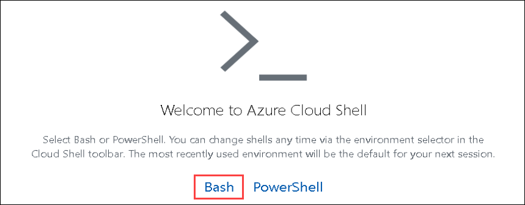
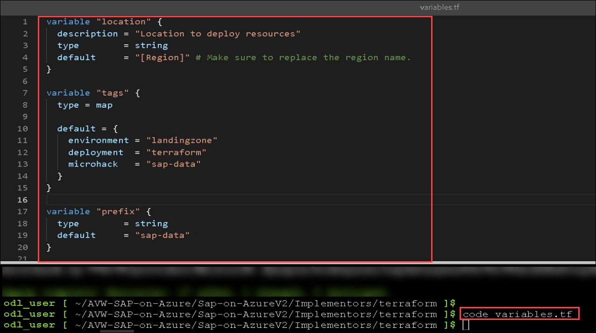
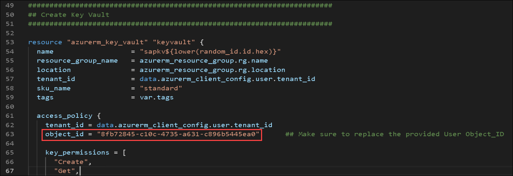

# Exercise 1: Deploying the Microhack environment with Terraform

In this Exercise, you will use Terraform to deploy the azure resources.

## Task 1: Getting started with Resource deployment using Terraform in Azure cloud shell

1. Open Azure Portal from the desktop by double-clicking on it.
    
   
   
2. On the **Sign in** tab, enter the following **Username** and, then click on **Next**. 

   * Email/Username: <inject key="AzureAdUserEmail"></inject>

   

3. Enter the following password and click on **Sign in**.

   * Password: <inject key="AzureAdUserPassword"></inject>

   

4. If you see the pop-up **Stay Signed in?**, click on No

5. If you see the pop-up **You have free Azure Advisor recommendations!**, close the window to continue the lab.

6. If a **Welcome to Microsoft Azure** popup window appears, click **Maybe Later** to skip the tour.

7. On the Home page of the Azure portal, open **Cloud shell** from the top menu bar.

   

8. In the Welcome to Azure Cloud Shell pane, click on **Bash**.

   

9. Click on Advanced settings and select the existing Resource group **aiw-sap-<inject key="DeploymentID" enableCopy="false"/>**. Create a new Storage account with the name **sapstorage<inject key="DeploymentID" enableCopy="false"/>** and create a File share with the name **blob**. Click on **Create storage**.

   

10. Run the below command to view the subscription you are using for Microhack deployment.

    ```bash
    az account show
    ```
    
    
    
11. Run the below command to clone the GitHub repository with the Terraform scripts.

    ```bash
    git clone -b prod https://github.com/CloudLabsAI-Azure/AVW-SAP-on-Azure
    ```
    
    
    
12. Change Directory into the terraform folder by running the below mentioned command.

    ```bash
    cd AVW-SAP-on-Azure/Sap-on-AzureV2/Implementors/terraform
    ```
    
13. You need to Check the default values defined in variables.tf, by running the below mentioned command.

    ```bash
    code variables.tf
    ```
    
        

14. You need to update the variable location default value with "**<inject key="Region" />**" region.

    
    
15. After updating the default value for location , move the cursor to the top right corner to get **More** **(1)** options menu and select **Save** **(2)**.

    
    
16. To close the code editor window, move the cursor to the top right corner to get **More** **(1)** options menu and select **Close Editor** **(2)**.

        

17. You need to update the **Deployment_ID** and **User Object_ID** in the ```main.tf``` file. Run the below mentined command to get into the code editor window.
    
    ```bash
    code main.tf
    ```
    
    
    
18. In the Create Resource Group part, make sure to replace the Deployment_ID in the resource group name as **microhack-rg-<inject key="DeploymentID" />**.

    
        
19. Scroll-down to Assign Storage role to user part and make sure to replace the User Object_ID with "**<inject key="ObjectID" />**" in the principal_id.

    
    
20. Scroll-down to Create Key Vault part and make sure to replace the User Object_ID with "**<inject key="ObjectID" />**" in the object_id.

    
    
21. After updating the Deployment_ID and User Object_ID, move the cursor to the top right corner to get **More** **(1)** options menu and select **Save** **(2)**.

    
    
22. To close the code editor window, move the cursor to the top right corner to get **More** **(1)** options menu and select **Close Editor** **(2)**.

       

23. Run the below mentioned command to initialize a working directory containing Terraform configuration files.

    ```bash
    terraform init
    ```
    
    

24. Replace the Subscription ID with "**<inject key="Subscription ID" />**" and replace Deployment ID in the Resource group name with "**microhack-rg-<inject key="DeploymentID" />**" in the below command, then run the below command to import the resource group.

    > **Info**: You will be running below command to import the existing resource group for deploying the required resources.

    ```bash
    terraform import azurerm_resource_group.rg /subscriptions/{SUBSCRIPTION_ID}/resourceGroups/microhack-rg-{DEPLOYMENT_ID}
    ```
    
    
    
25. Run the below mentioned command to execute the actions proposed in a terraform deployment, and choose ```yes``` once prompted to deploy the script.

    ```bash
    terraform apply
    ```
  
    
    
26. Once the script execution is finished you will get output as shown in the below image.

    
    
27. Navigate to the **microhack-rg-<inject key="DeploymentID" enableCopy="false"/>** resource group and go through the resources deployed in the resource group.

    * In the Resource group you have **Synapse Workspace**, **Azure Machine Learning workspace**, **Storage Account**, **Azure Cosmos Database**, **Container Registry**, **Key Vault** and **Application Insights** deployed. 

     * **Synapse Workspace**: You will be using Synapse Workspace to run the SQL scripts and verify the data. You will also review the pre-deployed Linked services, Integration Datasets, and Pipelines. 

     * **Azure Machine Learning workspace**: You will be using the Machine Learning Workspace to review the pre-deployed Automated ML run and the Best Model. By entering the data in the endpoint's JSON editor, you can also test the machine learning model.

     * **Storage Account**: You will be using the Azure Data Lake Storage Gen2 Storage Account to store the Sales Order Headers, Sales Order Items, and Payments in the container and also you will store the IoT data generated by the IoT hub device in the container.

     * **Azure Cosmos Database**: You will be using the Cosmos Database to store the raw Payment data. After the Pipeline is successfully deployed, the Payment data will be transferred from Azure Data Lake Storage Gen2 Storage Account to Cosmos Database.

     * **Key Vault**: You will be using the Key Vault to store secrets and other sensitive information that is needed by the Azure Machine Learning workspace.

     * **Application Insights**: You will be using the Application Insights to store monitoring information about the deployed models in the Azure Machine Learning workspace.

    
    
## Summary

In this exercise, you have completed resource deployment using terraform.
   
