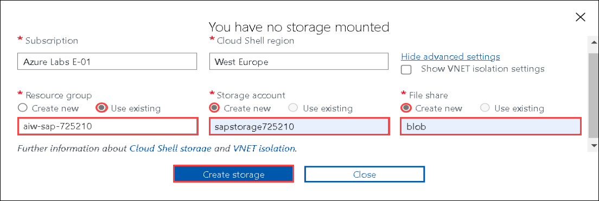
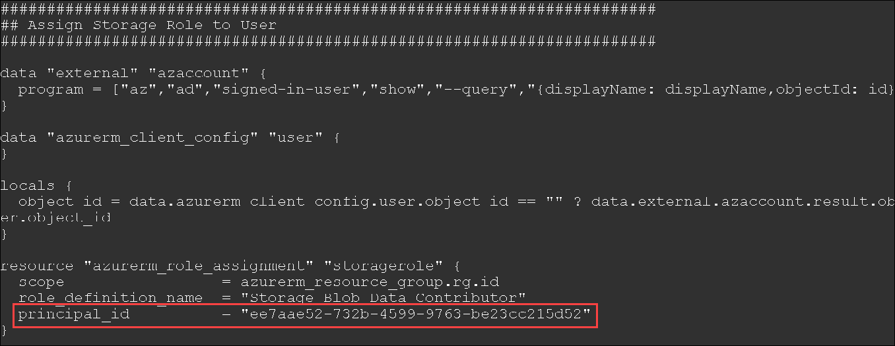
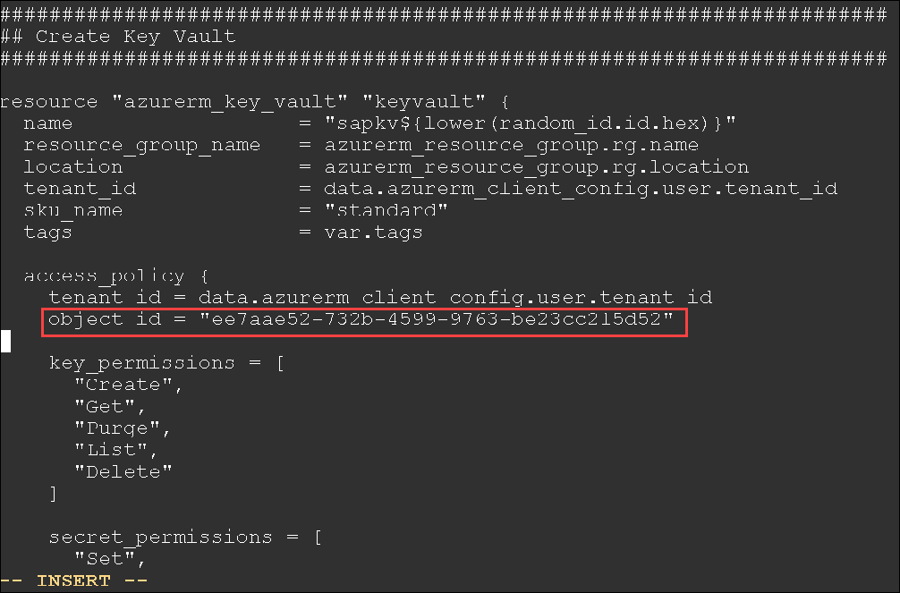
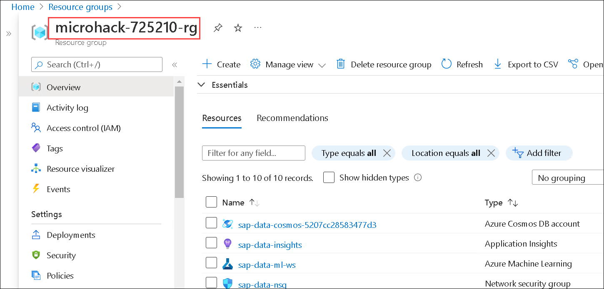

# Exercise 1: Deploying the Microhack environment with Terraform

In this Exercise, you are using Terraform to deploy the azure resources.

## Task 1: Getting started with Terraform deployment in Azure cloud shell

1. Open Azure Portal from the desktop by double-clicking on it.
    
   
   
2. On the **Sign into Microsoft Azure** tab, you will see the login screen, enter the following username, and, then click on **Next**.

   * Email/Username: <inject key="AzureAdUserEmail"></inject>

   

3. Now enter the following password and click on **Sign in**. 

   * Password: <inject key="AzureAdUserPassword"></inject>

   

4. If you see the pop-up **Stay Signed in?**, click on No

5. If you see the pop-up **You have free Azure Advisor recommendations!**, close the window to continue the lab.

6. If a **Welcome to Microsoft Azure** popup window appears, click **Maybe Later** to skip the tour.

7. From the Home page of the Azure portal, open **Cloud shell** from the top menu bar.

   

8. In the Welcome to Azure Cloud Shell pane, click on **Bash**.

   

9. Click on Advanced settings and select the existing Resource group **aiw-sap-DeploymentID**. Create a new Storage account with the name **sapstorageDeploymentID** and also create a File share with the name **blob**. Then click on **Create storage**.

   

10. Run the below command to view the subscription which you are using the Microhack deployment.

    ```bash
    az account show
    ```
    
    
    
11. Run the below command to clone the GitHub repository with the Terraform scripts.

    ```bash
    git clone -b prod https://github.com/CloudLabsAI-Azure/AVW-SAP-on-Azure
    ```
    
    
    
12. Change Directory into the terraform folder by running the below command.

    ```bash
    cd AVW-SAP-on-Azure/Sap-on-AzureV2/Implementors/terraform
    ```
    
13. Check the default values defined in variables.tf, you can do this by running the below given command. After reviewing, press **Ctrl + X** to exit from the editor window.

    ```bash
    nano variables.tf
    ```
    
    
    
14. You need to update the **Deployment_ID** and **User Object_ID** in the ```main.tf``` file. For that run the below command to get into the editor window and press ```i``` for Insert mode.

    ```bash
    vi main.tf
    ```
    
    
    
15. In the Create Resource Group part, make sure to replace the Deployment_ID in the name of the resource group as **microhack-<inject key="DeploymentID" enableCopy="false"/>-rg**.

    
        
16. Scroll-down to Assign Storage role to user part and make sure to replace the provided User Object_ID in the principal_id.

    
    
17. Scroll-down to Create Key Vault part and make sure to replace the provided User Object_ID in the object_id.

    
    
18. After updating the Deployment_ID and User Object_ID you need to press **Esc** to enter Command mode, and then type **:wq** to write and quit the file.

19. You need to need to run the below command to initialize a working directory containing Terraform configuration files.

    ```bash
    terraform init
    ```
    
    
    
20. Run terraform apply to execute the actions proposed in a terraform deployment, and choose ```yes``` once prompted to deploy the script.

    ```bash
    terraform apply
    ```
  
    
  
    
    
21. Once the script execution is finished you will get output as shown in the below image.

    
    
22. Navigate to the **microhack-<inject key="DeploymentID" enableCopy="false"/>-rg** resource group and go through the resources deployed in the resource group.

    
    
In this exercise, you have completed the resource deployment using terraform.
    
   
    
