# Exercise 2: Configure Synapse Workspace

## Overview

In this Exercise, you will be registering an integration runtime in Synapse Workspace. The Integration Runtime (IR) is the compute infrastructure used in Azure Synapse pipelines to provide the following data integration capabilities across different network environments:

* Data Flow: Execute a Data Flow in a managed Azure compute environment.
* Data movement: Copy data across data stores in a public or private networks (for both on-premises or virtual private networks). The service provides support for built-in connectors, format conversion, column mapping, and performant and scalable data transfer.

A self-hosted IR is capable of running copy activity between a cloud data stores and a data store in private network. Here, you will be using self-hosted integration runtime to support data stores that require bring-your-own driver, such as SAP Hana, MySQL, etc.

Each part of the solution is described here:

In order to ingest historical data from both sources, as previously stated, the solution uses Synapse Pipelines (SAP system and Azure Cosmos DB). Moreover, Synapse requires data integration services in order to connect to external data sources.

**Azure Synapse Workspace** is a cloud-based analytics service that combines big data and data warehousing. It provides users with tools to store and analyze large amounts of data and build data pipelines. Here are the components of Synapse Workspace:

1.	Synapse Studio: This is the main interface for Synapse Workspace. It provides unified experience for managing data, building pipelines, and creating visualizations.
2.	Apache Spark Pools: These are cloud-based Spark clusters that can be used for big data processing. They can be scaled up or down based on demand.
3.	SQL Pools: These are cloud-based data warehouses that can be used for storing and analyzing structured data. They can be scaled up or down based on demand.
4.	Data Flow: This is a data transformation service that can be used to build ETL (extract, transform, load) pipelines without writing code.
5.	Integration Runtimes: These are data integration services that can be used to connect to external data sources and move data to and from Synapse Workspace.

### Steps for setting up a Synapse Workspace environment:

1.	Create an Azure Synapse Workspace resource in the Azure portal.
2.	Once the resource is created, navigate to the Synapse Studio interface.
3.	Create an Apache Spark pool and/or SQL pool based on your data processing and storage needs.
4.	Create a Data Flow if you need to build ETL pipelines.
5.	Create an Integration Runtime if you need to connect to external data sources.
6.	Load data into your SQL pool or Spark pool using the Synapse Studio interface or other tools.
7.	Build data pipelines, create visualizations, and run analytics queries using the Synapse Studio interface.

> **Note**: There are many configuration options available for each component of Synapse Workspace, so it's important to carefully plan your environment based on your data needs and processing requirements. To learn more about Azure Synape refer: `https://learn.microsoft.com/en-us/azure/synapse-analytics/overview-what-is`.

## Task 1: Register Integration Runtime

1. Navigate to the **microhack-rg-<inject key="DeploymentID" enableCopy="false"/>** resource group and open Synapse workspace with the name **sapdatasynwsSUFFIX**.

   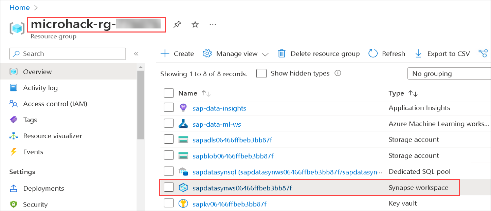
   
2. From the Overview pane of Synapse workspace, scroll-down to Getting started and click on **Open** to Open Synapse Studio.

   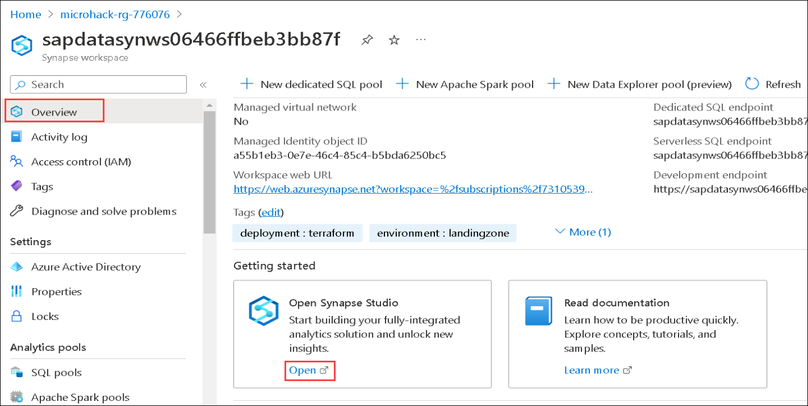

3. You will see that Synapse studio opened in the new tab. Click on **Manage** from the left-menu to register the integration runtime.

   
   
4. Under Integration, select **Integration runtimes** **(1)** and click on **+ New** **(2)**.

   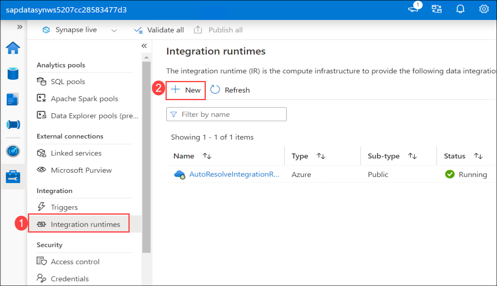
   
5. In the Integration runtime setup pane, choose **Azure, Self-Hosted** and click on **Continue**.

   
   
6. Choose **Self-Hosted** as the Network environment and click on **Continue**.

   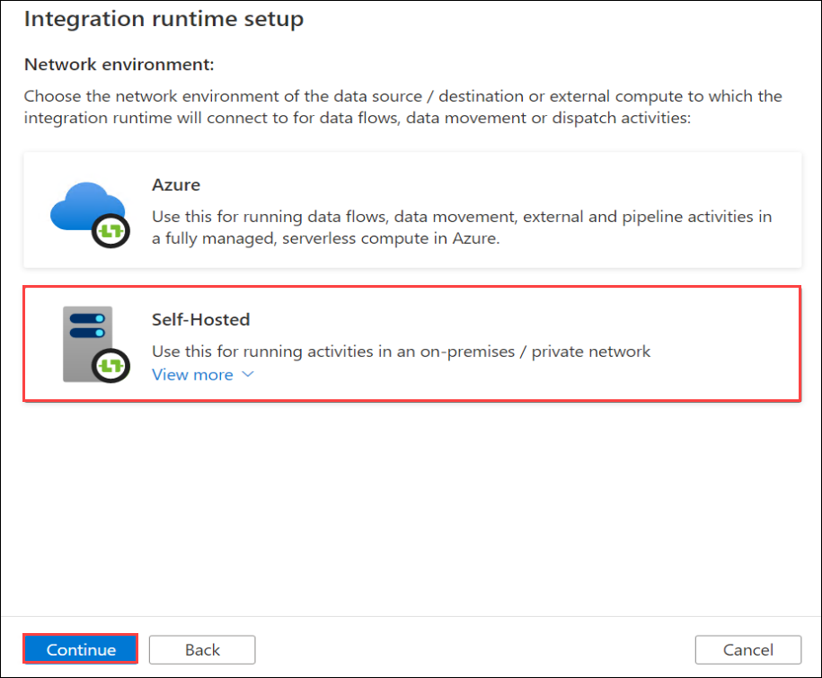
   
7. Enter the Name for integration runtime as **sap-intrun-<inject key="DeploymentID" enableCopy="false"/>** and click on **Create**.  

   
   
8. Once the integration runtime is created, Authentication keys under Option 2: Manual setup will appear. **Copy** **(1)** those keys to notepad, as you will need one of these keys in the next step.

   
   
9. In Option 2: Manual setup, download the integration runtime via Step 1. Click on **Download and install integration runtime**.

   
 
10. A new tab to Download Microsoft Integration Runtime will appear, scroll-down and click on **Download**.

    
    
11. Select the latest version of integration runtime and click on **Next**. You will see the download started.

    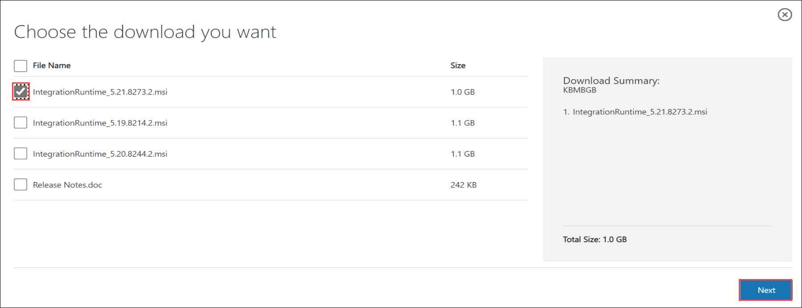
    
12. Once the downloading is complete, click on **Open file** of the downloaded integration runtime from Downloads.

    
    
13. In Welcome to the Microsoft Integration Runtime Setup Wizard pane, leave default English language selected and click on **Next**.

    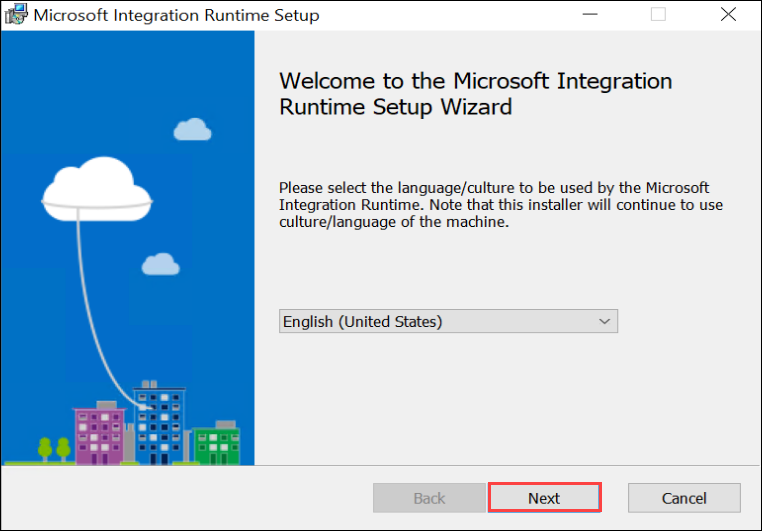

14. Check the box to accept the End-User license agreement and click on **Next**.

    
    
15. Leave default for the Destination Folder and click on **Next**.

    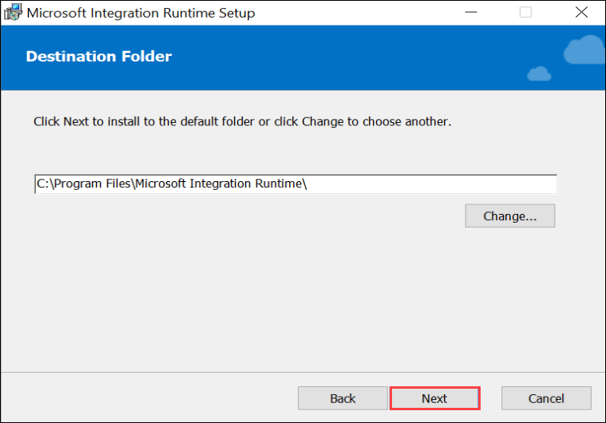
    
16. Click on **Install** in Ready to install Microsoft Integration Runtime. Installation will take around 5 minutes to complete.

    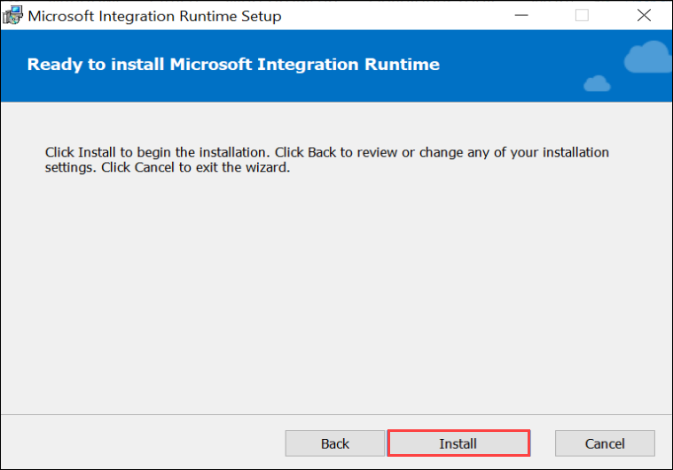
    
17. Once you click on **Finish**, you will see the Register Integration Runtime (Self-Hosted) pane. Enter **one of the keys** **(1)** you noted down earlier from the integration runtime setup and choose **Register** **(2)**.

    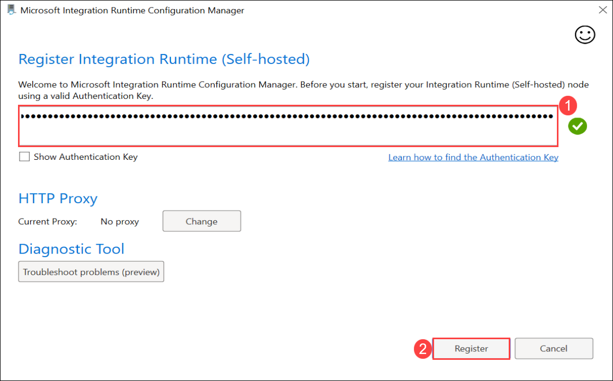
    
18. In the New Integration Runtime (Self-Hosted) Node pane, leave default and click on **Finish**. This can take a few minutes.

    
    
19. Once the Integration Runtime (Self-Hosted) node has been registered successfully, click on **Launch Configuration Manager**.

    
    
20. The Self-hosted node is connected to the cloud service.

    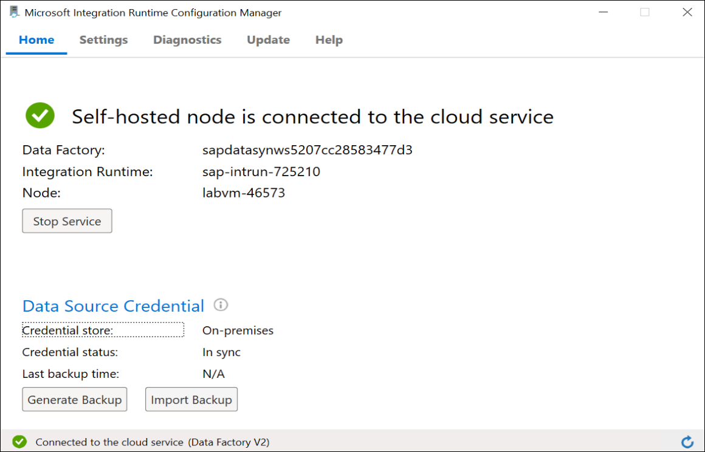

21. Navigate back to Synapse studio, click on **Close** in Integration runtime setup.

    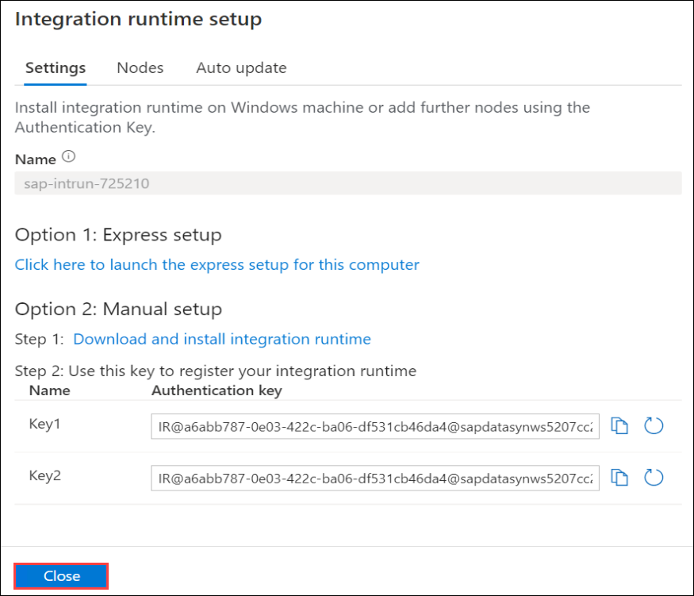
    
22. Click on **Refresh** to see the registered **sap-intrun-<inject key="DeploymentID" enableCopy="false"/>** self-hosted Integration runtime with status **Running**.

    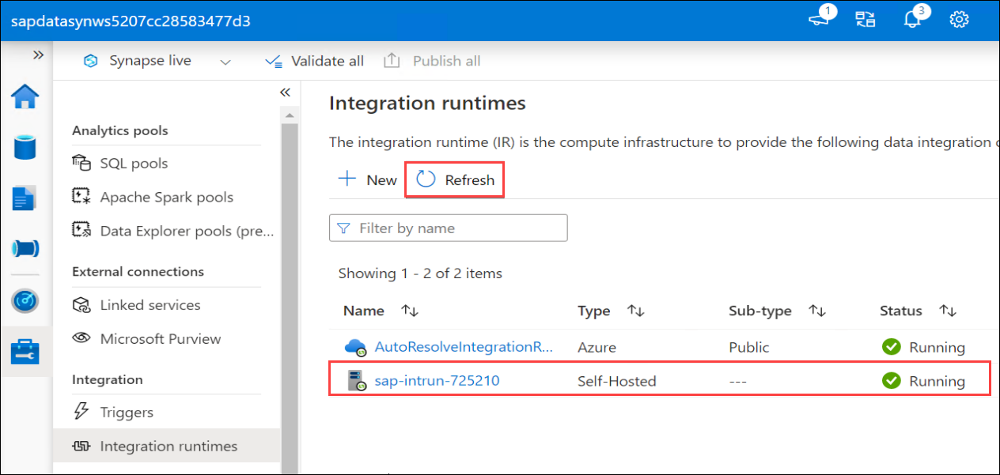     

## Summary

In this Exercise, you have registered and installed the Integration Runtime and the self-hosted node is connected. You can proceed with the next exercise. 
    
