# Exercise 4: Power BI Visualization

In this exercise you will be setting up the powerBI reports for the extracted data in the last exercise. You will be using [PowerBI Desktop](https://powerbi.microsoft.com/en-us/desktop/) for this.

### Task 1: Setup & Importing Data to Power BI

1. Navigate to the **microhack-<inject key="DeploymentID" enableCopy="false"/>-rg** resource group in the Azure portal and open the Synapse workspace named **sapdatasynwsSUFFIX** from the resources.

   
   
2. In the **Overview** of **sapdatasynwsSUFFIX** Synapse workspace, copy the **Dedicated SQL endpoint** and paste it in notepad for later use.

   
   
3. Open the **Power BI Desktop** application from the LabVM Desktop.

   
   
4. On the splash screen, select the **Get Data** item.

   
  
5. In the **Get data** pane, search for **Synapse** **(1)** and select **Azure Synapse Analytics (SQL DW)** **(2)**. Then click on **Connect** **(3)**.

   

6. On the SQL Server database dialog, enter the below values:

    | Field | Value |
    |-------|-------|
    | Server **(1)** | Enter the **Dedicated SQL endpoint** value recorded in the earlier steps. |
    | Database **(2)** | **sapdatasynsql** |
    | Data Connectivity mode **(3)** | Select **Import**. |
    
   After adding all the above values, click on **Ok** **(4)**.
   
   
   
7. An authentication dialog displays, select **Microsoft account** **(1)** from the left menu and then select the **Sign in** **(2)** button.

   
   
8. You will see the Sign in dialog apperas, enter the following username, and, then click on **Next**.

   * Email/Username: <inject key="AzureAdUserEmail"></inject>

   
   
9. Now enter the following password and click on **Sign in**. 

   * Password: <inject key="AzureAdUserPassword"></inject>

   
   
10. Once signed in, select the **Connect** button on the dialog.

    
    
11. On the Navigator dialog, **check the box** next to all three tables and then select the **Transform Data** button.

    
    
12. Once the data is transformed, you will be seeing the Power Query editor window as shown below:

    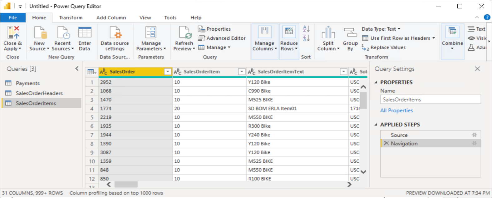

13. The columns in the tables representing sales order numbers were incorrectly interpreted as strings by Power BI. In the Power Query editor screen, select **SalesOrderItems** **(1)** from the Queries pane, then right-click on the **SalesOrder** **(2)** field and expand the **Change Type** **(3)** item and choose **Whole Number** **(4)**.

    
    
14. Repeat the previous step, this time changing the type of the following table columns to Whole Number.

    | Table (Queries pane) | Column |
    |-------|-------|
    | SalesOrderHeaders | SALESDOCUMENT |
    | Payments | SalesOrderNr |
    
    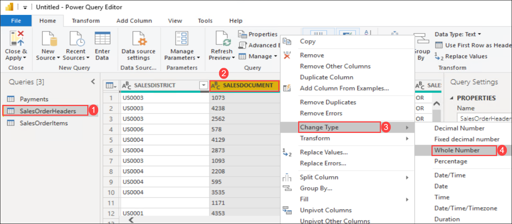
    
    
    
15. Select **Close & Apply** in the Power Query editor toolbar.

    
    
16. Once the data loading is completed, you will be able to see all the three tables under the Fields in Power BI Desktop application.

    
  
### Task 2: Create the relationship Model between the tables

1. From the left menu, select the **Model** item. This will switch to the Model view.

   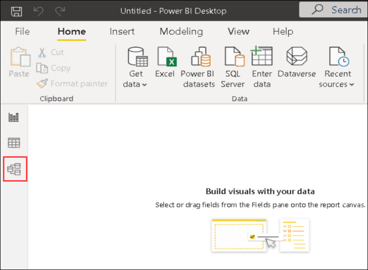
   
2. On the Model design canvas, drag the **SALESDOCUMENT** field from the **SalesOrderHeaders** table and drop it on the **SalesOrder** field of the **SalesOrderItems** table. This establishes a **one-to-many relationship ( 1 : * )** between the tables.  
   
   
   
3. Now you can look at the relationship details by double clicking on the connection link between **SalesOrderHeaders** and **SalesOrderItems** tables. After reviewing the relationship details, click **Ok** to close the Edit relationship dialog.

      
   
4. On the Model design canvas, drag the **SalesOrderNr** field from the **Payments** table and drop it on the **SALESDOCUMENT** field in the **SalesOrderHeaders** table. This establishes a **one-to-one relationship ( 1 : 1 )** between the tables.

   

5. Now you can look at the relationship details by double clicking on the connection link between **Payments** and **SalesOrderHeaders** tables. After reviewing the relationship details, click **Ok** to close the Edit relationship dialog.

   
   
### Task 3: Data Visualisation

1. To start the visualization, switch to the **Report** view.

   
   
- Sales per Date and CustomerGroup visualization
   
2. In the Visualizations pane, select **Stacked column chart** **(1)**. From the Fields pane, drag-and-drop the **SalesOrderHeaders.CREATIONDATE** **(2)** field to the **X-axis** box, the **SalesOrderHeaders.TOTALNETAMOUNT** **(3)** field to the **Y-axis** box and the **SalesOrderHeaders.CUSTOMERGROUP** **(4)** field to the **Legend** box.

   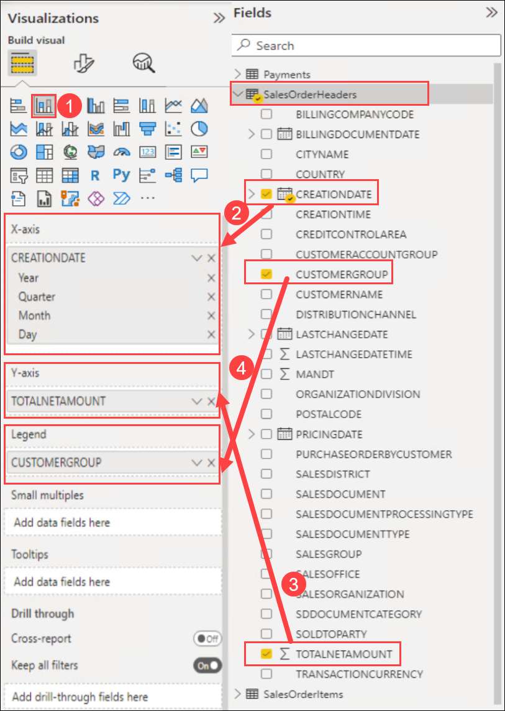
   
3. You can adjust the sizing of the chart on the report canvas as desired.

   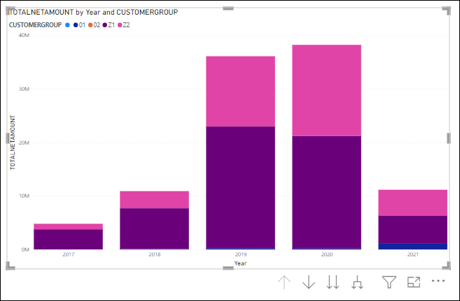
   
- Sales per Region and CustomerGroup visualization
   
4. In the Visualizations pane, select **Map** **(1)**. From the Fields pane, drag-and-drop the **SalesOrderHeaders.CITYNAME** **(2)** field to the **Location** box, the **SalesOrderHeaders.CUSTOMERGROUP** **(3)** field to the **Legend** box and the **SalesOrderHeaders.TOTALNETAMOUNT** **(4)** to the **Bubble size** box.

   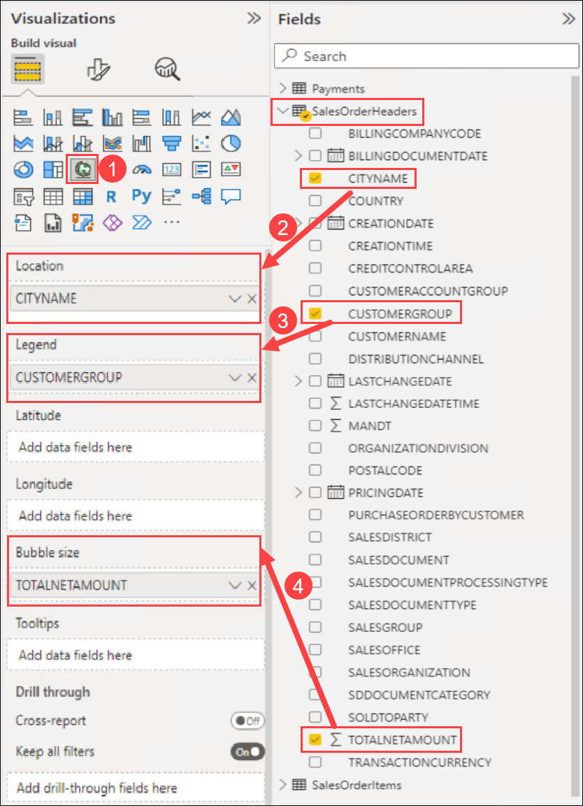
   
   > **Note**: Map visuals are disabled by default, access File -> Options and Settings -> Options -> Global - Security to enable. After updating Options in Power BI, you may need to close and reopen the report for the settings change to take effect.
    > 
   
5. Adjust the sizing and zoom of the map on the report canvas as desired.

   
   
6. You can select a Year and CustomerGroup in the Sales Report, the Map report will automatically update and only show this data.

   
   
- Payments per Date and CustomerGroup visualization

7. In the Visualizations pane, select **Stacked Column Chart** **(1)**. From the Fields pane, drag-and-drop the **Payments.PaymentDate** **(2)** field to the **X-axis** box, the **Payments.PaymentValue** **(3)** field to the **Y-axis** box and the **SalesOrderHeaders.CUSTOMERGROUP** **(4)** field to the **Legend** box.   
   
   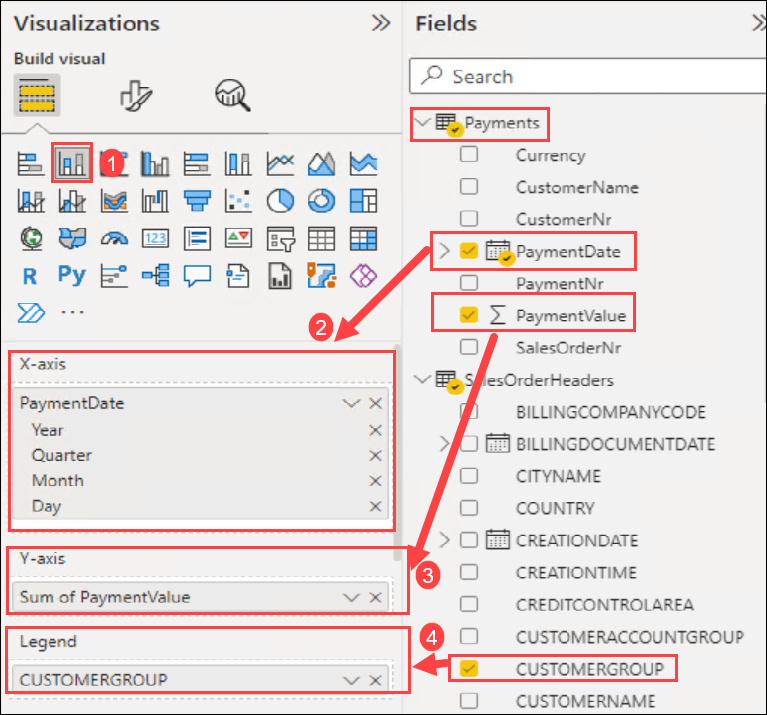
   
8. Adjust the sizing of the chart on the report canvas as desired.

   

- Sales Per CustomerGroup and MaterialGroup visualization

9. In the Visualizations pane, select **Stacked Bar Chart** **(1)**. From the Fields pane, drag-and-drop the **SalesOrderHeaders.CUSTOMERGROUP** **(2)** field to the **Y-axis** box, the **SalesOrderItems.NetAmount** **(3)** field to the **X-axis** box and the **SalesOrderItems.MaterialGroup** **(4)** field to the **Legend** box.

   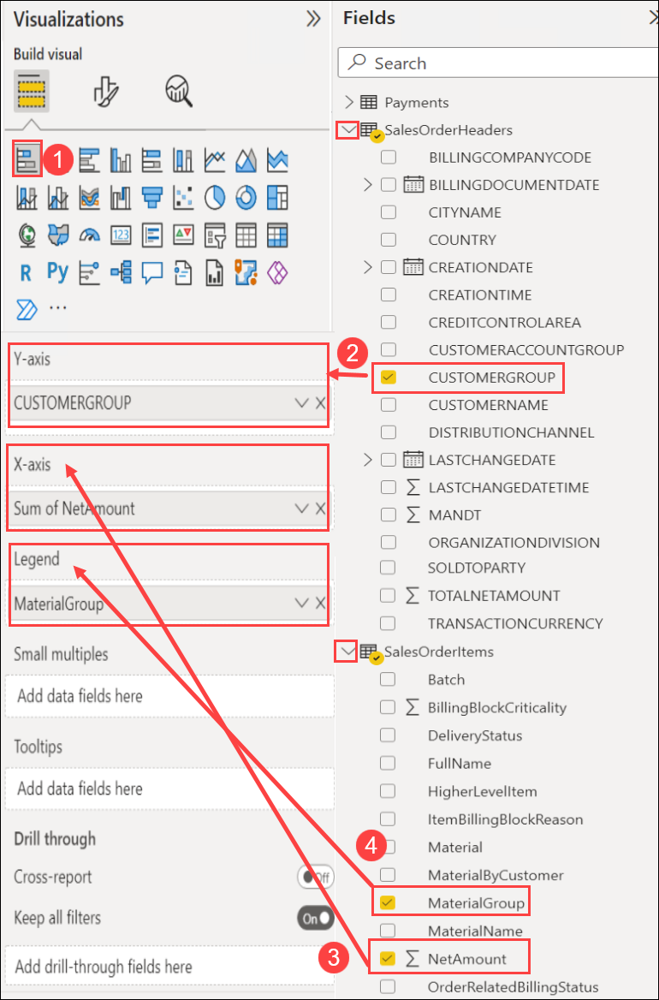
   
10. Adjust the sizing of the chart on the report canvas as desired.

    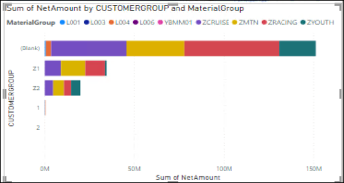

- Payment Offset per CustomerGroup visualization
  - This report shows the average number of days by which each customer group pays their SalesOrders. Afterwards, a comparison can be made with the outcome of the Machine Learning Model built in the next exercise. SalesOrderHeaders and the Payment data are combined to calculate the number of days between the billing date and the payment date.

11. In Power BI Desktop, on **Home** tab toolbar menu expand the **Transform data** item. Select **Transform data**.

    
    
12. In the Power Query Editor window, select the **SalesOrderHeaders** **(1)** table from the Queries pane, and expand the **Combine** **(2)** followed by expand **Merge Queries** **(3)** option on the Home toolbar menu. Select the **Merge Queries as New** **(4)** option.

    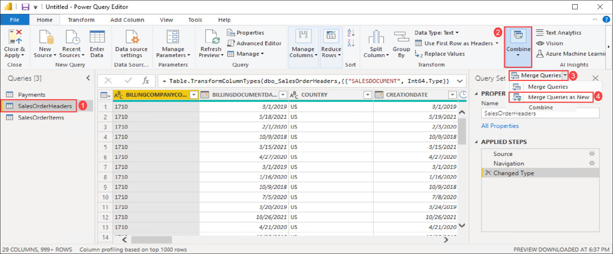
    
13. In the Merge window, select the **SALESDOCUMENT** **(1)** column of the SalesOrderHeaders table. Select the **Payments** **(2)** table as the second table, and select the **SalesOrderNr** **(3)** field. Select **Inner (only matching rows)** **(4)** as **Join Kind** and  select **OK** **(5)**.

    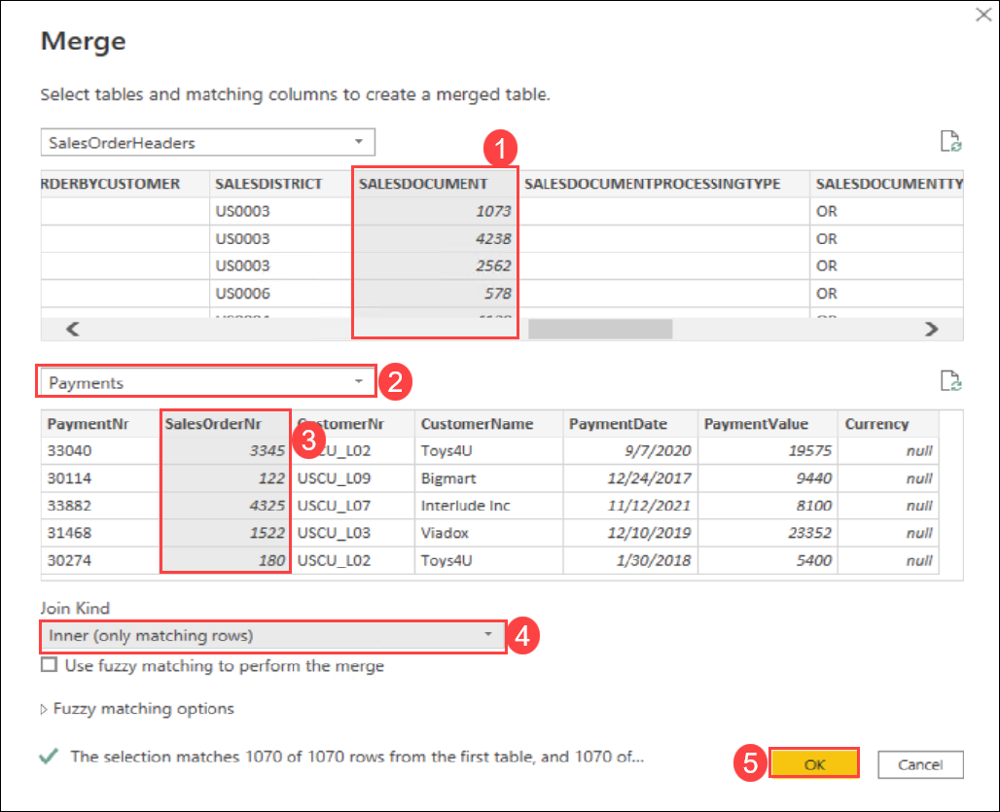    

14. Rename the Merge query by right-clicking the Merge query in the Queries pane, and selecting **Rename**. Name the merged query **SalesOrderPayments**.

15. With the **SalesOrderPayments** **(1)** query selected, scroll the table completely to the right. Expand the **Payments** **(2)** column menu, and choose to include the following **fields** **(3)**: **PaymentNr**, **PaymentDate**, **PaymentValue** and **Currency**. Make sure to **Uncheck** **(4)** for Use original column name as prefix and select **OK** **(5)**.

    
    
16. Select **Close & Apply** in the Power Query editor toolbar.

    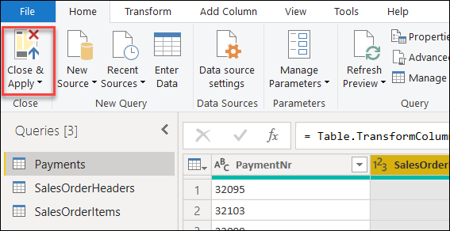
    
- Calculate Payment Offset visualization 

17. From the report designer on **Home** **(1)** tab toolbar menu, expand the **Transform data** **(2)** item. Select **Transform data** **(3)**.

       
   
18. In the Power Query Editor window, select the **SalesOrderPayments** **(1)** table from the Queries pane. A new column is required to calculate the difference between the billing date and the actual payment data. Select the **Add Column** **(2)** tab and select the **Custom Column** **(3)** button on the toolbar menu.

    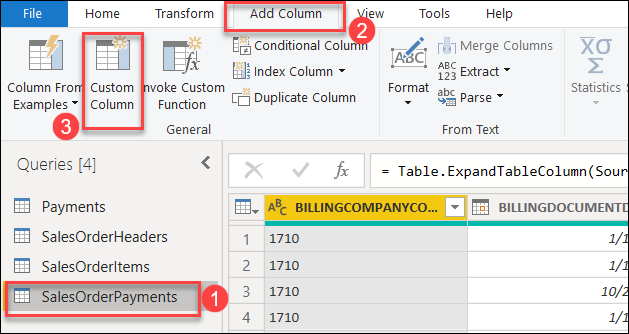
    
19. In the Custom Column window, enter `Offset` **(1)** for the New column name. In the Custom column formula field, enter the following formula **(2)**. Select **OK** **(3)**.

    ```vb
    Duration.Days([PaymentDate] - [BILLINGDOCUMENTDATE])
    ```
    
    
    
20. In the table, right-click on the newly created **Offset** **(1)** field and expand the **Change Type** **(2)** option. Select **WholeNumber** **(3)** to convert this column to integer.

    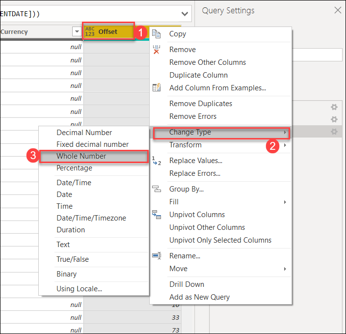
    
21. Return to the **Home** **(1)** tab and select **Close & Apply** **(2)** in the Power Query editor toolbar.

    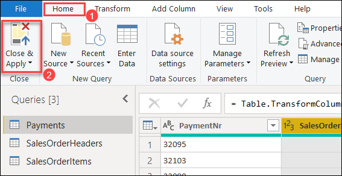
    
22. On the report canvas, add a **Stacked Column chart** **(1)**. Drag-and-drop the **SalesOrderPayments.CUSTOMERGROUP** **(2)** to the **X-axis** box and **SalesOrderPayments.Offset** **(3)** to the **Y-axis** box.

    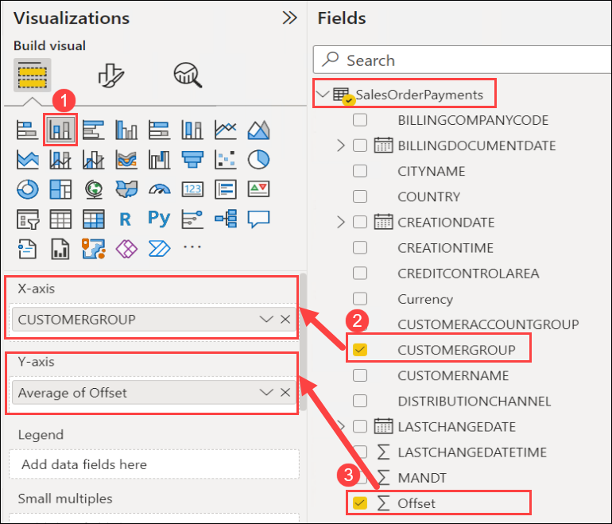

23. Expand the menu next to the **Offset column** and choose to report the **Average** **(4)**.

    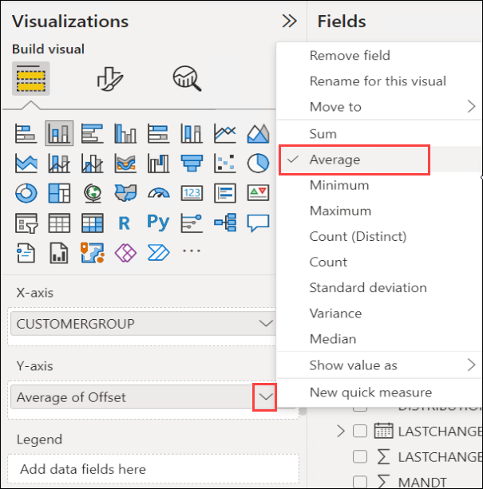
    
24. Adjust the sizing of the chart on the report canvas as desired.

    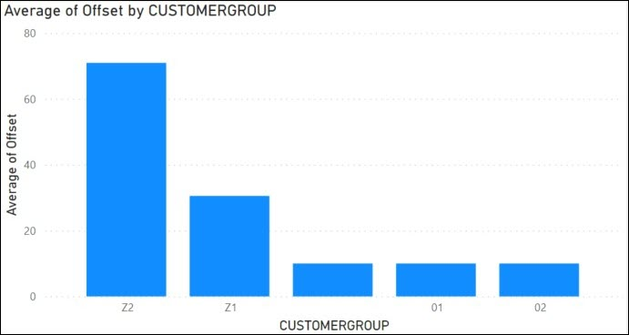
    
- Payment offset per customer group box plot visualization (Optional)
  - A box plot can provide a more detailed view of the payment offset by customer group data.
  
25. In the Visualizations pane, expand the ellipsis menu and select **Get more visuals**.

    
    
26. On the Power BI visuals window, search for **Box and Whisker** **(1)**. Then choose the **Box and Whisker chart** **(2)** by DataScenarios.

    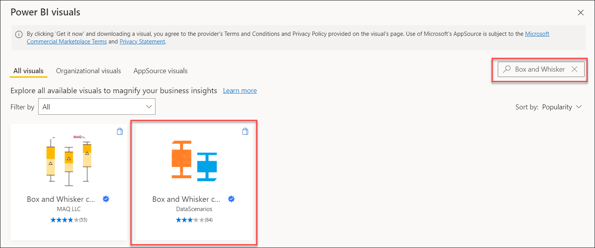
    
27. On the AppSource window, select the **Add** button to add the Box and Whisker chart.

    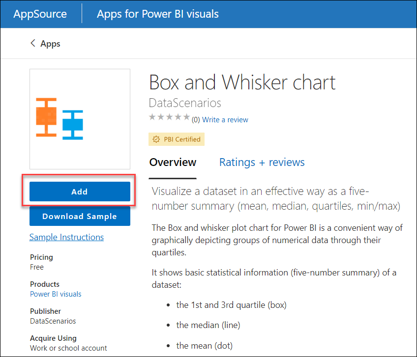
    
28. On the Visualizations pane, select the newly added **Box and Whisker chart** **(1)**. In the **Category** field, drag-and-drop the **SalesOrderPayments.CUSTOMERGROUP** **(2)**, **SalesOrderPayments.Offset** **(3)** into the **Sampling** field, and **SalesOrderPayments.Offset** **(4)** into the **Value** field.

    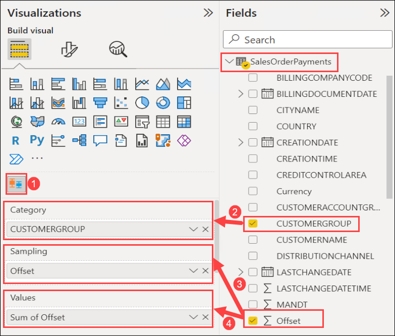 

29. Expand the menu in the **Value** field and select the **Average** option.

    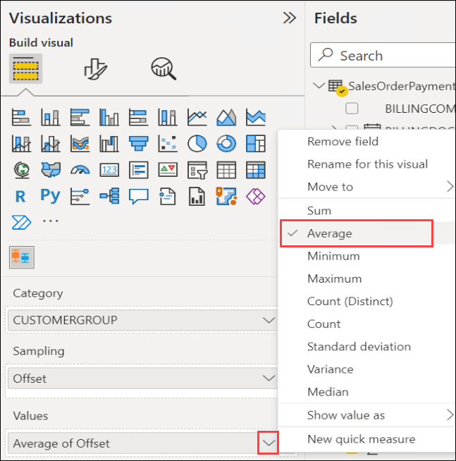
    
30. Adjust the sizing of the chart on the report canvas as desired.    
   
    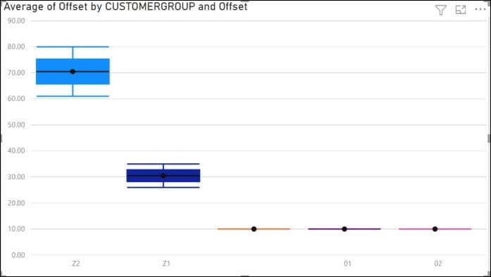

    From this diagram you can see that:
    * CustomerGroup1 pays within 70 days +/- 10 days
    * CustomerGroup2 pays within 30days +/- 5 days
    * Other customergroups pay after 10 days

>**Note**: Keep this report open in Power BI desktop for future exercises.
   
