# Exercise 4: Power BI Visualization

In this exercise you will be setting up the powerBI reports for the extracted data in the last exercise. You will be using [PowerBI Desktop](https://powerbi.microsoft.com/en-us/desktop/) for this.

### Task 1: Setup & Importing Data to Power BI

1. Navigate to the **microhack-<inject key="DeploymentID" enableCopy="false"/>-rg** resource group in the Azure portal and open the Synapse workspace named **sapdatasynwsSUFFIX** from the resources.

   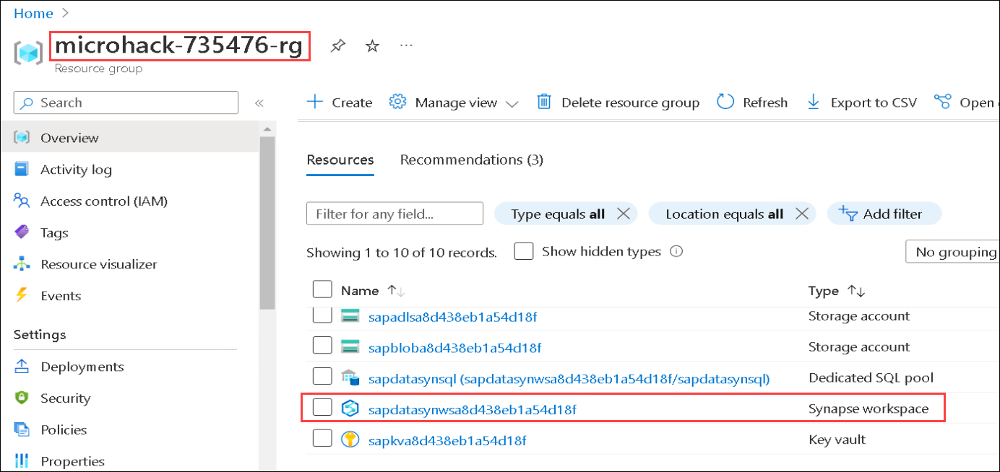
   
2. In the **Overview** of **sapdatasynwsSUFFIX** Synapse workspace, copy the **Dedicated SQL endpoint** and paste it in notepad for later use.

   
   
3. Open the **Power BI Desktop** application from the LabVM Desktop.

   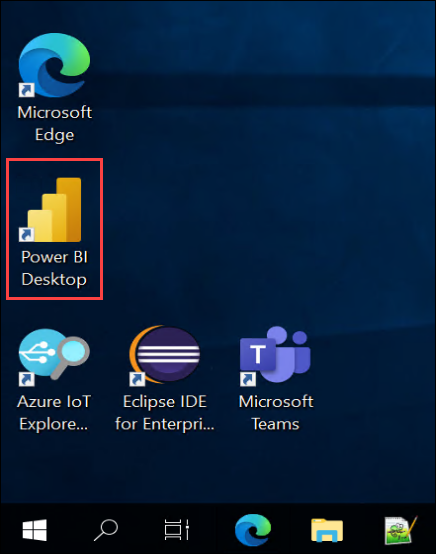
   
4. On the splash screen, select the **Get Data** item.

   
  
5. In the **Get data** pane, search for **Synapse** **(1)** and select **Azure Synapse Analytics (SQL DW)** **(2)**. Then click on **Connect** **(3)**.

   

6. On the SQL Server database dialog, enter the below values:

    | Field | Value |
    |-------|-------|
    | Server **(1)** | Enter the **Dedicated SQL endpoint** value recorded in the earlier steps. |
    | Database **(2)** | **sapdatasynsql** |
    | Data Connectivity mode **(3)** | Select **Import**. |
    
   After adding all the above values, click on **Ok** **(4)**.
   
   
   
7. An authentication dialog displays, select **Microsoft account** **(1)** from the left menu and then select the **Sign in** **(2)** button.

   
   
8. You will see the Sign in dialog apperas, enter the following username, and, then click on **Next**.

   * Email/Username: <inject key="AzureAdUserEmail"></inject>

   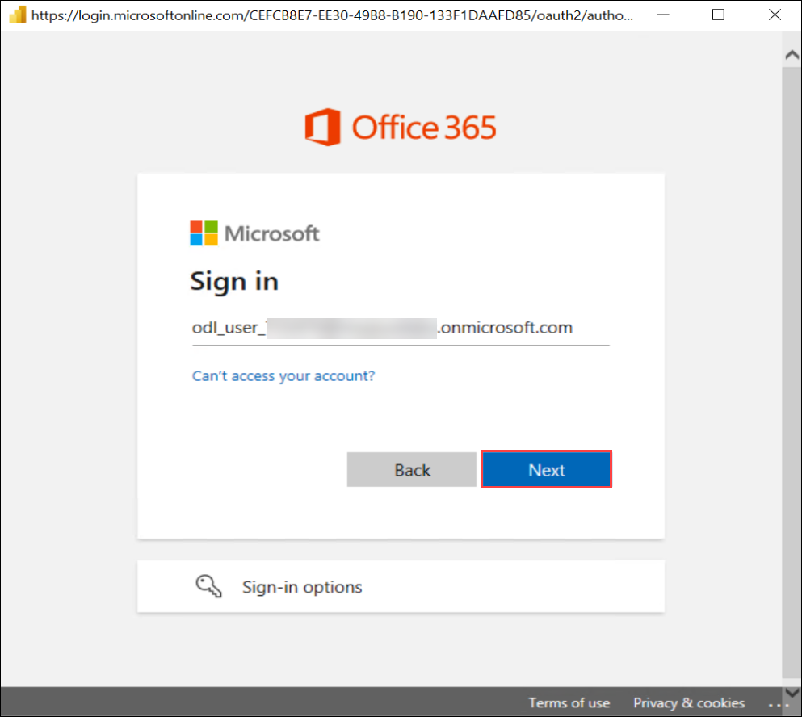
   
9. Now enter the following password and click on **Sign in**. 

   * Password: <inject key="AzureAdUserPassword"></inject>

   
   
10. Once signed in, select the **Connect** button on the dialog.

    
    
11. On the Navigator dialog, **check the box** next to all three tables and then select the **Transform Data** button.

    
    
12. Once the data is transformed, you will be seeing the Power Query editor window as shown below:

    

13. The columns in the tables representing sales order numbers were incorrectly interpreted as strings by Power BI. In the Power Query editor screen, select **SalesOrderItems** **(1)** from the Queries pane, then right-click on the **SalesOrder** **(2)** field and expand the **Change Type** **(3)** item and choose **Whole Number** **(4)**.

    
    
14. Repeat the previous step, this time changing the type of the following table columns to Whole Number.

    | Table (Queries pane) | Column |
    |-------|-------|
    | SalesOrderHeaders | SALESDOCUMENT |
    | Payments | SalesOrderNr |
    
    
    
    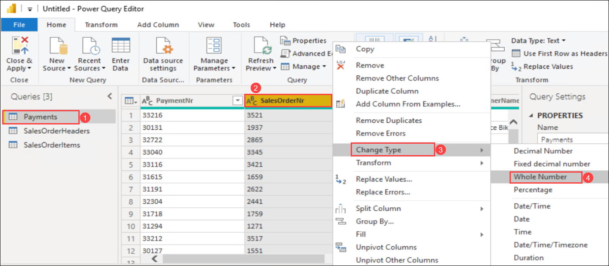
    
15. Select **Close & Apply** in the Power Query editor toolbar.

    
    
16. Once the data loading is completed, you will be able to see all the three tables under the Fields in Power BI Desktop application.

    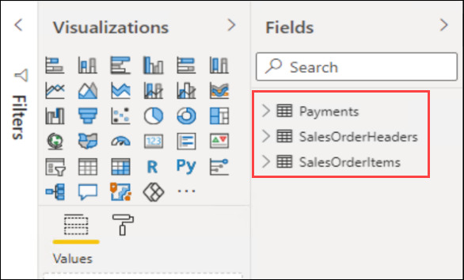
  
### Task 2: Create the relationship Model between the tables

1. From the left menu, select the **Model** item. This will switch to the Model view.

   
   
2. On the Model design canvas, drag the **SALESDOCUMENT** field from the **SalesOrderHeaders** table and drop it on the **SalesOrder** field of the **SalesOrderItems** table. This establishes a **one-to-many relationship ( 1 : * )** between the tables.  
   
   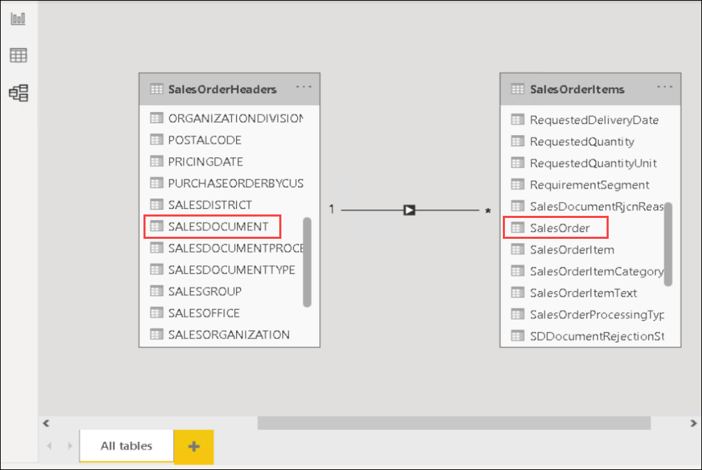
   
3. Now you can look at the relationship details by double clicking on the connection link between **SalesOrderHeaders** and **SalesOrderItems** tables. After reviewing the relationship details, click **Ok** to close the Edit relationship dialog.

   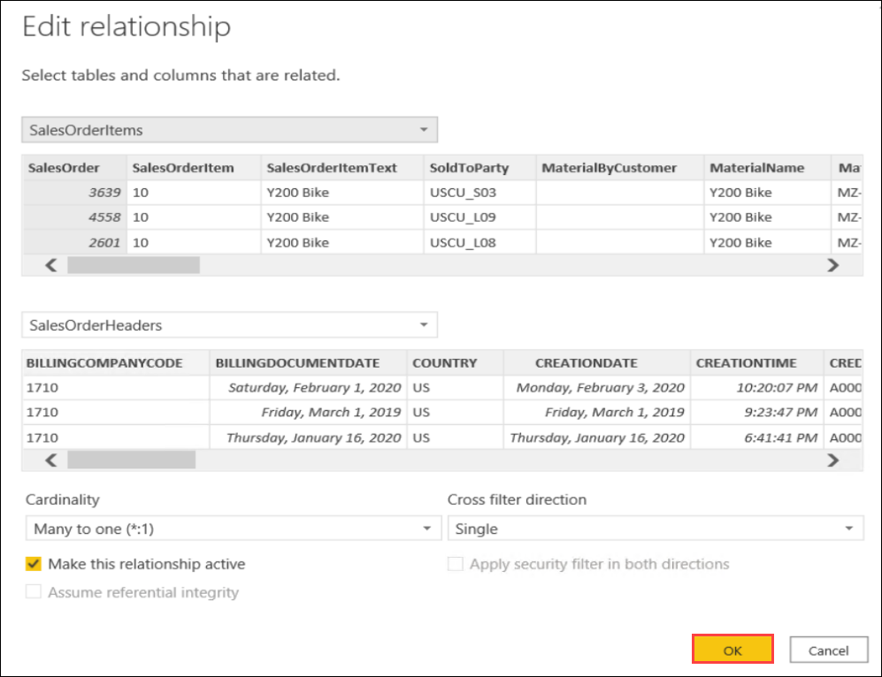   
   
4. On the Model design canvas, drag the **SalesOrderNr** field from the **Payments** table and drop it on the **SALESDOCUMENT** field in the **SalesOrderHeaders** table. This establishes a **one-to-one relationship ( 1 : 1 )** between the tables.

   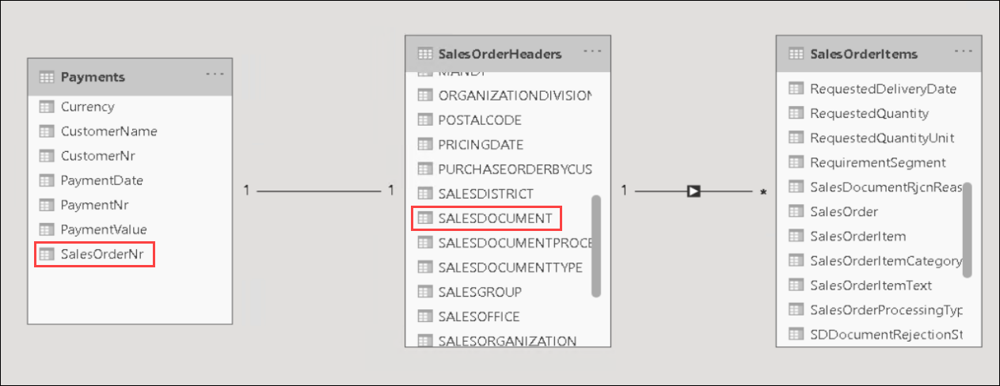

5. Now you can look at the relationship details by double clicking on the connection link between **Payments** and **SalesOrderHeaders** tables. After reviewing the relationship details, click **Ok** to close the Edit relationship dialog.

   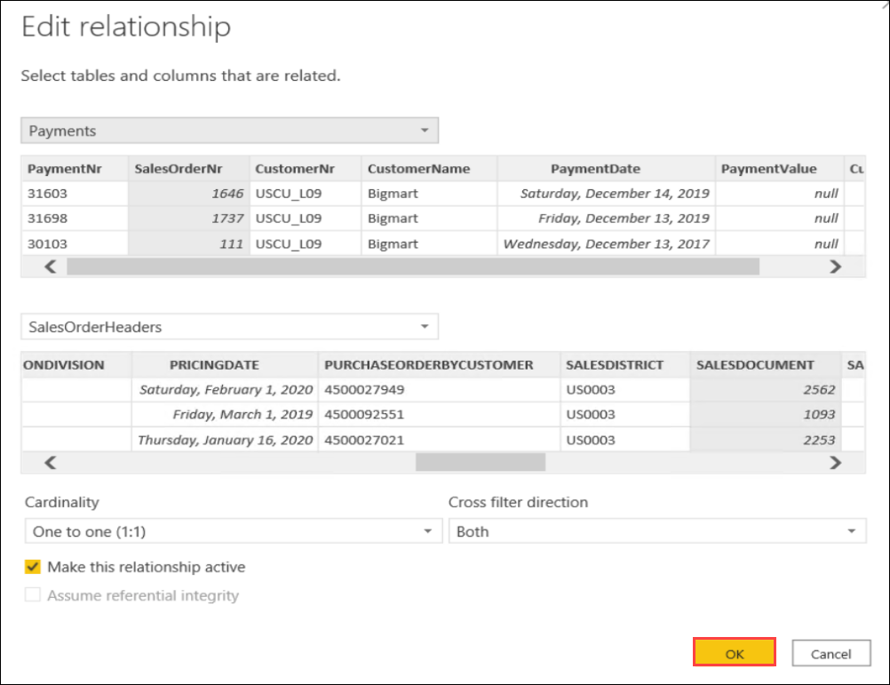
   
### Task 3: Data Visualisation

1. To start the visualization, switch to the **Report** view.

   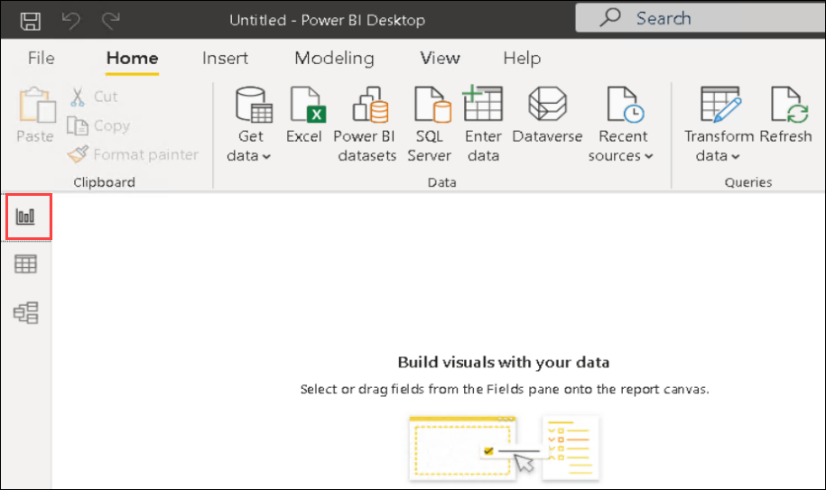
   
- Sales per Date and CustomerGroup visualization
   
2. In the Visualizations pane, select **Stacked column chart** **(1)**. From the Fields pane, drag-and-drop the **SalesOrderHeaders.CREATIONDATE** **(2)** field to the **Axis** box, the **SalesOrderHeaders.TOTALNETAMOUNT** **(3)** field to the **Values** box and the **SalesOrderHeaders.CUSTOMERGROUP** **(4)** field to the **Legend** box.

   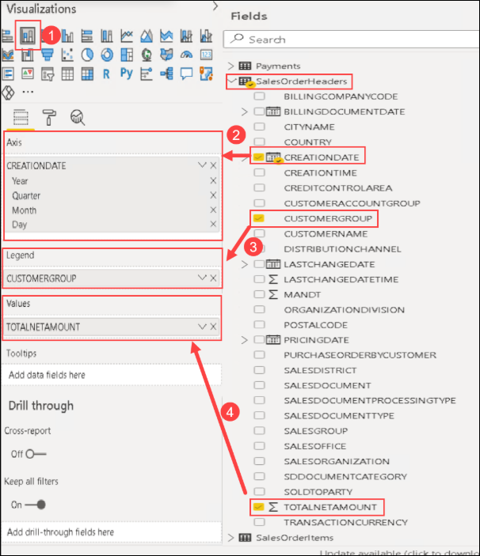
   
3. You can adjust the sizing of the chart on the report canvas as desired.

   
   
- Sales per Region and CustomerGroup visualization
   
4. In the Visualizations pane, select **Map** **(1)**. From the Fields pane, drag-and-drop the **SalesOrderHeaders.CITYNAME** **(2)** field to the **Location** box, the **SalesOrderHeaders.CUSTOMERGROUP** **(3)** field to the **Legend** box and the **SalesOrderHeaders.TOTALNETAMOUNT** **(4)** to the **Size** box.

   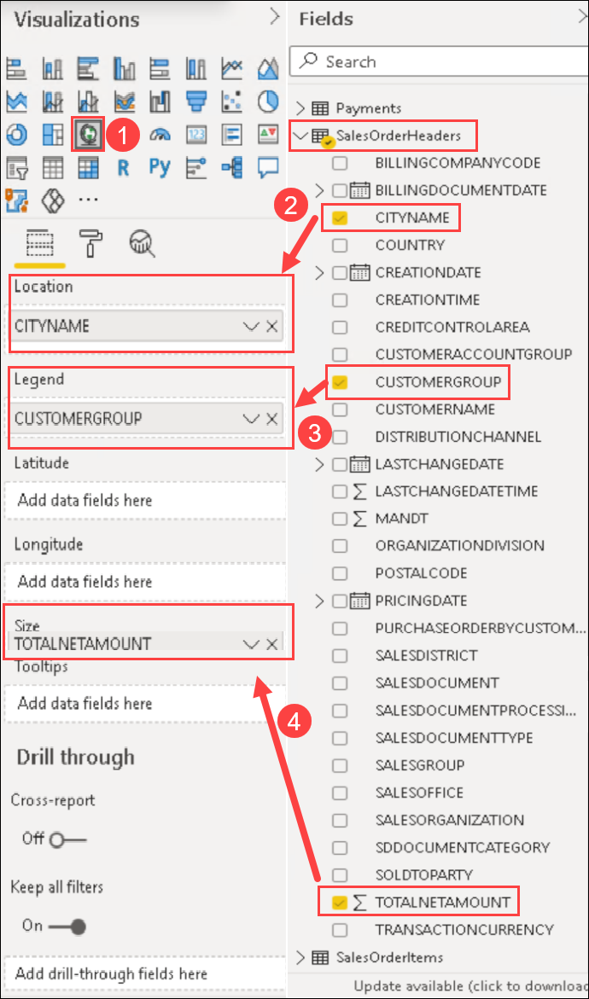
   
5. Adjust the sizing and zoom of the map on the report canvas as desired.

   
   
6. You can select a CustomerGroup and Quarter in the Sales Report, the Map report will automatically update and only show this data.

   
   
- Payments per Date and CustomerGroup visualization

7. In the Visualizations pane, select **Stacked Column Chart** **(1)**. From the Fields pane, drag-and-drop the **Payments.PaymentDate** **(2)** field to the X-axis box, the **Payments.PaymentValue** **(3)** field to the Y-axis box and the **SalesOrderHeaders.CUSTOMERGROUP** **(4)** field to the **Legend** box.   
   
   
   
   
   
   
   
   
   
   
