# Exercise 5: Predict Incoming Cashflow

In this exercise you wll create a model to predict incoming cashflow based on historical payment delays for previous sales.

You wll be using [Azure Machine Learning](https://ml.azure.com/) for this.

### Task 1: Create a View in Synapse Workspace

1. From the Synapse Studio, click on **Develop** **(1)** from the left-menu. Click on```+``` **(2)** and select **SQL script** **(3)** to create a new view.

   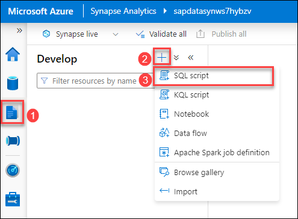
   
2. In the Properties, enter the Name as **CreateSalesPaymentsFull** **(1)** and change the SQL pool ```Connect to``` **sapdatasynsql** **(2)**. Then copy the below code and paste it in the codespace **(3)** and click on **Run** **(4)**.

   ```sql
   CREATE VIEW [dbo].[SalesPaymentsFull]
	        AS SELECT s.[SALESDOCUMENT]
      , s.[CUSTOMERNAME]
      , s.[CUSTOMERGROUP]
      , s.[BILLINGCOMPANYCODE]
      , s.[BILLINGDOCUMENTDATE]
      , p.[PaymentDate] as PAYMENTDATE
      , s.[CUSTOMERACCOUNTGROUP]
      , s.[CREDITCONTROLAREA]
      , s.[DISTRIBUTIONCHANNEL]
      , s.[ORGANIZATIONDIVISION]
      , s.[SALESDISTRICT]
      , s.[SALESGROUP]
      , s.[SALESOFFICE]
      , s.[SALESORGANIZATION]
      , s.[SDDOCUMENTCATEGORY]
      , s.[CITYNAME]
      , s.[POSTALCODE]
      , DATEDIFF(dayofyear, s.BILLINGDOCUMENTDATE, p.PaymentDate) as PAYMENTDELAYINDAYS
    FROM [dbo].[SalesOrderHeaders] as s
   JOIN [dbo].[Payments] as p ON REPLACE(LTRIM(REPLACE(s.[SALESDOCUMENT], '0', ' ')), ' ', '0') = p.[SalesOrderNr]
   ```
   
   
   
3. From **Data** **(1)**, click on **Workspace** **(2)** and select **sapdatasynsql** SQL database **(3)**. You will see the created **dbo.SalesPaymentsFull** view under **Views** **(4)**. If you are not able to see, click on eclipse **(...)** button next to **Views** and select **Refresh**.

   
   
4. You can now test the view by executing the SQL. From **Develop** **(1)**, click on ```+``` **(2)** and select **SQL script** **(3)** to create a new SQL script.

   
   
5. Enter the below SQL script into the codespace **(1)** and change the SQL pool ```Connect to``` **sapdatasynsql** **(2)**. Then click on **Run** **(3)** and explore the **Results** **(4)**.

    ```bash
    select * from SalesPaymentsFull
    ```

       
   
### Task 2: Configure the Data store in ML studio

1. Navigate to the **microhack-<inject key="DeploymentID" enableCopy="false"/>-rg** resource group in the Azure portal and open the Azure Machine Learning workspace named **sap-data-ml-ws** from the resources.

   
   
2. In the Overview of **sapdatasynwsSUFFIX** Azure Machine Learning workspace, click on **Launch studio**. You will be to navigated to Microsoft Azure Machine Learning Studio.

   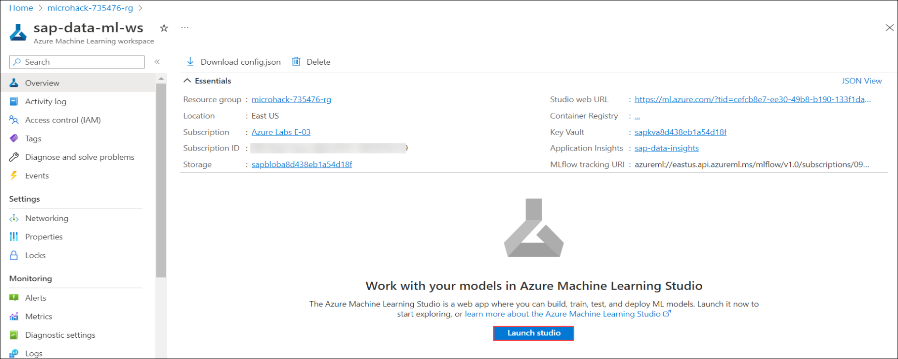
   
3. From **Machine Learning Studio**, scroll-down to **Manage** from left-menu. Click on **Datastores** **(1)** and select ```+ Create``` **(2)** to create new datastore.

   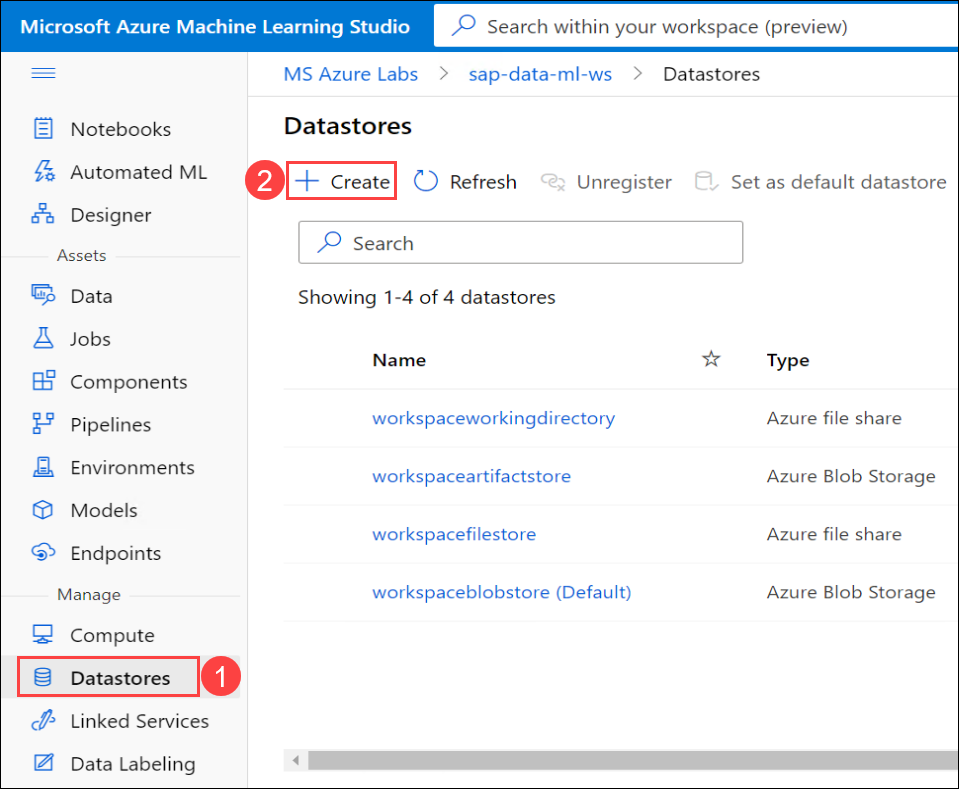
   
4. In the Create datastore pane, enter the following values in the respective fields and click on **Create** **(11)**.

   | Field                         | Value                        |
   |------------------------------ |----------------------------- |
   | Datastore name (1)            | **sap_data_ml_ds**           |
   | Datastore type (2)           | **Azure SQL Database**       |
   | Account Selection method (3)  | select `Enter Manually`      |
   | Enter your Synapse Workspace name as Server Name (4) | **sapdatasynwsSUFFIX** |
   | Enter your Synapse SQL Pool as Database Name (5) | **sapdatasynsql** |
   | Select your Subscription (6)  | Select the subscription in which **microhack-<inject key="DeploymentID" enableCopy="false"/>-rg** resource group is deployed |
   | Enter your resource group name (7) | **microhack-<inject key="DeploymentID" enableCopy="false"/>-rg** |
   | Authentication Type (8) | **SQL Authentication** |
   | Enter UserId (9)        | **azureadmin**         |
   | Enter Password (10)     |  **Sapdata!pass123**   |
   
   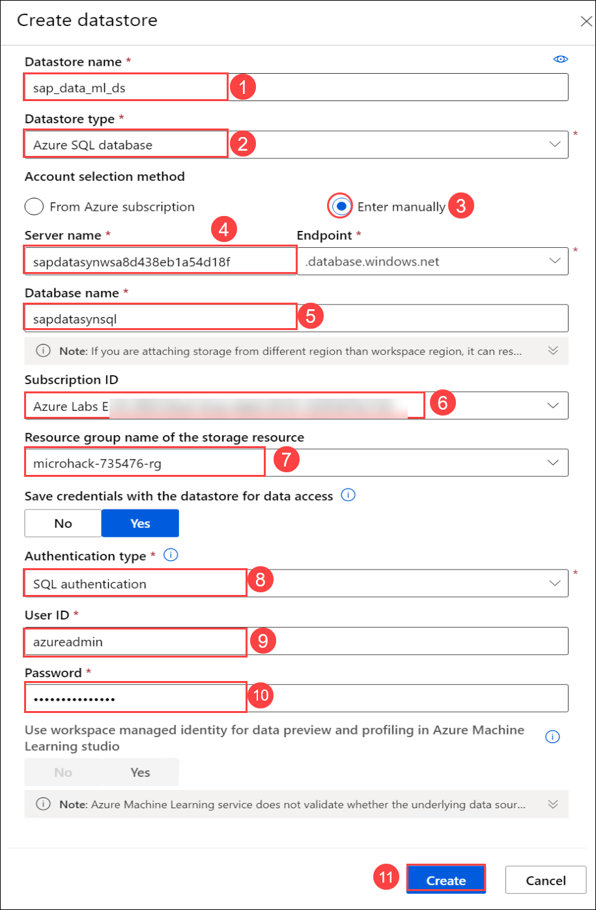
   
5. Once the Datastore is Successfully created, you will be able to see the **sap_data_ml_ds** listed under Datastores.

       

### Task 3: Configure the Automated ML Run

1. In the left menu, click on **Automated ML** **(1)** and select **New Automated ML Run** **(2)**.

   
   
2. On the Create a new Automated ML job Select a data asset step, expand the **Create** **(1)** menu and select **From datastore** **(2)**.

   
   
3. On the **Create dataset from datastore** blade Basic info step, name the dataset **SalesPaymentsView** **(1)**. Select **Next** **(2)**.

   
   
4. From **Datastore selection** step, select the **sap_data_ml_ds** **(1)** datastore. Add the below SQL query **(2)** to get all the data from the view defined above and then click **Next** **(3)**. 

   ```sql
   select * from SalesPaymentsFull
   ```  
   
   
   
5. In the **Settings and preview** step, you can ensure and verify the data for the query is working fine by visualizing the data in the next window. Click **Next**.

   
   
6. In the **Schema** step, toggle the following **fields off** so that they are not included in the dataset and then select **Next**:

    - SALESDOCUMENT
    - BILLINGDOCUMENTDATE
    - PAYMENTDATE
    - SALESGROUP
    - SALESOFFICE

   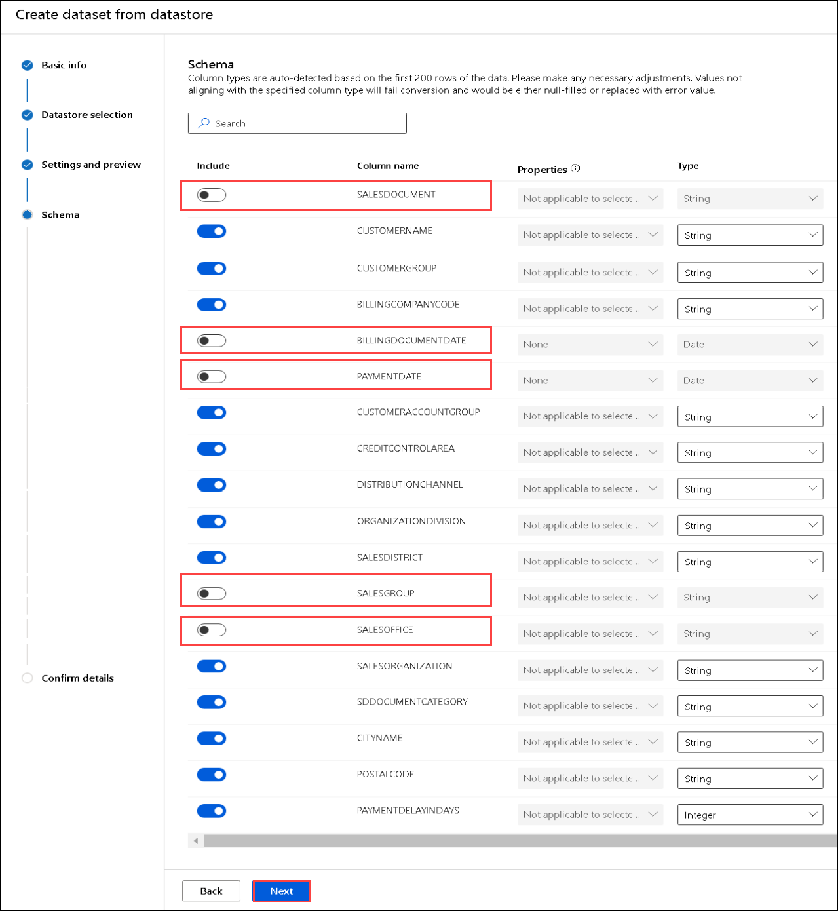
   
7. In the **Confirm** details step, select **Create**.

   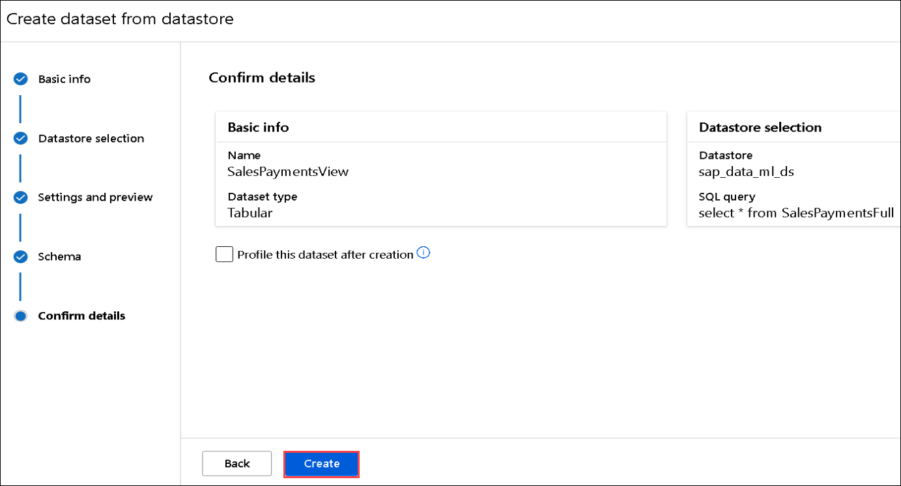
   
8. On the Select data asset step, select **SalesPaymentsView** **(1)** from the list and select **Next** **(2)**.

   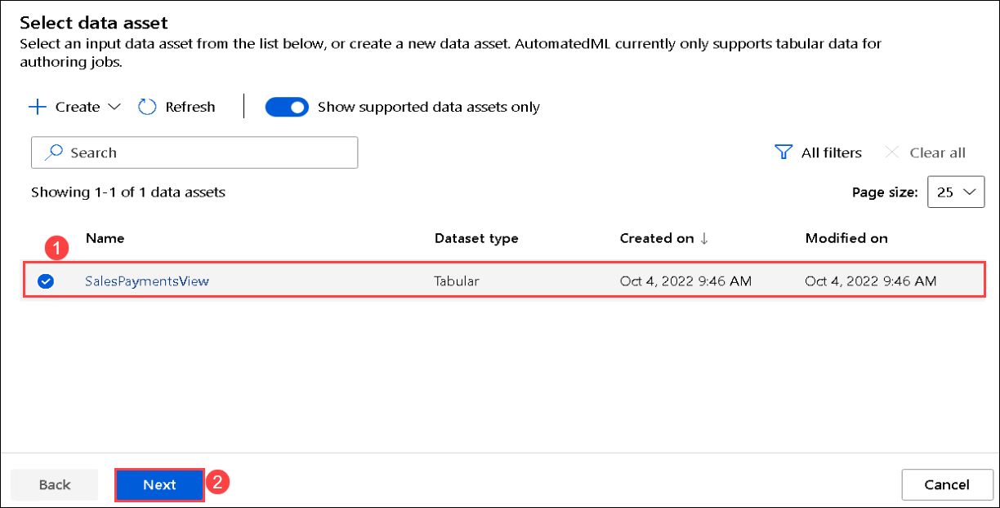
   
9. On the Configure job step, enter the below values:

    | Field | Value |
    |-------|-------|
    | Experiment name (1)     | Check for **Create new**   |
    | New experiment name (2) | Enter **sap-data-ml-experiment** |
    | Target column (3) | Select **PAYMENTDELAYINDAYS** |
    | Select compute type (4) | Select **Compute cluster** |
    | Select Azure ML compute cluster (5) | Click on **+ New** |
   
   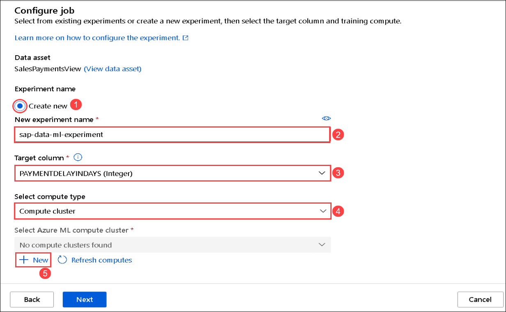
   
10. In the Create compute cluster blade Virtual machine step, accept the default values and select **Next**.

     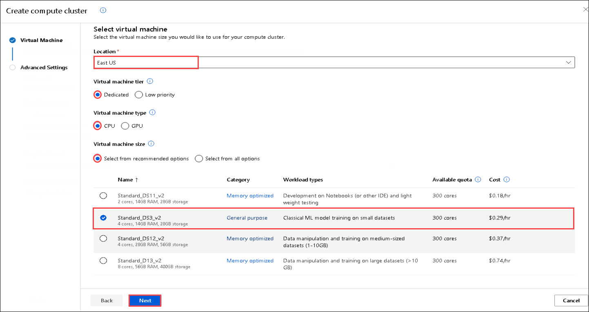
     
11. In the Create compute cluster blade Advanced settings, enter the below values and then select **Create** **(3)**. It takes a few moments for the cluster to be provisioned.

    | Field | Value |
    |-------|-------|
    | Compute name (1) | Enter **sap-data-ml-vm** |
    | Maximum number of nodes (2) | Enter `3` |
    
    
    
12. Once the compute cluster is created successfully, you will be reverted back to the Configure job step. Select the **sap-data-ml-vm** **(1)** computer cluster For Select Azure ML compute cluster from the drop-down and select **Next** **(2)**.

    
     
13. In the Select task and settings step, select **Regression** **(1)**, then select **View additional configuration settings** **(2)**.

    
    
14. In the Additional configurations blade, select the Primary metric of **Normalized root mean squared error** **(1)**, then **expand the Blocked models** **(2)** drop down, check the following items, and select **Save** **(3)**. This will reduce the time to train the model. Make sure that **DecisionTree** and **XGBoostRegressor** are unchecked.

     - ElasticNet
     - GradientBoosting
     - KNN
     - LassoLars
     - SGD
     - RandomForest
     - ExtremeRandomTrees
     - LightGBM
     - FastLinearRegressor
     - OnlineGradientDescentRegressor    
   
    
    
15. Select **Next** on the Select task and settings step. On the Validate and test step, select **Finish**.

    
    
16. The job has started creating and opened in the browser. Use the **Refresh** button to monitor the current state.

    > **Note**: Training will take approximately 15-20 minutes.

    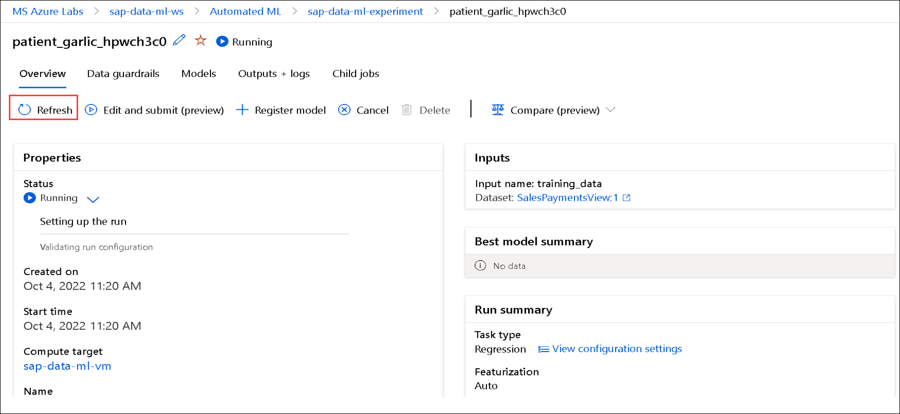
    
17. During the run you can follow-up on the tested models via **Models** tab.

    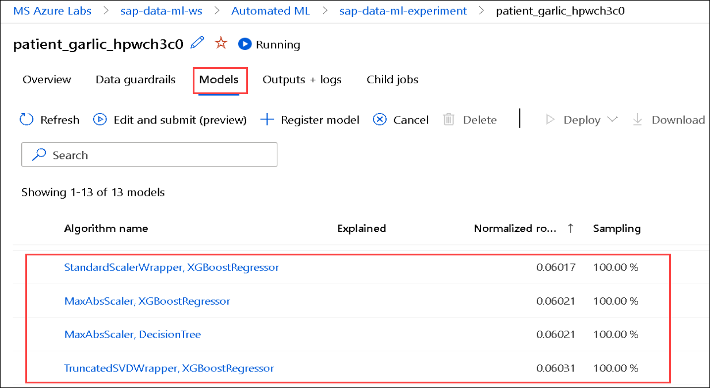
    
### Task 4: Deploy the best trained Model

1. Once the Automated ML job indicates a status of **Completed** **(1)**. Scroll-down to Best model summary card on the screen and select the hyperlink beneath the **Algorithm name** **(2)** heading.

   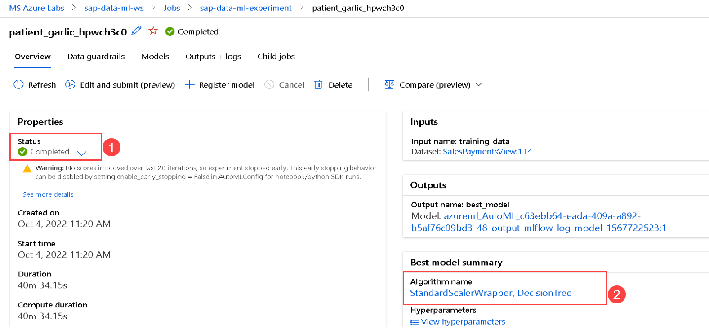
    
2. You can navigate into the different sections and visualize the information about this algorithm. Then on the Model screen, expand the **Deploy** **(1)** item in the toolbar menu and select **Deploy to web service** **(2)**.

   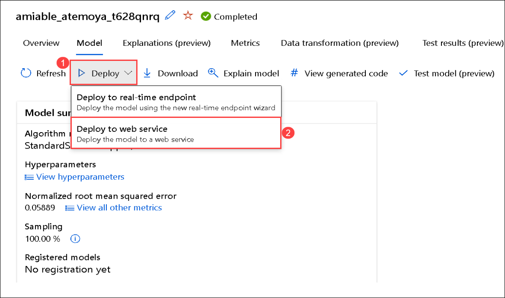
   
3. On the Deploy a model blade, enter the below values and then select **Deploy** **(3)**.

    | Field | Value |
    |-------|-------|
    | Name (1) | Enter **sap-data-ml-model** |
    | Compute type (2) | Select **Azure Container Instance** |
    
   
   
4. In the Model screen, monitor the Deploy status at the bottom of the Model summary card. It will indicate a status of **Completed** in a few minutes time.

   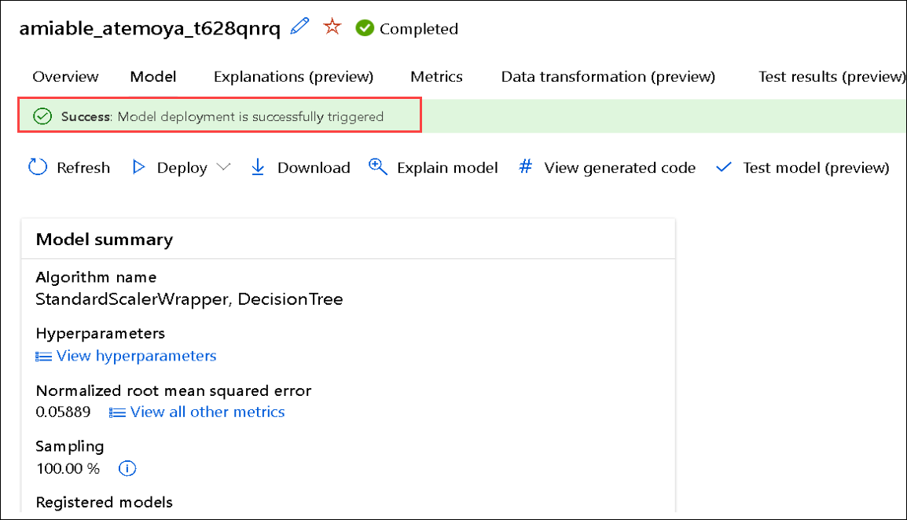
   
### Task 5: Test the Payment Delay/Offset Prediction

1. Navigate to **Endpoints** **(1)** section from left-menu, under **Real-time endpoints** **(2)** select **sap-data-ml-model** **(3)**.

   
   
2. On the **sap-data-ml-model** endpoint screen, select the **Test** **(1)** tab. Replace the contents of the input data with the below given code **(2)** and select **Test** **(3)**. Verify the **Test result** **(4)**.

   ```json
    {
        "Inputs": {
            "data": [
            { 
                "CUSTOMERNAME": "Westend Cycles",
                "CUSTOMERGROUP": "Z1",
                "BILLINGCOMPANYCODE": 1710,
                "CUSTOMERACCOUNTGROUP": "KUNA",
                "CREDITCONTROLAREA": "A000",
                "DISTRIBUTIONCHANNEL": 10,
                "ORGANIZATIONDIVISION": 0,
                "SALESDISTRICT": "US0003",
                "SALESORGANIZATION": 1710,
                "SDDOCUMENTCATEGORY": "C",
                "CITYNAME": "RALEIGH",
                "POSTALCODE": "27603"
            },
            { 
                "CUSTOMERNAME": "Skymart Corp",
                "CUSTOMERGROUP": "Z2",
                "BILLINGCOMPANYCODE": 1710,
                "CUSTOMERACCOUNTGROUP": "KUNA",
                "CREDITCONTROLAREA": "A000",
                "DISTRIBUTIONCHANNEL": 10,
                "ORGANIZATIONDIVISION": 0,
                "SALESDISTRICT": "US0004",
                "SALESORGANIZATION": 1710,
                "SDDOCUMENTCATEGORY": "C",
                "CITYNAME": "New York",
                "POSTALCODE": "10007"
            }
            ]
        },
        "GlobalParameters": 1.0
   }
   ```
   
   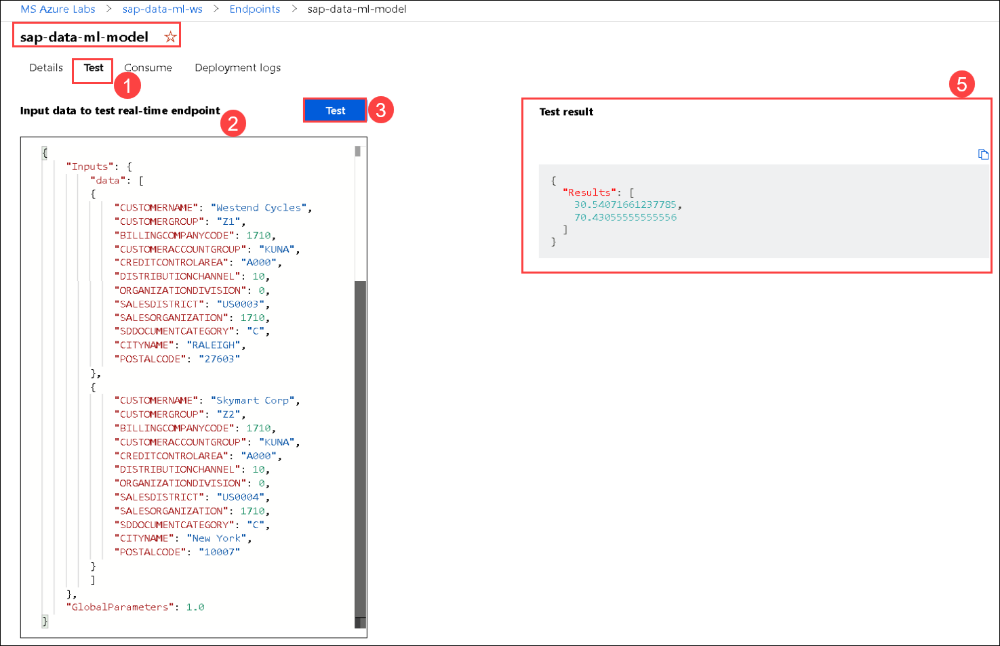
     
### Task 6: Automated ML - Best Model - Additional Info (Optional)

1. 
