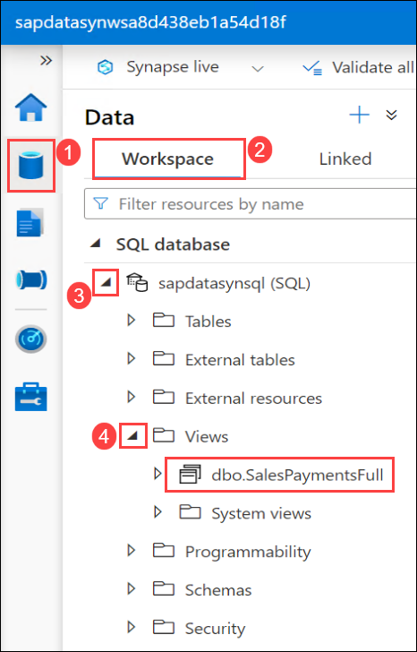

# Exercise 5: Predict Incoming Cashflow

In this exercise you wll create a model to predict incoming cashflow based on historical payment delays for previous sales.

You wll be using [Azure Machine Learning](https://ml.azure.com/) for this.

### Task 1: Create a View in Synapse Workspace

1. From the Synapse Studio, click on **Develop** **(1)** from the left-menu. Click on```+``` **(2)** and select **SQL script** **(3)** to create a new view.

   
   
2. In the Properties, enter the Name as **CreateSalesPaymentsFull** **(1)** and change the SQL pool ```Connect to``` **sapdatasynsql** **(2)**. Then copy the below code and paste it in the codespace **(3)** and click on **Run** **(4)**.

   ```sql
   CREATE VIEW [dbo].[SalesPaymentsFull]
	        AS SELECT s.[SALESDOCUMENT]
      , s.[CUSTOMERNAME]
      , s.[CUSTOMERGROUP]
      , s.[BILLINGCOMPANYCODE]
      , s.[BILLINGDOCUMENTDATE]
      , p.[PaymentDate] as PAYMENTDATE
      , s.[CUSTOMERACCOUNTGROUP]
      , s.[CREDITCONTROLAREA]
      , s.[DISTRIBUTIONCHANNEL]
      , s.[ORGANIZATIONDIVISION]
      , s.[SALESDISTRICT]
      , s.[SALESGROUP]
      , s.[SALESOFFICE]
      , s.[SALESORGANIZATION]
      , s.[SDDOCUMENTCATEGORY]
      , s.[CITYNAME]
      , s.[POSTALCODE]
      , DATEDIFF(dayofyear, s.BILLINGDOCUMENTDATE, p.PaymentDate) as PAYMENTDELAYINDAYS
    FROM [dbo].[SalesOrderHeaders] as s
   JOIN [dbo].[Payments] as p ON REPLACE(LTRIM(REPLACE(s.[SALESDOCUMENT], '0', ' ')), ' ', '0') = p.[SalesOrderNr]
   ```
   
   
   
3. From **Data** **(1)**, click on **Workspace** **(2)** and select **sapdatasynsql** SQL database **(3)**. You will see the created **dbo.SalesPaymentsFull** view under **Views** **(4)**. If you are not able to see, click on eclipse **(...)** button next to **Views** and select **Refresh**.

   
   
4. You can now test the view by executing the SQL. From **Develop** **(1)**, click on ```+``` **(2)** and select **SQL script** **(3)** to create a new SQL script.

   
   
5. Enter the below SQL script into the codespace **(1)** and change the SQL pool ```Connect to``` **sapdatasynsql** **(2)**. Then click on **Run** **(3)** and explore the **Results** **(4)**.

    ```bash
    select * from SalesPaymentsFull
    ```

       
   
### Task 2: Configure the Data store in ML studio

1. 
   
