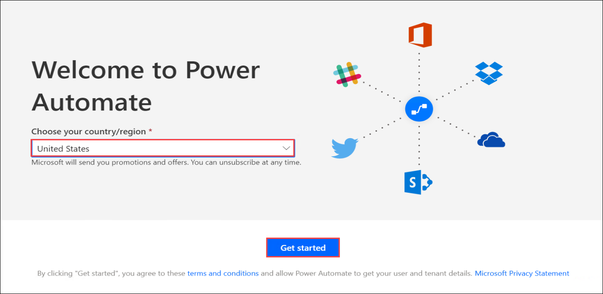

# Exercise 6: Integrate Azure Machine Learning and PowerBI

In this exercise, you can now integrate the Azure Machine Learning Model within PowerBI. The Azure Machine Learning exposes a REST interface which you can integrate in PowerBI.

### Task 1: Add Machine Learning info to the PowerBI Datamodel

1. On the Power BI report from **Home** **(1)** tab toolbar menu, expand the **Transform data** **(2)** item. Select **Transform data** **(3)**.

   
   
2. In the Power Query Editor window, select the **SalesOrderPayments** **(1)** table from the Queries pane and select the **Azure Machine Learning** **(2)** item from the Home toolbar menu.

   
   
3. In the Azure Machine Learning Models dialog, select the **AzureML.sap-data-ml-model** **(1)** item and select **OK** **(2)**. This will add an additional column to the table with the predicted offset.

   
   
4. In the Power Query Editor, with the SalesOrderPayments table selected in the Queries pane, scroll all the way to the right of the displayed table. Right-click the **AzureML.sap-data-ml-model** **(1)** field menu and choose to rename the field **predOffset** **(2)**.

   

5. 
