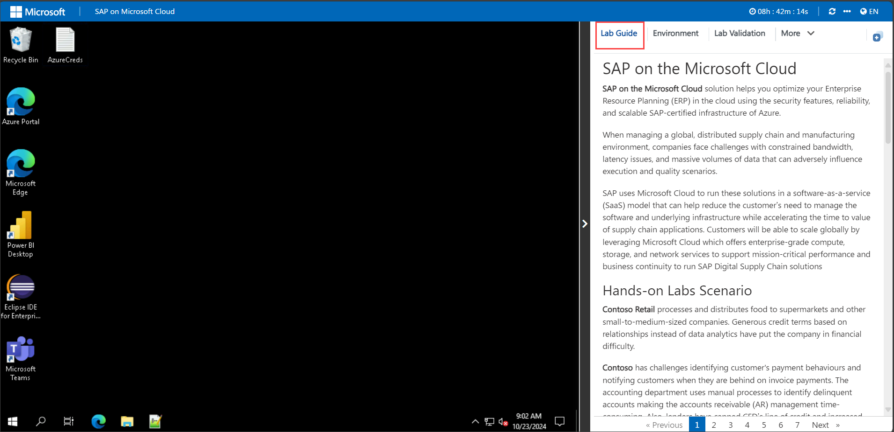

# **Getting Started with Your SAP on Azure Workshop**
 
Welcome to your SAP on Azure workshop! We've prepared a seamless environment for you to explore and learn about Azure services. Let's begin by making the most of this experience:
 
## **Accessing Your Lab Environment**
 
Once you're ready to dive in, your virtual machine and lab guide will be right at your fingertips within your web browser.
 
   

### **Virtual Machine & Lab Guide**
 
Your virtual machine is your workhorse throughout the workshop. The lab guide is your roadmap to success.
 
## **Exploring Your Lab Resources**
 
To get a better understanding of your lab resources and credentials, navigate to the **Environment Details** tab.

   .png)
 
## **Utilizing the Split Window Feature**
 
For convenience, you can open the lab guide in a separate window by selecting the **Split Window** button from the Top right corner.
 
   .png)
 
## **Managing Your Virtual Machine**
 
Feel free to start, stop, or restart your virtual machine as needed from the **Resources** tab. Your experience is in your hands!
 
   
 
## **Let's Get Started with Azure Portal**
 
1. On your virtual machine, click on the Azure Portal icon as shown below:
 
    .png)

2. On the **Sign into Microsoft Azure** tab, you will see the login screen, enter the following username, and, then click on **Next**.

   * Email/Username: <inject key="AzureAdUserEmail"></inject>

   

3. Now enter the following password and click on **Sign in**. 

   * Password: <inject key="AzureAdUserPassword"></inject>

   

4. If you see the pop-up **Stay Signed in?**, click on **No**.

   

5. If you see the pop-up **You have free Azure Advisor recommendations!**, close the window to continue the lab.

6. If a **Welcome to Microsoft Azure** popup window appears, click **Maybe Later** to skip the tour.

1. Now you can see the Azure Portal Dashboard, click on **Resource groups** from the Navigate panel to see the resource groups.

   

1. Click on the **aiw-sap-<inject key="DeploymentID" enableCopy="false" />** Resource group and go through with the pre-deployed resources.

   * In the Resource group we have one **Virtual Machine**, **Service Bus**, **IoT Hub**, **Synapse Workspace**, **Azure Machine Learning workspace**, **Storage Account**, **Azure Cosmos Database**, **Container Registry**, **Key Vault** and **Application Insights** deployed.

   * **Virtual Machine**: You will be using the Virtual Machine which is already open on the left side of the page to perform all the lab exercises.

   * **IoT Hub**: Using the existing IoT hub you will review the pre-deployed IoT hub devices and Message routing rules. 

   * **Synapse Workspace**: You will be using Synapse Workspace to run the SQL scripts and verify the data. You will also review the pre-deployed Linked services, Integration Datasets, and Pipelines. 

   * **Azure Machine Learning workspace**: You will be using the Machine Learning Workspace to review the pre-deployed Automated ML run and the Best Model. By entering the data in the endpoint's JSON editor, you can also test the machine learning model.

    * **Storage Account**: 
       - You will be using the Azure Data Lake Storage Gen2 Storage Account to store the Sales Order Headers, Sales Order Items, and Payments in the container and also you will store the IoT data generated by the IoT hub device in the container.

    * **Azure Cosmos Database**: You will be using the Cosmos Database to store the raw Payment data. After the Pipeline is successfully deployed, the Payment data will be transferred from Azure Data Lake Storage Gen2 Storage Account to Cosmos Database.

    * **Key Vault**: You will be using the Key Vault to store secrets and other sensitive information that is needed by the Azure Machine Learning workspace.

    * **Application Insights**: You will be using the Application Insights to store monitoring information about the deployed models in the Azure Machine Learning workspace.

    * **Container Registry**: You will be using the Container Registry to register the docker images which are being used in training the models in the Azure Machine Learning workspace.
    
    

## Summary

* In this exercise, you signed into the Azure Portal and reviewed the pre-deployed resources.
 
Now you're all set to explore the powerful world of technology. Feel free to reach out if you have any questions along the way. Enjoy your workshop!
