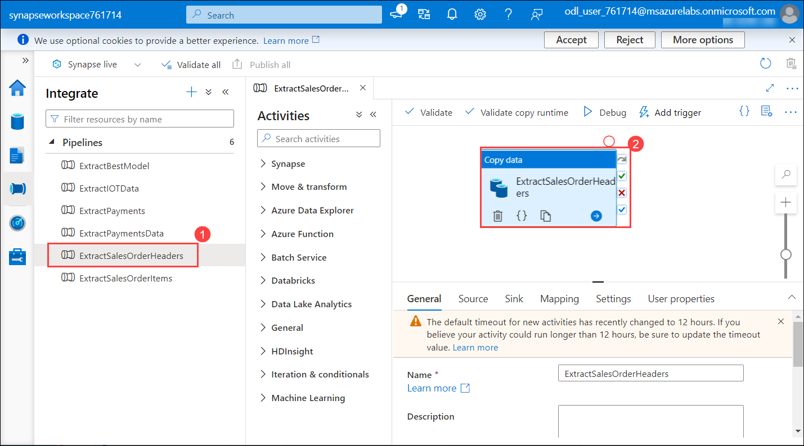
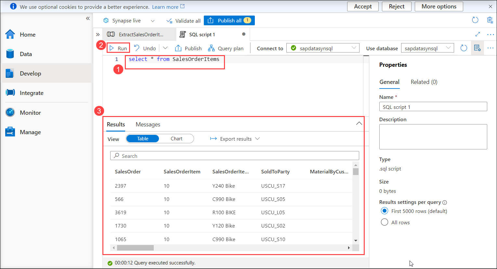
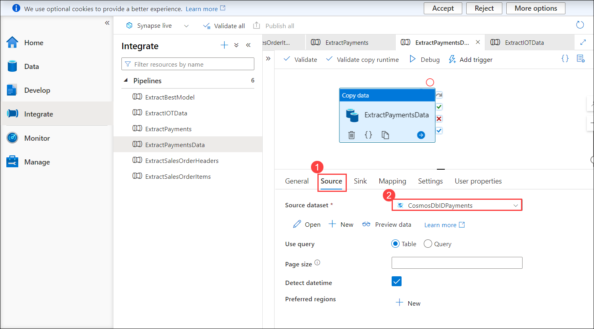
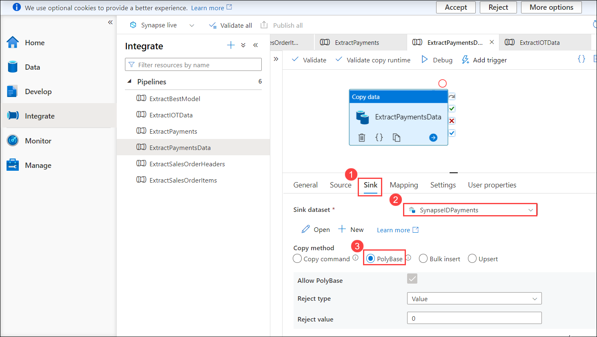
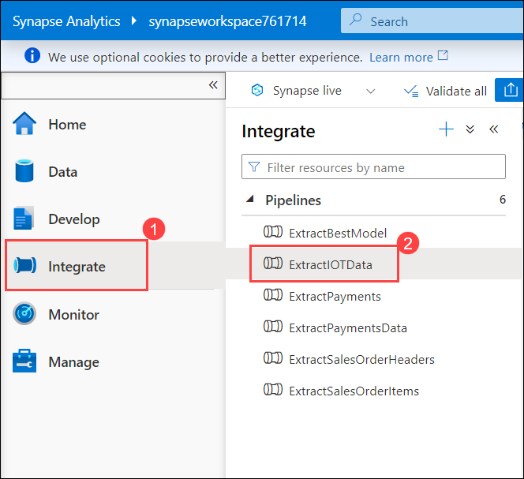
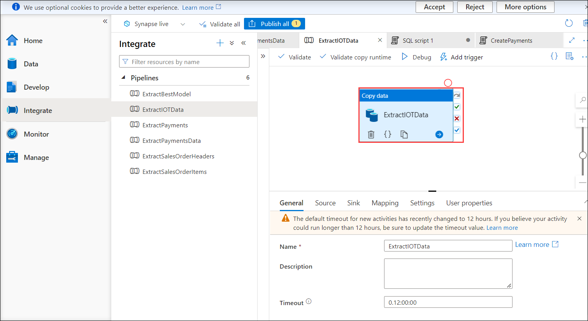
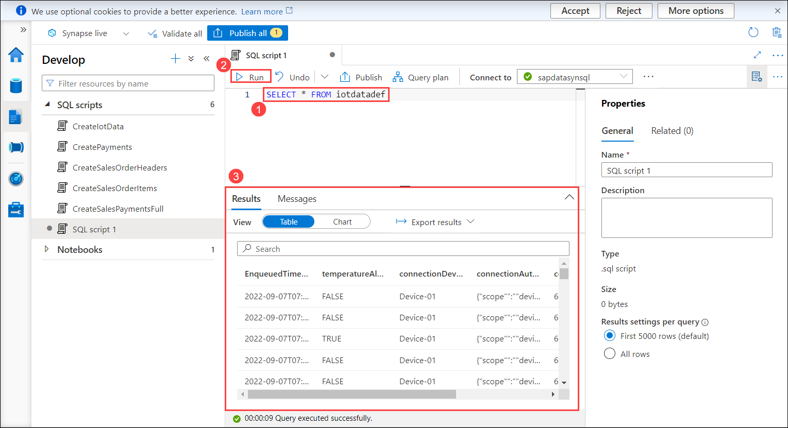

# Exercise 2: Combine and streamline SAP and non-SAP Data Flow 


## Overview

Azure Synapse Analytics is a limitless analytics service that brings together data integration, enterprise data warehousing, and big data analytics. It gives you the freedom to query data on your terms, using either serverless or dedicated resources at scale. Azure Synapse brings these worlds together with a unified experience to ingest, explore, prepare, transform, manage and serve data for immediate BI and machine learning needs. To learn more about Azure Synapse refer: `https://learn.microsoft.com/en-us/azure/synapse-analytics/overview-what-is`


In this exercise, you will review the pre-deployed Synapse Pipelines and will run the SQL scripts to review the data for the tables **SalesOrderHeaders, SalesOrderItems, Payments, and IoT Hub device.**

 * The **SalesOrderHeaders** data is extracted from the SAP Hana database using the Pipeline **ExtractSalesOrderHeaders**, and then it is copied to the SalesOrderHeaders table in the Synapse workspace.
 * The **SalesOrderItems** data is extracted from the SAP Hana database using the Pipeline **ExtractSalesOrderItems**, and then it is copied to the SalesOrderItems table in the Synapse workspace.
 * The  **Payments data** is extracted from the Cosmos DB using the Pipeline **ExtractPaymentsData**, and then it is copied to the Payments table in the Synapse workspace.
 * Using the Pipeline **ExtractIOTData**, the Non-SAP data that is obtained from the IoT Hub Device is extracted from the Storage account and then copied to the iotdatadef table in the Synapse workspace.

This exercise includes the following tasks:

  * Review the pre-deployed Pipeline for **SalesOrderHeaders data**
  * Review the pre-deployed Pipeline for **SalesOrderItems data**
  * Review the pre-deployed Pipeline for **Payments data**
  * Review the pre-deployed Pipeline for **IoT Hub device data**

## Task 1:  Review the pre-deployed Pipeline for SalesOrderHeaders data.

In this task, you will review the pipeline that extracts the **SalesOrderHeaders** data from the **SAP Hana database** and then copy it to the **SalesOrderHeaders** table in the Synapse workspace.

1. Navigate to the **aiw-sap-<inject key="DeploymentID" enableCopy="false"/>** **(1)** resource group and open Synapse workspace named **synapseworkspace<inject key="DeploymentID" enableCopy="false"/>** **(2)**.

   
   
2. From the Overview **(1)** pane of Synapse workspace, scroll down and click on **Open** **(2)** under **Getting started** to Open **Synapse Studio**.

   
   
3. In Synapse Analytics Studio, from the left panel click on the expand icon.

   
   
4. Select **Integrate (1)** hub from left hand side menu and click on **Pipelines** **(2)**.

    

    >**Info:** You can observe the pre-deployed Pipelines for SalesOrderHeaders, SalesOrderItems, Payments, and IoT Data.

5. Click on **ExtractSalesOrderHeaders (1)** under Pipelines and select **ExtractSalesOrderHeaders (2)** from the canvas.

    

6. Navigate to the **Source (1)** tab and observe the Source settings of the Pipeline

    
    
    >Info: In this Pipeline **HanaIDHeaders (2)** has been selected as the Source dataset where HanaIDHeaders is an Integration dataset that stores data of **Sales Order Headers** that are being fetched from the SAP Hana database.
    
7. Switch to the **Sink (1)** tab and observe the Sink settings of the Pipeline.

    
   
   >**Info:**
     1. In this Pipeline **SynapseIDHeaders (2)** has been selected as the Sink dataset and **PolyBase (3)** as the Copy Method. 
     2. When the pipeline is successful, the data from the **HanaIDHeaders** Integration dataset will be copied to the Synapse table that is mapped with the Integration dataset **SynapseIDHeaders**.

8. Navigate to **Develop (1)** hub, click on **+** **(2)** and select **SQL Script (3)** to verify the SalesOrderHeaders data.

    
   
9. In the SQL script tab, choose **sapdatasynsql** dedicated SQL pool from the drop-down that is next to the **Connect to** parameter in the toolbar menu.

    

10.  Enter the below SQL script into the codespace **(1)** and click on **Run** **(2)** then explore the **Results** **(3)**.

     ```bash
     select * from SalesOrderHeaders
     ```

     

## Task 2:  Review the pre-deployed Pipeline for SalesOrderItems data

In this task, you will review the pipeline that extracts the **SalesOrderItems** data from the **SAP Hana database** and then copy it to the **SalesOrderItems** table in the Synapse workspace.

1. Navigate back to **Integrate (1)** hub and click on **ExtractSalesOrderItems (2)** under Pipelines.

   
   
2. Click on **ExtractSalesOrderItems** from the canvas.

    
    
3. Navigate to the **Source (1)** tab and observe the Source settings of the Pipeline.

    
    
    >**Info:** In this Pipeline **HanaIDOrders (2)** has been selected as the Source dataset where HanaIDHeaders is an Integration dataset that stores data of **Sales Order Items** that are being fetched from the SAP Hana database.

4. Switch to the **Sink (1)** tab and observe the Sink settings of the Pipeline.

    
    
     >**Info:** In this Pipeline **SynapseIDOrders (2)** has been selected as the Sink dataset and **PolyBase (3)** as Copy Method. When the pipeline is successful, the data from the **HanaIDOrders** Integration dataset will be copied to the Synapse table that is mapped to the Integration dataset **SynapseIDOrders**.

5. Navigate to **Develop (1)** hub, click on **+** **(2)** and select **SQL Script (3)** to verify the SalesOrderHeaders data.

    
    
6. In the SQL script tab, choose **sapdatasynsql** dedicated SQL pool from the drop-down next to the **Connect to** parameter in the toolbar menu.

    
    
7.  Enter the below SQL script into the codespace **(1)** and click on **Run** **(2)** then explore the **Results** **(3)**.

     ```bash
     select * from SalesOrderItems
     ```

     
     
 ## Task 3:  Review the pre-deployed Pipeline for PaymentsData

In this task, you will review the pipeline that extracts the **Payments** data from the **Cosmos DB** and then copies it to the **Payments** table in the Synapse workspace.

1. Navigate back to **Integrate (1)** hub and click on **ExtractPaymentsData (2)** under Pipelines.

   
   
2. Click on **ExtractPaymentsData** from the canvas.

    
    
3. Navigate to the **Source (1)** tab and observe the Source settings of the Pipeline.

    
    
    >**Info:** In this Pipeline **CosmosDbIDPayments (2)** has been selected as the Source dataset whereas **CosmosDbIDPayments** is an Integration dataset for the Cosmos database that stores data of Payments that are being fetched from the Storage account.

4. Switch to the **Sink (1)** tab and observe the Sink settings of the Pipeline.

    
    
    >**Info:** 
      1. In this Pipeline **SynapseIDPayments (2)** has been selected as the Sink dataset and **PolyBase (3)** as the Copy Method. 
      2. When the pipeline is successful, the data from the **CosmosDbIDPayments** Integration dataset will be copied to the Synapse table, which is connected to the Integration dataset **SynapseIDPayments**.

5. Navigate to **Develop (1)** hub, click on **+** **(2)** and select **SQL Script (3)** to verify the SalesOrderHeaders data.

    
    
6. In the SQL script tab, choose **sapdatasynsql** dedicated SQL pool from the drop-down next to the **Connect to** parameter in the toolbar menu.

    
    
7.  Enter the below SQL script into the codespace **(1)** and click on **Run** **(2)** then explore the **Results** **(3)**.

     ```bash
     select * from Payments
     ```

     


 ## Task 4:  Review the pre-deployed Pipeline for IoT Hub device data

In this task, you will review the pipeline that extracts the **IoT Hub Device** data that is stored in the Storage account and then copies it to the **iotdatadef** table in Synapse workspace.

1. Navigate back to **Integrate (1)** hub and click on **ExtractIOTData (2)** under Pipelines.

   
   
2. Click on **ExtractIOTData** from the canvas.

     

3. Navigate to the **Source (1)** tab and observe the Source settings of the Pipeline.

    
    
    >**Info:** In this Pipeline **StaccID-IoTdata (2)** has been selected as the Source dataset where StaccID-IoTdata is an Integration dataset that stores the telemetry data sent by the simulated IoT Hub device to Azure IoT Hub.

4. Switch to the **Sink (1)** tab and observe the Sink settings of the Pipeline.

    
    
    >**Info:** 
      1. In this Pipeline **SynapseID-IOT (2)** has been selected as the Sink dataset and **PolyBase (3)** as the Copy Method.
      2.  When the pipeline is successful, the data from the **StaccID-IoTdata** Integration dataset will be copied to the Synapse table that is mapped to the Integration dataset **SynapseID-IOT**.

5. Navigate to **Develop (1)** hub, click on **+** **(2)** and select **SQL Script (3)** to verify the SalesOrderHeaders data.

    
    
6. In the SQL script tab, choose **sapdatasynsql** dedicated SQL pool from the drop-down next to the **Connect to** parameter in the toolbar menu.

    
    
7.  Enter the below SQL script into the codespace **(1)** and click on **Run** **(2)** then explore the **Results** **(3)**.

     ```bash
     select * from iotdatadef
     ```

     

## Summary

* In this exercise, you have reviewed the pre-deployed pipelines for **SalesOrderHeaders data**, **SalesOrderItems data**, **Payments data**, and **IoT Hub device data**
