# Exercise 5: Predict Incoming Cashflow

Azure Machine Learning is a cloud service for accelerating and managing the machine learning project lifecycle. Machine learning professionals, data scientists, and engineers can use it in their day-to-day workflows: Train and deploy models, and manage MLOps. To learn more about Azure Machine Learning refer: `https://learn.microsoft.com/en-us/azure/machine-learning/overview-what-is-azure-machine-learning`

In this exercise, you will be reviewing the pre-deployed **Automated ML Run** and **best-trained model** that predicts incoming cash flow based on historical payment delays for previous sales. You will also test the best model using the **SalesPaymentFull** data which is the integrated data of **SalesOrdersHeaders** and **Payments** and also you will review the test end results.

The best model is selected based on the error between the predicted **Payment Offset** and the **Actual offset**. The model with the least error is selected. You can find more references about how automated ML works here: `https://docs.microsoft.com/en-us/azure/machine-learning/concept-automated-ml#how-automated-ml-works`
 
This exercise includes the following tasks:

1. Deploy and review the Automated ML Run and best-trained Model
2. Test the Payment Delay/Offset Prediction

### Task 1: Deploy and review the Automated ML Run and best-trained model

In this task, you will be deploying and reviewing the  **Automated ML Run** and **best-trained model** that predicts incoming cash flow based on historical payment delays for previous sales with a help of a jupyter notebook.

1. Navigate to the **db-sap-<inject key="DeploymentID" enableCopy="false"/>** resource group in the Azure portal and open the Azure Machine Learning workspace named **asamlworkspace<inject key="DeploymentID" enableCopy="false"/>** from the resources list.

   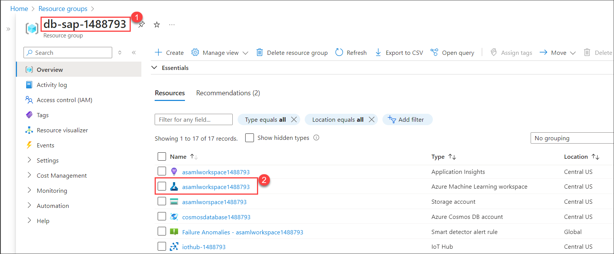
   
2. From the **Overview** tab of **asamlworkspace<inject key="DeploymentID" enableCopy="false"/>** Azure Machine Learning workspace, click on **Launch studio**. You will be navigated to Microsoft Azure Machine Learning Studio.

   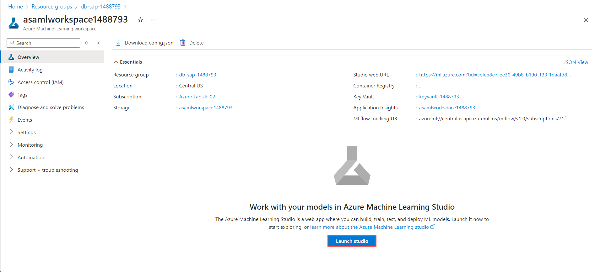
   
3. Select the **Notebooks** **(1)** from the left menu of the AML studio.

   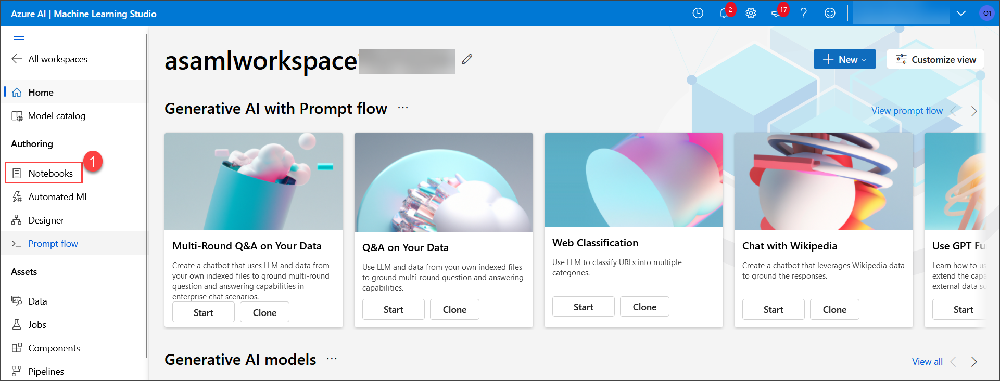

4. Click on **+** **(1)** icon to add a notebook, next click on **Upload files** **(2)**.

   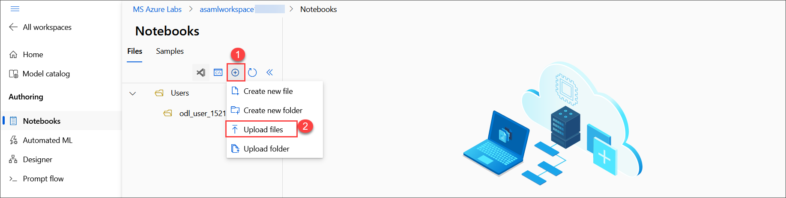

5. Select **Click to browse and select files(s)**.

   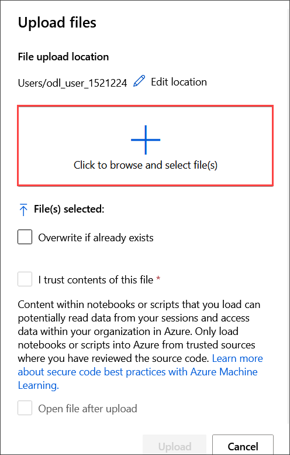

6. Navigate to **"C:\LabFiles\EnvSetup\Notebook"** **(1)**, select the **Notebook1** **(2)** and click on **Open** **(3)**.

   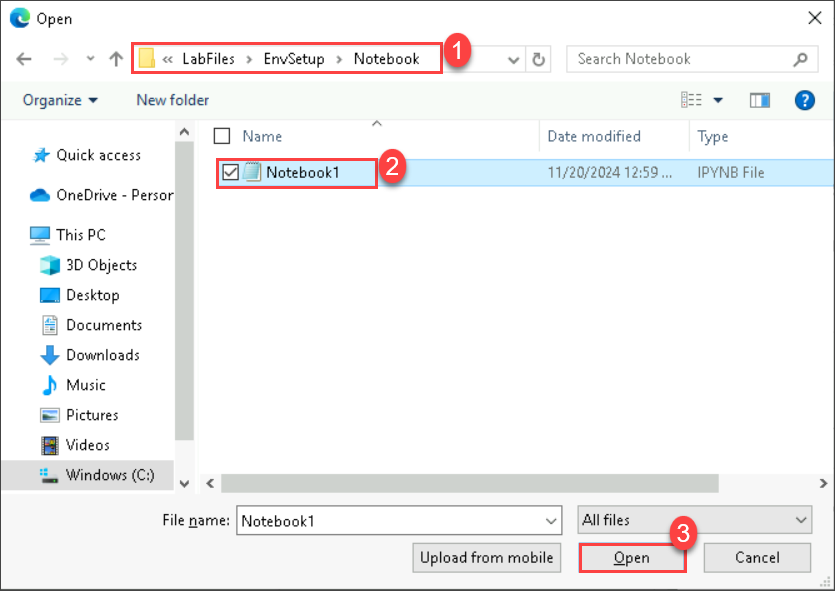

7. Check the **I trust contents of this file** and click on **Upload**.

   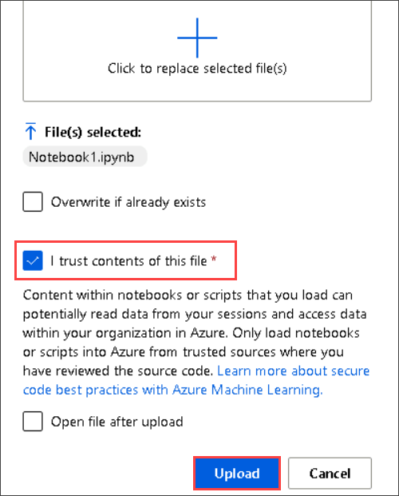

8. Select the notebook which you have uploaded in the previous step, once you have the notebook opened, you will see a prompt to be authenticated to the compute, click on the **Authenticate** button & then proceed with the next steps.

   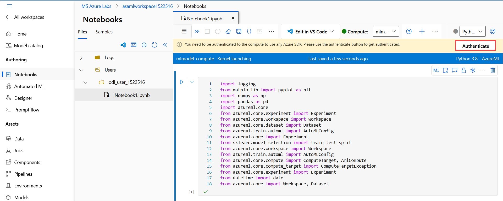

9. Ensure that the **mlmodel-compute** is selected in the Compute section before you proceed towards running your Jupyter notebook.

   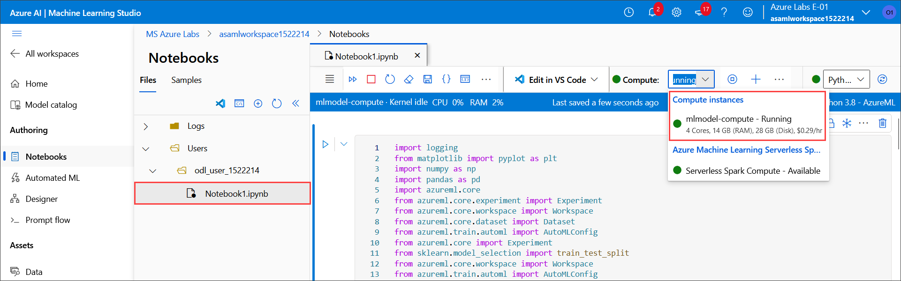

10. Run all the commands one by one by clicking the **Run cell** icon present on the left side of each cell in the notebook.

    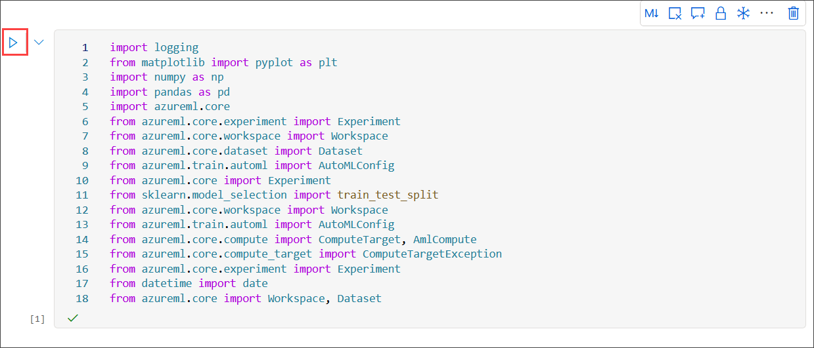

11. Select **Automated ML** **(1)** from the left menu of AML studio and then click on **Pre-deployed Automated ML job** **(2)** available under recent automated ML jobs.

    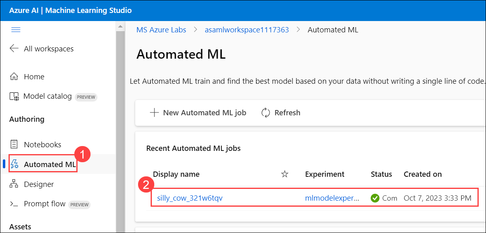
   
12. Review the Automated ML job details such as **Status**, **Inputs**, and **Best Model**. 

    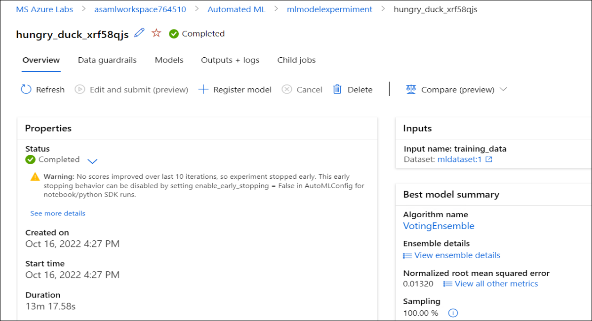

13. From the **Best model summary** card on the **Overview** **(1)** tab, select the hyperlink beneath the **Algorithm name** **(2)** which will take you to the model details blade.
  
    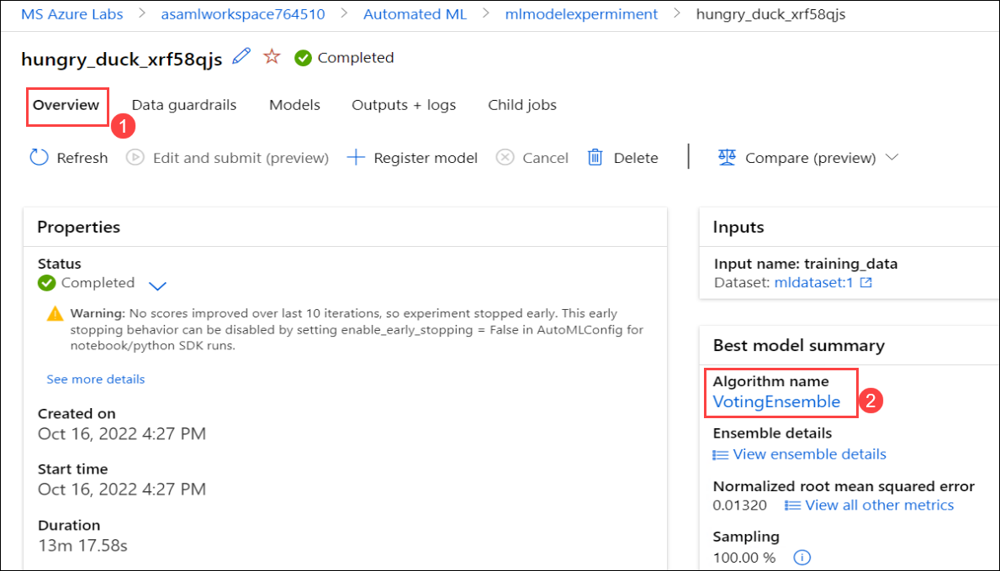
   
14. From the **Model** **(1)** tab, select the hyperlink beneath the **Registered models** **(2)** under Model summary to review the best-trained model.

    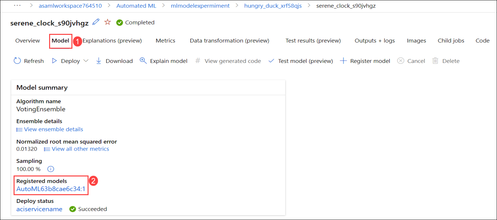
   
15. Now, you can review the best-trained model details from the **Details** tab.

    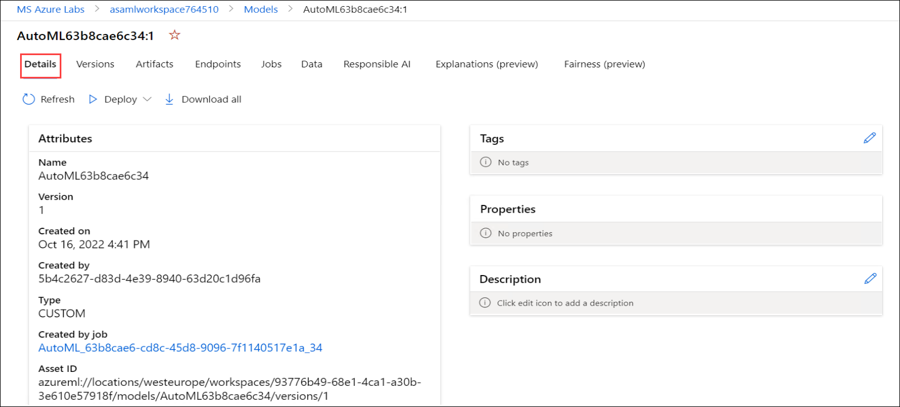  

### Task 2: Test the Payment Delay/Offset Prediction

In this task, you will test the best-trained model and review the results.

1.  In the Notebooks section, click on **+** **(1)** icon to add a files, next click on **Upload files** **(2)**.

     
   
2. Navigate to **"C:\LabFiles\Model-test"** **(1)**, select the **predict** and **input** files **(2)** and click on **Open** **(3)**.

     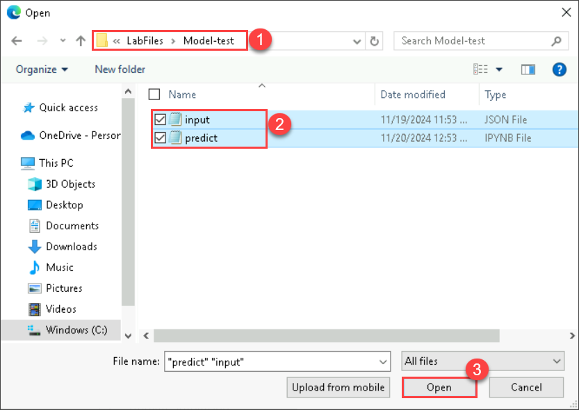

  >**Info :**

  - In the above step, out of the files you have uploaded the input file stores the values of SalesPaymentsFull to test the best model. While, the **predict.ipynb** file will be used to send data to to the "modelendpoint" in Azure Machine Learning and receive predictions.

3. Check the **I trust contents of this file** and click on **Upload**.

    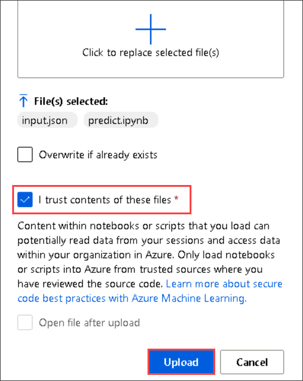

4. Open the **predict** **(1)** notebook & run the commands one by one by clicking on the **Run cell** **(2)** icon on the left side of each cell.
   
    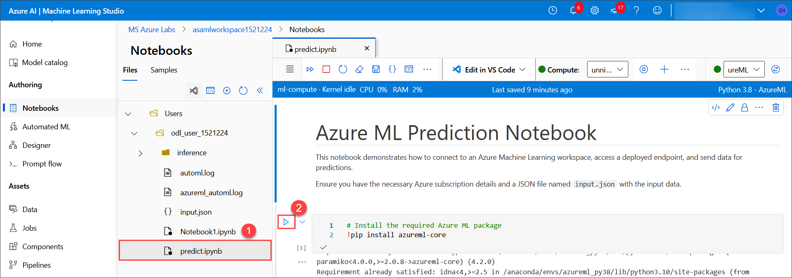

5. Once you execute the final code cell, you should see the prediction output, which will display the payment predictions.

    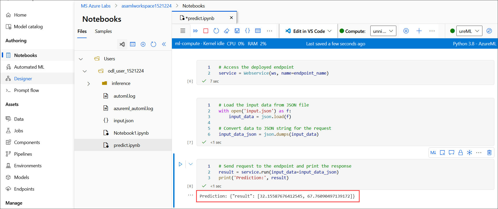

 >**Info :**
 - Once, the test has been run successfully, you were provided with the values in the Test result box. These values will include the **predicted payment delay in days**  which helps to predict the delay of payments for SalesOrderHeaders data. The Late Payment Prediction can help you reduce outstanding receivables and fine-tune your collections strategy by predicting whether sales orders will be paid on time. For example, if a payment is predicted to be late, you might decide to adjust the terms of payment or the payment method for the customer.

>**Note :** Make sure to run the **Validations** before moving to next exercise.

## Summary

In this exercise, you have covered the following:

* Deployed and reviewed the Automated ML Run and best-trained model.
* Tested the best-trained Model and reviewed the results.
